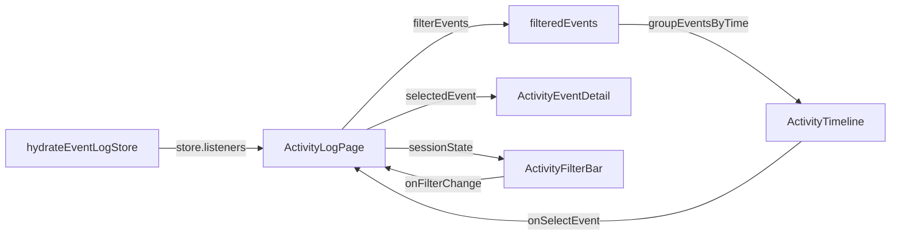

# 设计文档：Activity Log 页面重建 (Activity Log Rebuild)

## 概述

本设计覆盖 Activity Log 页面内容的完全重建——从现有 3-pane 小面板设计重建为全屏游戏事件日志/战斗记录风格界面。核心变更：

1. **删除现有 workspace/ 组件** — ActivityLogPage、ActivityLogEventFocus、ActivityLogFiltersPane
2. **新建全屏游戏事件日志布局** — ActivityFilterBar（顶部过滤栏）+ ActivityTimeline（时间分组事件列表）+ ActivityEventDetail（右侧详情面板）
3. **时间分组算法** — groupEventsByTime 纯函数，将事件按 Today/Yesterday/This Week/This Month/Older 分组
4. **格式化 payload 展示** — ActivityPayloadView 组件，key-value 格式化 + 嵌套对象可折叠

本 spec 不涉及导航架构变更（由 navigation-architecture spec 处理），仅实现 Activity Log 页面的内容渲染。

依赖：navigation-architecture spec 提供的精简 FullPageWorkspaceShell（浮动返回按钮 + 全视口 children）。

## 架构

### 组件层级

```
FullPageWorkspaceShell (view === 'activity-log')
├── FloatingBackButton ("← Office")
└── children:
    └── ActivityLogPage                        ← 全屏入口（过滤栏 + 时间线 + 详情面板）
        ├── ActivityFilterBar                   ← 顶部 h-16：日期预设 + 类型 + Actor + 搜索
        ├── ActivityTimeline                    ← 全宽/60% 事件时间线（按时间分组）
        │   └── ActivityTimeGroup × N           ← 时间分组（标题 + 事件列表）
        │       └── ActivityEventRow × M        ← 单行事件（48px 高，域图标 + 标签 + 时间戳 + 级别色条）
        ├── ActivityEventDetail                 ← 右侧 40% 事件详情面板（选中时展开）
        │   └── ActivityPayloadView             ← 格式化 payload（key-value，可折叠）
        └── ActivityEmptyState                  ← 空状态：无事件 / 过滤无结果
```

### 数据流



### 全屏布局设计 — 默认视图（无事件选中）

```
┌─────────────────────────────────────────────────────────────────────────┐
│ [← Office]                                                              │
│                                                                         │
│ ActivityFilterBar (h-16)                                                │
│ [📅 Last 30 days ▼] [Type ▼] [Actor ▼] [🔍 Search events...]          │
├─────────────────────────────────────────────────────────────────────────┤
│                                                                         │
│  ActivityTimeline (flex-1, overflow-y-auto, 全宽)                       │
│                                                                         │
│  ── Today (5 events) ───────────────────────────────────────────────    │
│  │ 🔵 UserCheck │ Employee "Alice" created        │ 2:34 PM │ Info  │  │
│  │ 🟡 Plug      │ MCP server connection timeout   │ 2:12 PM │ Warn  │  │
│  │ 🔵 GitBranch │ Auto-commit: fix login flow     │ 1:58 PM │ Info  │  │
│  │ 🔴 Zap       │ Pipeline execution failed       │ 1:45 PM │ Error │  │
│  │ 🔵 BookOpen  │ Knowledge base updated          │ 1:30 PM │ Info  │  │
│                                                                         │
│  ── Yesterday (3 events) ───────────────────────────────────────────    │
│  │ 🔵 UserCheck │ Employee "Bob" skill assigned   │ 5:20 PM │ Info  │  │
│  │ 🔵 Package   │ "AI Coder" v2.1 installed       │ 3:15 PM │ Info  │  │
│  │ ...                                                               │  │
│                                                                         │
│  (每行全宽，48px 高，hover 高亮)                                         │
│  (时间分组标题：半透明背景条 + 粗体标签 + 事件计数)                       │
│                                                                         │
└─────────────────────────────────────────────────────────────────────────┘
```

### 全屏布局设计 — 事件选中视图

```
┌─────────────────────────────────────────────────────────────────────────┐
│ [← Office]                                                              │
│                                                                         │
│ ActivityFilterBar (h-16)                                                │
│ [📅 Last 30 days ▼] [Type ▼] [Actor ▼] [🔍 Search events...]          │
├──────────────────────────────────────┬──────────────────────────────────┤
│                                      │                                  │
│  ActivityTimeline (60%)              │  ActivityEventDetail (40%)       │
│                                      │                                  │
│  ── Today ─────────────────────      │  Event: employee.created         │
│  │ 🔵 Employee "Alice" created │◀──│  Level: 🔵 Info                  │
│  │ 🟡 MCP timeout             │     │  Time: Apr 9, 2:34:12 PM        │
│  │ 🔵 Auto-commit             │     │                                  │
│  │ 🔴 Pipeline failed         │     │  ── Entity ──                    │
│  │ ...                        │     │  Type: Employee                   │
│  │                            │     │  ID: emp_abc123                   │
│  │                            │     │  Name: Alice                      │
│  │                            │     │                                  │
│  │                            │     │  ── Payload ──                    │
│  │                            │     │  role: developer                  │
│  │                            │     │  skills: [typescript, react]      │
│  │                            │     │  assignedZone: engineering        │
│  │                            │     │                                  │
│  └────────────────────────────┘     └──────────────────────────────────┘
│                                                                         │
│  (选中事件时，时间线缩为 60%，右侧展开 40% 详情面板)                     │
│  (payload 按 key-value 格式化展示，嵌套对象可折叠)                       │
│                                                                         │
└─────────────────────────────────────────────────────────────────────────┘
```

## 组件与接口

### 1. ActivityLogPage — 全屏入口

**文件**: `packages/ui-office/src/components/events/ActivityLogPage.tsx`

Activity Log 全屏页面入口。管理事件订阅、过滤管道、时间分组和子组件编排。

```tsx
interface ActivityLogPageProps {
  sessionState: ActivityLogSessionState;
  onSessionStateChange: (updater: (prev: ActivityLogSessionState) => ActivityLogSessionState) => void;
}

type ActivityLogSessionState = {
  selectedEventId: string | null;
  search: string;
  eventTypes: string[];
  actorFilters: string[];
  datePreset: 'today' | '7d' | '30d' | 'custom';
};
```

**职责：**
- 调用 `hydrateEventLogStore(eventBus, bootstrapState.eventHistory)` 订阅实时事件流
- 通过 `store.listeners` 同步事件到组件 state
- 使用 `filterEvents()` 应用四种过滤器（日期、类型、Actor、搜索）
- 使用 `groupEventsByTime()` 将过滤后事件按时间分组
- 计算 `actorOptions`（通过 `getAvailableActorFilters`）
- 管理 selectedEventId 状态
- 根据 selectedEventId 决定 Timeline 宽度（全宽 vs 60%）

**布局结构：**
```tsx
<div className="flex h-full flex-col">
  <ActivityFilterBar ... />
  <div className="flex flex-1 min-h-0">
    <ActivityTimeline className={selectedEventId ? 'w-3/5' : 'w-full'} ... />
    {selectedEventId && <ActivityEventDetail className="w-2/5 border-l border-white/10" ... />}
  </div>
</div>
```

### 2. ActivityFilterBar — 顶部过滤栏

**文件**: `packages/ui-office/src/components/events/ActivityFilterBar.tsx`

```tsx
interface ActivityFilterBarProps {
  datePreset: DatePreset;
  eventTypes: string[];
  actorFilters: string[];
  actorOptions: string[];
  search: string;
  onDatePresetChange: (preset: DatePreset) => void;
  onEventTypesChange: (types: string[]) => void;
  onActorFiltersChange: (actors: string[]) => void;
  onSearchChange: (search: string) => void;
}
```

**布局：** 固定高度 64px（h-16），水平排列，内边距 px-6：
- 日期预设下拉（`<Select>`，选项：Last 30 days / Today / Last 7 days / All time，默认 '30d'）
- 事件类型下拉（`<Select>`，多选，选项来自 ALL_EVENT_TYPES）
- Actor 下拉（`<Select>`，多选，选项来自 actorOptions）
- 搜索输入框（`<Input>`，flex-1，placeholder "Search events..."，左侧 Search 图标）

### 3. ActivityTimeline — 事件时间线

**文件**: `packages/ui-office/src/components/events/ActivityTimeline.tsx`

```tsx
interface ActivityTimelineProps {
  groups: TimeGroup[];
  selectedEventId: string | null;
  onSelectEvent: (eventId: string) => void;
  className?: string;
}
```

**布局：** 垂直滚动容器（`overflow-y-auto`），渲染 ActivityTimeGroup 列表。

### 4. ActivityTimeGroup — 时间分组

**文件**: `packages/ui-office/src/components/events/ActivityTimeGroup.tsx`

```tsx
interface ActivityTimeGroupProps {
  label: string;
  eventCount: number;
  events: Array<{ event: RuntimeEvent; level: EventDisplayLevel }>;
  selectedEventId: string | null;
  onSelectEvent: (eventId: string) => void;
}
```

**布局：**
- 分组标题行：半透明背景（`bg-white/[0.03]`），粗体标签 + 事件计数 badge
- 事件列表：渲染 ActivityEventRow

### 5. ActivityEventRow — 单行事件

**文件**: `packages/ui-office/src/components/events/ActivityEventRow.tsx`

```tsx
interface ActivityEventRowProps {
  event: RuntimeEvent;
  level: EventDisplayLevel;
  selected: boolean;
  onClick: () => void;
}
```

**视觉设计（48px 高）：**
```
┌──────────────────────────────────────────────────────────────────────┐
│ [域图标 24px]  事件标签 (flex-1)              2:34 PM  [级别色条 4px] │
└──────────────────────────────────────────────────────────────────────┘
```

- 域图标：使用 `domainIcon(event.type)` 获取图标和颜色（24px）
- 事件标签：使用 `getDisplayLabel(event)` 获取文本（flex-1，单行截断）
- 时间戳：使用 `formatTimestamp(event.timestamp)` 格式化（固定宽度，右对齐）
- 级别色条：右侧 4px 宽色条，Error=red-500，Warning=amber-500，Info=透明
- Error 行额外左侧 4px 红色边条（`border-l-[4px] border-red-500`）
- Warning 行额外左侧 4px 琥珀色边条（`border-l-[4px] border-amber-500`）
- Hover 效果：`hover:bg-white/[0.04]`
- 选中效果：`bg-white/[0.06] border-l-[4px] border-accent`

### 6. ActivityEventDetail — 事件详情面板

**文件**: `packages/ui-office/src/components/events/ActivityEventDetail.tsx`

```tsx
interface ActivityEventDetailProps {
  event: RuntimeEvent;
  onClose: () => void;
}
```

**布局：** 右侧 40% 面板，垂直滚动，游戏成就/任务详情风格：

```
┌──────────────────────────────────┐
│ Event Detail              [✕]    │  ← 标题 + 关闭按钮
├──────────────────────────────────┤
│                                  │
│ ── Event Type ──                 │
│ employee / created               │
│                                  │
│ ── Level ──                      │
│ [🔵 Info]                        │
│                                  │
│ ── Timestamp ──                  │
│ Apr 9, 2026 2:34:12 PM          │
│                                  │
│ ── Entity ──                     │
│ Type: Employee                   │
│ ID: emp_abc123                   │
│ Name: Alice                      │
│                                  │
│ ── Payload ──                    │
│ ActivityPayloadView              │
│                                  │
└──────────────────────────────────┘
```

每个区域使用分组标题（`text-[10px] uppercase tracking-wider text-slate-500`）+ 内容。

### 7. ActivityPayloadView — 格式化 payload 展示

**文件**: `packages/ui-office/src/components/events/ActivityPayloadView.tsx`

```tsx
interface ActivityPayloadViewProps {
  payload: Record<string, unknown>;
  depth?: number;
}
```

**渲染规则：**
- 基本类型（string/number/boolean/null）：直接显示值，key 左对齐 + 值右对齐
- 数组（长度 ≤ 5）：逗号分隔的内联列表，用 `[]` 包裹
- 数组（长度 > 5）：可折叠区域，默认折叠，显示 `[N items]`
- 对象：可折叠子区域，默认展开（depth < 2 时），深层默认折叠
- 每行高度约 32px，key 使用 `font-mono text-slate-400`，值使用 `text-slate-200`

### 8. ActivityEmptyState — 空状态

**文件**: `packages/ui-office/src/components/events/ActivityEmptyState.tsx`

```tsx
interface ActivityEmptyStateProps {
  variant: 'no-events' | 'no-results';
  onResetFilters?: () => void;
}
```

根据 variant 显示不同内容：
- `no-events`: 全屏居中，大图标（Activity/Clock）+ "No activity recorded yet" + "Events will appear here as your company operates." 描述
- `no-results`: 居中，Search 图标 + "No events match your filters" + "Reset filters" 按钮

### 9. activity-log-grouping.ts — 时间分组纯函数

**文件**: `packages/ui-office/src/components/events/activity-log-grouping.ts`

纯数据模块，无 React 依赖，可独立测试。

```tsx
import type { RuntimeEvent } from '@offisim/shared-types';
import type { EventDisplayLevel } from './EventLog';

type FilteredEvent = { event: RuntimeEvent; level: EventDisplayLevel };

interface TimeGroup {
  label: string;
  events: FilteredEvent[];
}

const GROUP_ORDER = ['Today', 'Yesterday', 'This Week', 'This Month', 'Older'] as const;

function groupEventsByTime(events: FilteredEvent[]): TimeGroup[] {
  // 1. 计算 today/yesterday/thisWeekStart/thisMonthStart 的时间边界
  // 2. 将每个事件分配到对应的桶
  // 3. 每个桶内按 timestamp 降序排列
  // 4. 过滤掉空桶
  // 5. 按 GROUP_ORDER 顺序返回
}
```

**时间边界计算：**
- Today: 今天 00:00:00 至现在
- Yesterday: 昨天 00:00:00 至今天 00:00:00
- This Week: 本周一 00:00:00 至昨天 00:00:00
- This Month: 本月 1 日 00:00:00 至本周一 00:00:00
- Older: 本月 1 日之前

### 10. activity-log-filter.ts — 组合过滤管道纯函数

**文件**: `packages/ui-office/src/components/events/activity-log-filter.ts`

纯函数模块，组合四种过滤器。

```tsx
import type { RuntimeEvent } from '@offisim/shared-types';
import type { EventDisplayLevel } from './EventLog';
import { getEventLevel } from './EventLog';
import { getDisplayLabel } from './EventItem';
import { getDateCutoff, matchesActorFilters } from './activity-log-utils';
import { TYPE_PREFIX_MAP } from './EventLog';
import type { DatePreset } from './activity-log-utils';

interface FilterOptions {
  datePreset: DatePreset;
  eventTypes: string[];
  actorFilters: string[];
  search: string;
}

type FilteredEvent = { event: RuntimeEvent; level: EventDisplayLevel };

function filterEvents(events: RuntimeEvent[], filters: FilterOptions): FilteredEvent[] {
  const cutoff = getDateCutoff(filters.datePreset);
  const searchLower = filters.search.toLowerCase();

  // 收集选中类型的前缀
  const prefixes: string[] = [];
  if (filters.eventTypes.length > 0) {
    for (const type of filters.eventTypes) {
      const p = TYPE_PREFIX_MAP[type];
      if (p) prefixes.push(...p);
    }
  }

  const result: FilteredEvent[] = [];
  for (const event of events) {
    // 日期过滤
    if (event.timestamp < cutoff) continue;
    // 类型过滤
    if (prefixes.length > 0 && !prefixes.some(p => event.type.startsWith(p))) continue;
    // Actor 过滤
    if (!matchesActorFilters(event, filters.actorFilters)) continue;
    // 搜索过滤
    if (searchLower) {
      const haystack = `${event.type} ${getDisplayLabel(event)} ${event.entityType ?? ''}`.toLowerCase();
      if (!haystack.includes(searchLower)) continue;
    }
    result.push({ event, level: getEventLevel(event) });
  }
  return result;
}
```

## 数据模型

### 核心类型（来自 @offisim/shared-types，不修改）

```tsx
interface RuntimeEvent {
  type: string;
  timestamp: number;
  entityId?: string;
  entityType?: string;
  payload: Record<string, unknown>;
}
```

### 现有工具函数（保留不修改）

```tsx
// activity-log-utils.ts
type DatePreset = 'today' | '7d' | '30d' | 'custom';
function getDateCutoff(preset: DatePreset): number;
function getEventId(event: RuntimeEvent): string;
function getActivityActorLabel(event: RuntimeEvent): string | null;
function getAvailableActorFilters(events: RuntimeEvent[]): string[];
function matchesActorFilters(event: RuntimeEvent, actorFilters: string[]): boolean;

// EventLog.tsx
type EventDisplayLevel = 'Info' | 'Warning' | 'Error';
function getEventLevel(event: RuntimeEvent): EventDisplayLevel;
function hydrateEventLogStore(eventBus: EventBus, events: RuntimeEvent[]): EventHistoryStore;
const TYPE_PREFIX_MAP: Record<EventFilterType, string[]>;
const LEVEL_ROW_STYLES: Record<EventDisplayLevel, string>;

// EventItem.tsx
function getDisplayLabel(event: RuntimeEvent): string;
function domainIcon(type: string): { Icon: LucideIcon; color: string } | null;
```

### Session State 类型

```tsx
type ActivityLogSessionState = {
  selectedEventId: string | null;
  search: string;
  eventTypes: string[];
  actorFilters: string[];
  datePreset: 'today' | '7d' | '30d' | 'custom';
};
```

### 新增类型

```tsx
// activity-log-grouping.ts
interface TimeGroup {
  label: string;
  events: Array<{ event: RuntimeEvent; level: EventDisplayLevel }>;
}

// activity-log-filter.ts
interface FilterOptions {
  datePreset: DatePreset;
  eventTypes: string[];
  actorFilters: string[];
  search: string;
}

type FilteredEvent = { event: RuntimeEvent; level: EventDisplayLevel };
```

### 保留的组件/模块

以下文件保留不动：
- `activity-log-utils.ts` — getDateCutoff、matchesActorFilters、getEventId、getAvailableActorFilters、getActivityActorLabel
- `EventLog.tsx` — hydrateEventLogStore、getEventLevel、TYPE_PREFIX_MAP、LEVEL_ROW_STYLES、EventLog 组件（面板版）
- `EventItem.tsx` — getDisplayLabel、domainIcon、EventItem 组件（面板版）
- `EventFilters.tsx` — ALL_EVENT_TYPES、ALL_LEVELS（被 ActivityFilterBar 引用）

### 删除的组件

以下组件将被删除（workspace/ 目录）：
- `workspace/ActivityLogPage.tsx` — 被新 ActivityLogPage 替代
- `workspace/ActivityLogEventFocus.tsx` — 被 ActivityEventDetail 替代
- `workspace/ActivityLogFiltersPane.tsx` — 被 ActivityFilterBar 替代

## 正确性属性

### Property 1: 事件时间分组保持事件总数不变

*对于任意*过滤后事件数组 `events`，`groupEventsByTime(events)` 返回的所有 TimeGroup 中事件总数之和应等于输入 `events` 的长度。即：所有事件恰好出现一次，不遗漏、不重复。

**Validates: Requirements 7.2**

### Property 2: 事件时间分组内降序排列

*对于任意*过滤后事件数组 `events`，`groupEventsByTime(events)` 返回的每个 TimeGroup 内，事件按 timestamp 从大到小（新到旧）排列。即：对于组内相邻事件 `events[i]` 和 `events[i+1]`，`events[i].event.timestamp >= events[i+1].event.timestamp`。

**Validates: Requirements 7.4**

### Property 3: getEventLevel 始终返回有效级别

*对于任意* RuntimeEvent `event`（type 为任意字符串），`getEventLevel(event)` 的返回值必须是 `'Info'`、`'Warning'` 或 `'Error'` 之一。

**Validates: Requirements 8.1**

### Property 4: 空 Actor 过滤器允许所有事件通过

*对于任意* RuntimeEvent `event`，`matchesActorFilters(event, [])` 应返回 `true`。

**Validates: Requirements 9.1**

### Property 5: 组合过滤管道 — 结果事件满足所有过滤条件

*对于任意*事件数组 `events` 和过滤选项 `filters`，`filterEvents(events, filters)` 返回的每个事件应同时满足：
- `event.timestamp >= getDateCutoff(filters.datePreset)`
- 如果 `filters.eventTypes` 非空，event.type 匹配至少一个选中类型的前缀
- `matchesActorFilters(event, filters.actorFilters)` 返回 true
- 如果 `filters.search` 非空，event 的 type + label + entityType 包含搜索词

**Validates: Requirements 2.7**

## 错误处理

| 场景 | 处理方式 |
|------|---------|
| eventBus 或 bootstrapState 为 null | 使用空数组初始化 store，显示空状态 |
| selectedEventId 对应的事件不在 store 中 | Toast 提示 "The selected event is no longer available"，重置 selectedEventId 为 null |
| getDisplayLabel 返回空字符串 | 回退到 event.entityId 或 event.type（已在现有实现中处理） |
| payload 包含循环引用 | ActivityPayloadView 使用 try-catch 包裹 JSON 序列化，降级为 "[Unable to display]" |
| 过滤后无结果 | 显示 ActivityEmptyState variant="no-results" + Reset filters 按钮 |
| 无任何事件 | 显示 ActivityEmptyState variant="no-events" |

## 测试策略

### 属性测试（Property-Based Testing）

使用 `fast-check` 库，每个属性测试最少 100 次迭代。

1. **Property 1: 时间分组保持事件总数** — 生成随机 FilteredEvent 数组（随机 timestamp、type、level），验证 groupEventsByTime 输出的事件总数等于输入长度
2. **Property 2: 组内降序排列** — 生成随机 FilteredEvent 数组，验证 groupEventsByTime 每个组内 timestamp 降序
3. **Property 3: getEventLevel 返回有效值** — 生成随机字符串作为 event.type，验证返回值在 ['Info', 'Warning', 'Error'] 中
4. **Property 4: 空 Actor 过滤器** — 生成随机 RuntimeEvent，验证 matchesActorFilters(event, []) 返回 true
5. **Property 5: 组合过滤管道** — 生成随机事件数组和过滤选项，验证 filterEvents 返回的每个事件满足所有过滤条件

每个属性测试标注格式：`Feature: activity-log-rebuild, Property {N}: {描述}`

### 单元测试（Example-Based）

- ActivityLogPage 根据 selectedEventId 渲染全宽 Timeline 或 60/40 分割
- ActivityFilterBar 渲染日期预设、类型、Actor 下拉和搜索框
- ActivityTimeGroup 渲染分组标题 + 事件计数 + 事件列表
- ActivityEventRow 渲染域图标、标签、时间戳和级别色条
- ActivityEventDetail 渲染事件类型、级别、时间戳、实体信息和 payload
- ActivityPayloadView 格式化基本类型、数组和嵌套对象
- ActivityEmptyState 根据 variant 渲染不同文案

### 测试工具

- vitest + @testing-library/react
- fast-check（属性测试）
