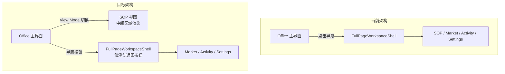
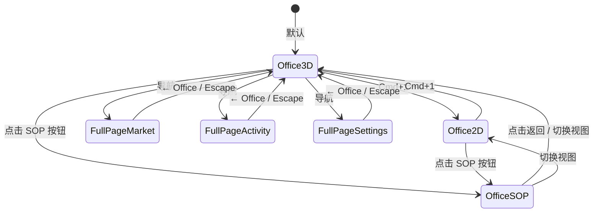
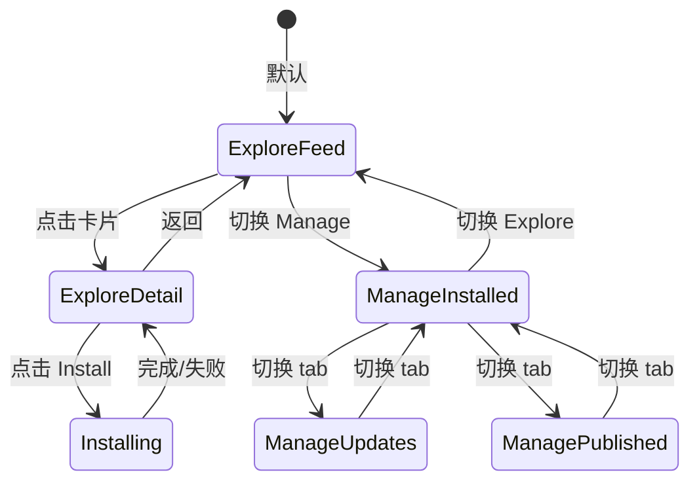

# 设计文档：全屏页面重写 (Fullscreen Pages Rebuild)

## 概述

本设计覆盖 Offisim 4 个全屏页面的完全重写：SOP（降级为 Office 视图模式）、Market、Activity Log 和 Settings。核心变更包括：

1. **导航架构重构** — SOP 从独立全屏页面降级为 Office 中间区域的视图模式（与 2D/3D 同级），Market/Activity Log/Settings 保留为独立全屏页面但精简外壳
2. **FullPageWorkspaceShell 精简** — 去除 header、tab pills、圆角容器，仅保留浮动返回按钮 + 全视口 children
3. **4 个页面全部删除重建** — 游戏风格 UI，全屏利用，1440px+ 宽屏优化

设计参考：[交接文档](../../Docs/superpowers/specs/2026-04-09-fullscreen-pages-handoff.md)

## 架构

### 导航架构变更



**关键路由变更：**

- `app-view-layout.ts`: 从 `FULL_PAGE_WORKSPACE_VIEWS` 移除 `'sops'`，新增 `OfficeViewMode = '2D' | '3D' | 'sop'`
- `App.tsx`: SOP 不再走 `isFullPageWorkspaceView()` 分支，改为通过 `OfficeWorkspaceShell` 的 `centerContent` 渲染
- `FullPageWorkspaceShell.tsx`: 完全重写，去除所有 chrome，仅保留浮动 `← Office` 按钮

### 视图模式状态机



### 整体组件层级

```
App.tsx
├── OfficeWorkspaceShell (view === 'office')
│   ├── Header (含 ViewMode 切换: 2D / 3D / SOP)
│   ├── AgentPanel (左侧 Team sidebar)
│   ├── centerContent:
│   │   ├── OfficeSceneSurface (viewMode === '2D' | '3D')
│   │   └── SopViewSurface (viewMode === 'sop')  ← 新增
│   └── CollaborationSidebar (右侧 Chat)
│
├── FullPageWorkspaceShell (view === 'market' | 'activity-log' | 'settings')
│   ├── FloatingBackButton ("← Office")
│   └── children (100vw × 100vh):
│       ├── MarketPage
│       ├── ActivityLogPage
│       └── SettingsPage
```

## 组件与接口

### 1. FullPageWorkspaceShell（精简版）

**文件**: `apps/web/src/components/workspaces/FullPageWorkspaceShell.tsx`

删除重建。去除 header、tab pills、圆角容器、`WORKSPACE_META` 映射。

#### 全屏布局设计

```
┌─────────────────────────────────────────────────────────────────────────┐
│                                                                         │
│  [← Office]  ← 浮动按钮 (absolute top-4 left-4 z-50)                   │
│              半透明背景 + backdrop-blur，hover 时不透明度增加             │
│              圆角胶囊形，内含箭头图标 + "Office" 文字                     │
│                                                                         │
│  ┌─────────────────────────────────────────────────────────────────┐    │
│  │                                                                 │    │
│  │                     children (100%)                             │    │
│  │                                                                 │    │
│  │              占据整个视口，无 padding/margin                     │    │
│  │              深色渐变背景（从 slate-950 到 slate-900）            │    │
│  │                                                                 │    │
│  │              各页面自行管理内部 padding                           │    │
│  │                                                                 │    │
│  └─────────────────────────────────────────────────────────────────┘    │
│                                                                         │
│  Escape 键监听 → onBackToOffice()                                       │
│                                                                         │
└─────────────────────────────────────────────────────────────────────────┘
```

```tsx
interface FullPageWorkspaceShellProps {
  onBackToOffice: () => void;
  children: ReactNode;
}
```

**关键实现细节：**
- 全屏 `div`（`fixed inset-0` 或 `h-screen w-screen`），深色渐变背景
- 浮动 `← Office` 按钮：`absolute top-4 left-4 z-50`，半透明 `bg-white/10 backdrop-blur-sm`，hover 时 `bg-white/20`
- `children` 占据 100% 视口，无额外 padding（各页面自行管理）
- 监听 Escape 键，触发 `onBackToOffice()`
- 无 header、无面包屑、无 tab pills、无圆角容器、无内边距限制

### 2. SOP 视图（Office 内嵌）

**目录**: `packages/ui-office/src/components/sop/`

SOP 不再是独立页面，而是 Office 中间区域的一个视图模式。删除现有 `workspace/` 子目录下的 3-pane 组件，重建为单一全宽视图。

#### 全屏布局设计

SOP 视图占据 Office 中间区域的全部可用空间（左侧 Team sidebar 和右侧 Chat panel 之间）。布局为垂直三段式：

```
┌─────────────────────────────────────────────────────────────────┐
│ SopLibraryBar (h-14)                                            │
│ [SOP 下拉选择器] [搜索] [Run ▶] [Edit ✏] [Import ↓] [+ Create]│
├─────────────────────────────────────────────────────────────────┤
│                                                                 │
│                    SopDagCanvas (flex-1)                         │
│                                                                 │
│   ┌──────────┐     ┌──────────┐     ┌──────────┐               │
│   │ Step 1   │────▶│ Step 2   │────▶│ Step 4   │               │
│   │ PM       │     │ Developer│     │ QA       │               │
│   │ ● Active │     │ ○ Pending│     │ ○ Pending│               │
│   └──────────┘     └──────────┘     └──────────┘               │
│                    ┌──────────┐          │                      │
│                    │ Step 3   │──────────┘                      │
│                    │ Designer │                                  │
│                    │ ○ Pending│                                  │
│                    └──────────┘                                  │
│                                                                 │
│   (可平移/缩放的 SVG 画布，节点间贝塞尔曲线连线)                  │
│   (节点 280×140px，列间距 120px，行间距 32px)                    │
│   (画布自动居中于内容，支持 wheel 缩放 + 拖拽平移)                │
│                                                                 │
├─────────────────────────────────────────────────────────────────┤
│ SopNlCommandBar (h-16)                                          │
│ [💬 For step "Design UI" (designer): ___________________] [Send]│
└─────────────────────────────────────────────────────────────────┘
```

**关键布局规则：**
- 顶部操作栏固定高度 56px，包含 SOP 选择器（下拉）、搜索、操作按钮
- 中间 DAG 画布占据所有剩余空间（`flex-1 overflow-hidden`）
- 底部 NL 命令栏固定高度 64px，类似 chat 输入框
- 无 SOP 选中时，中间区域显示全屏空状态引导（Create / Import 大按钮）
- DAG 画布是可交互的 SVG 容器，支持：
  - 鼠标滚轮缩放（0.25x ~ 2x）
  - 拖拽平移
  - 自动 fit-to-view（首次加载或双击空白区域）
  - 节点点击选中（高亮 + 预填 NL 输入）

**节点设计（n8n/Retool 风格）：**
- 尺寸 280×140px（比之前的 240×120 更大，全屏下需要更大的节点）
- 深色卡片背景 + 左侧角色颜色条（4px 宽）
- 内容：步骤标签（16px 粗体）、角色 badge（12px）、instruction 摘要（14px，2 行截断）
- 状态指示：左上角圆点（pending=灰、active=蓝脉冲、completed=绿、failed=红）
- Hover 效果：边框发光 + 轻微上浮阴影
- 选中效果：accent 色边框 + 更强发光

**连线设计：**
- SVG 贝塞尔曲线，从源节点右侧中点到目标节点左侧中点
- 默认灰色半透明，active 时蓝色 + 流动粒子动画
- completed 时绿色实线
- 列间距 120px 确保连线有足够弯曲空间

#### 新组件结构

```
sop/
├── SopViewSurface.tsx        ← 新：Office 中间区域入口（垂直三段布局）
├── SopLibraryBar.tsx          ← 新：顶部 SOP 选择 + 操作栏
├── SopDagCanvas.tsx           ← 新：可缩放/平移的全宽 DAG 画布
├── SopDagNode.tsx             ← 新：单个步骤节点（280×140px，n8n 风格）
├── SopDagEdge.tsx             ← 新：依赖连线（SVG 贝塞尔曲线 + 动画）
├── SopNlCommandBar.tsx        ← 新：底部自然语言输入栏
├── SopEmptyState.tsx          ← 新：无 SOP 时的全屏引导
├── SopEditorDialog.tsx        ← 保留
├── SopImportDialog.tsx        ← 保留
└── sop-dag-layout.ts          ← 新：DAG 布局算法（纯函数）
```

#### SopViewSurface

```tsx
interface SopViewSurfaceProps {
  sessionState: SopSessionState;
  onSessionStateChange: (updater: (prev: SopSessionState) => SopSessionState) => void;
}
```

**简化的 Session State**（去除 3-pane 相关字段）：

```tsx
type SopSessionState = {
  selectedSopId: string | null;
  search: string;
};
```

#### SopDagCanvas

可缩放/平移的全宽 DAG 渲染器。调用 `getExecutionBatches(definition)` 获取拓扑排序批次，按列（batch）× 行（batch 内步骤）布局。

```tsx
interface SopDagCanvasProps {
  definition: SopDefinition;
  runtimeState: SopRuntimeStepState[] | null;
  onStepClick: (stepId: string) => void;
  selectedStepId: string | null;
}
```

布局算法（`sop-dag-layout.ts`）：
- 输入：`SopDefinition`
- 输出：`{ nodes: DagNodeLayout[], edges: DagEdgeLayout[], totalWidth: number, totalHeight: number }`
- 每个 batch 占一列，列内步骤垂直排列
- 节点尺寸 280×140px，列间距 120px，行间距 32px
- 边为 SVG 贝塞尔曲线，从源节点右侧中点到目标节点左侧中点
- 输出 totalWidth/totalHeight 用于画布 fit-to-view 计算

#### SopDagNode

大尺寸节点卡片（280×140px），显示：
- 步骤标签（label）— 16px 粗体主标题
- 角色标识（role_slug）— 带颜色的 badge（左侧 4px 颜色条 + 右上角 badge）
- instruction 摘要 — 14px，最多 2 行，溢出截断
- 执行状态（status）— 左上角圆点 + 颜色（pending/active/completed/failed）
- 点击触发 `onStepClick`
- Hover/选中视觉反馈

```tsx
interface SopDagNodeProps {
  step: SopStep;
  status: SopStepStatus;
  selected: boolean;
  onClick: () => void;
}
```

### 3. Market 页面

**目录**: `packages/ui-office/src/components/marketplace/`

删除 `workspace/` 子目录下所有文件，重建为全屏游戏商店风格。

#### 全屏布局设计 — Explore 模式

Market 占据 100vw × 100vh（减去浮动返回按钮区域）。Explore 模式参考 Steam 商店首页：顶部紧凑过滤栏 + 全屏卡片网格。

```
┌─────────────────────────────────────────────────────────────────────────┐
│ [← Office]                                                              │
│                                                                         │
│ MarketFilterBar (h-16)                                                  │
│ [🔍 Search packages...] [Kind ▼] [Sort ▼] [Explore | Manage] [Publish] │
├─────────────────────────────────────────────────────────────────────────┤
│                                                                         │
│  MarketCardGrid (flex-1, overflow-y-auto, p-6)                          │
│                                                                         │
│  ┌─────────────┐ ┌─────────────┐ ┌─────────────┐ ┌─────────────┐      │
│  │ 🟦 Employee │ │ 🟪 Skill    │ │ 🟨 SOP      │ │ 🟩 Component│      │
│  │ "AI Coder"  │ │ "Code Rev"  │ │ "Deploy"    │ │ "Chart"     │      │
│  │ ★★★★☆ 4.2  │ │ ★★★★★ 4.8  │ │ ★★★☆☆ 3.5  │ │ ★★★★☆ 4.0  │      │
│  │ ↓ 1.2k      │ │ ↓ 3.4k      │ │ ↓ 890       │ │ ↓ 2.1k      │      │
│  │ @creator    │ │ @creator    │ │ @creator    │ │ @creator    │      │
│  └─────────────┘ └─────────────┘ └─────────────┘ └─────────────┘      │
│  ┌─────────────┐ ┌─────────────┐ ┌─────────────┐ ┌─────────────┐      │
│  │ ...         │ │ ...         │ │ ...         │ │ ...         │      │
│  └─────────────┘ └─────────────┘ └─────────────┘ └─────────────┘      │
│                                                                         │
│  (CSS Grid: auto-fill, minmax(280px, 1fr), gap-5)                       │
│  (1440px 下约 4-5 列，1920px 下约 5-6 列，自适应填满)                     │
│  (滚动到底部自动 loadMore)                                               │
│                                                                         │
└─────────────────────────────────────────────────────────────────────────┘
```

#### 全屏布局设计 — Detail 视图

点击卡片后进入详情视图，占据整个内容区域（替换卡片网格），不是 overlay：

```
┌─────────────────────────────────────────────────────────────────────────┐
│ [← Back to listings]                                                    │
│                                                                         │
│ ┌───────────────────────────────────┬───────────────────────────────┐   │
│ │ 左侧：Hero 区域 (60%)             │ 右侧：元数据 (40%)            │   │
│ │                                   │                               │   │
│ │ [Kind Badge: 🟦 Employee]         │ Version: 2.1.0                │   │
│ │                                   │ Creator: @handle              │   │
│ │ ████████████████████████          │ Rating: ★★★★☆ 4.2 (128)      │   │
│ │ █  Package Title       █          │ Installs: 1,234               │   │
│ │ █  Short description   █          │                               │   │
│ │ ████████████████████████          │ [████ Install ████]           │   │
│ │                                   │                               │   │
│ │ ── Tags ──                        │ ── Permissions ──             │   │
│ │ [ai] [coding] [automation]        │ ✓ Read files                  │   │
│ │                                   │ ✓ Execute commands            │   │
│ │ ── Description ──                 │ ✗ Network access              │   │
│ │ Full markdown description...      │                               │   │
│ │                                   │ ── Compatibility ──           │   │
│ │                                   │ Runtime: ≥1.2.0               │   │
│ └───────────────────────────────────┴───────────────────────────────┘   │
│                                                                         │
│ (两栏布局，左 60% 右 40%，内容填满视口高度)                               │
│ (Install 按钮醒目，使用 kind 对应的稀有度 accent 色)                      │
│                                                                         │
└─────────────────────────────────────────────────────────────────────────┘
```

#### 全屏布局设计 — Manage 模式

```
┌─────────────────────────────────────────────────────────────────────────┐
│ [← Office]                                                              │
│                                                                         │
│ MarketFilterBar (h-16)                                                  │
│ [🔍 Search...] [Explore | Manage]                                       │
│ [Installed (12)] [Updates (3)] [Published (1)]  ← 子 tab                │
├─────────────────────────────────────────────────────────────────────────┤
│                                                                         │
│  全宽列表/表格视图 (flex-1, overflow-y-auto)                             │
│                                                                         │
│  ┌─────────────────────────────────────────────────────────────────┐    │
│  │ 🟦 AI Coder v2.1.0    │ @creator │ Installed 3d ago │ [Update] │    │
│  ├─────────────────────────────────────────────────────────────────┤    │
│  │ 🟪 Code Review v1.0.0 │ @creator │ Installed 1w ago │ [Up to date]│ │
│  ├─────────────────────────────────────────────────────────────────┤    │
│  │ 🟨 Deploy SOP v3.2.1  │ @creator │ Installed 2w ago │ [Update] │    │
│  └─────────────────────────────────────────────────────────────────┘    │
│                                                                         │
│  (全宽行，每行显示 kind 图标 + 名称 + 版本 + creator + 安装时间 + 操作)  │
│  (无已安装包时显示 "No packages installed" + "Browse the store" 按钮)    │
│                                                                         │
└─────────────────────────────────────────────────────────────────────────┘
```

**关键布局规则：**
- 过滤栏固定在顶部（h-16），搜索框宽度自适应（`flex-1`），过滤器紧凑排列
- 卡片网格使用 CSS Grid `auto-fill, minmax(280px, 1fr)`，自动填满视口宽度
- 卡片高度固定 220px，内容垂直分布：kind badge → 标题 → 描述 → 评分/安装数 → creator
- 每张卡片有 kind 对应的稀有度边框发光效果（hover 时增强）
- Detail 视图是全屏替换（不是 overlay），左右两栏 60/40 分割
- Manage 模式使用全宽行列表，不是卡片网格
- 错误状态（Connection Lost）占据整个内容区域，居中显示游戏风格错误图标 + 重试按钮

#### 新组件结构

```
marketplace/
├── MarketPage.tsx             ← 新：全屏入口（路由 Explore/Detail/Manage）
├── MarketFilterBar.tsx        ← 新：顶部过滤栏（搜索 + kind + sort + mode 切换）
├── MarketCardGrid.tsx         ← 新：CSS Grid 全屏卡片网格（auto-fill）
├── MarketListingCard.tsx      ← 新：单张 listing 卡片（280px min，稀有度配色）
├── MarketDetailView.tsx       ← 新：listing 详情全屏两栏视图
├── MarketManageView.tsx       ← 新：Manage 模式全宽行列表
├── MarketErrorState.tsx       ← 新：游戏风格 "Connection Lost" 全屏错误界面
├── MarketEmptyState.tsx       ← 新：搜索无结果 / 无已安装包 空状态
├── marketplace-meta.tsx       ← 保留（KIND_ICON, KIND_FILTERS, SORT_OPTIONS）
├── PermissionsBlock.tsx       ← 保留
├── PublishDialog.tsx          ← 保留
└── market-rarity.ts           ← 新：AssetKind → 稀有度配色映射
```

#### MarketPage

```tsx
interface MarketPageProps {
  sessionState: MarketSessionState;
  onSessionStateChange: (updater: (prev: MarketSessionState) => MarketSessionState) => void;
  onStartInstall?: (listingId: string, version: string) => void;
}
```

#### Market 状态机



#### MarketListingCard

卡片根据 `AssetKind` 使用不同的"稀有度"配色（`market-rarity.ts`）：

```tsx
const RARITY_COLORS: Record<AssetKind, { border: string; glow: string; badge: string }> = {
  employee: { border: 'border-blue-500/40', glow: 'shadow-blue-500/20', badge: 'bg-blue-500/20 text-blue-300' },
  skill:    { border: 'border-purple-500/40', glow: 'shadow-purple-500/20', badge: 'bg-purple-500/20 text-purple-300' },
  sop:      { border: 'border-amber-500/40', glow: 'shadow-amber-500/20', badge: 'bg-amber-500/20 text-amber-300' },
  component:{ border: 'border-emerald-500/40', glow: 'shadow-emerald-500/20', badge: 'bg-emerald-500/20 text-emerald-300' },
  // ... 其他 kind
};
```

### 4. Activity Log 页面

**目录**: `packages/ui-office/src/components/events/`

删除 `workspace/` 子目录下所有文件，重建为游戏事件日志风格。

#### 全屏布局设计

Activity Log 占据 100vw × 100vh。参考游戏战斗日志/事件记录界面。布局为：顶部过滤栏 + 左侧时间线主体 + 右侧事件详情面板（选中事件时展开）。

**默认视图（无事件选中）：**

```
┌─────────────────────────────────────────────────────────────────────────┐
│ [← Office]                                                              │
│                                                                         │
│ ActivityFilterBar (h-16)                                                │
│ [📅 Last 30 days ▼] [Type ▼] [Actor ▼] [🔍 Search events...]          │
├─────────────────────────────────────────────────────────────────────────┤
│                                                                         │
│  ActivityTimeline (flex-1, overflow-y-auto, 全宽)                       │
│                                                                         │
│  ── Today ──────────────────────────────────────────────────────────    │
│  │ 🔵 UserCheck │ Employee "Alice" created        │ 2:34 PM │ Info  │  │
│  │ 🟡 Plug      │ MCP server connection timeout   │ 2:12 PM │ Warn  │  │
│  │ 🔵 GitBranch │ Auto-commit: fix login flow     │ 1:58 PM │ Info  │  │
│  │ 🔴 Zap       │ Pipeline execution failed       │ 1:45 PM │ Error │  │
│  │ 🔵 BookOpen  │ Knowledge base updated          │ 1:30 PM │ Info  │  │
│                                                                         │
│  ── Yesterday ──────────────────────────────────────────────────────    │
│  │ 🔵 UserCheck │ Employee "Bob" skill assigned   │ 5:20 PM │ Info  │  │
│  │ 🔵 Package   │ "AI Coder" v2.1 installed       │ 3:15 PM │ Info  │  │
│  │ ...                                                               │  │
│                                                                         │
│  ── This Week ──────────────────────────────────────────────────────    │
│  │ ...                                                               │  │
│                                                                         │
│  (每行全宽，左侧域图标 + 事件标签 + 右侧时间戳 + 级别色条)              │
│  (行高 48px，hover 高亮，级别色：Info=默认, Warn=amber-500, Error=red-500)│
│  (时间分组标题用半透明分隔线 + 粗体标签)                                  │
│                                                                         │
└─────────────────────────────────────────────────────────────────────────┘
```

**事件选中视图（右侧详情面板展开）：**

```
┌─────────────────────────────────────────────────────────────────────────┐
│ [← Office]                                                              │
│                                                                         │
│ ActivityFilterBar (h-16)                                                │
│ [📅 Last 30 days ▼] [Type ▼] [Actor ▼] [🔍 Search events...]          │
├──────────────────────────────────────┬──────────────────────────────────┤
│                                      │                                  │
│  ActivityTimeline (60%)              │  ActivityEventDetail (40%)       │
│                                      │                                  │
│  ── Today ─────────────────────      │  Event: employee.created         │
│  │ 🔵 Employee "Alice" created │◀──│  Level: 🔵 Info                  │
│  │ 🟡 MCP timeout             │     │  Time: Apr 9, 2:34:12 PM        │
│  │ 🔵 Auto-commit             │     │                                  │
│  │ 🔴 Pipeline failed         │     │  ── Entity ──                    │
│  │ ...                        │     │  Type: Employee                   │
│  │                            │     │  ID: emp_abc123                   │
│  │                            │     │  Name: Alice                      │
│  │                            │     │                                  │
│  │                            │     │  ── Payload ──                    │
│  │                            │     │  role: developer                  │
│  │                            │     │  skills: [typescript, react]      │
│  │                            │     │  assignedZone: engineering        │
│  │                            │     │                                  │
│  │                            │     │  (格式化的 key-value 展示，       │
│  │                            │     │   不是原始 JSON dump)             │
│  │                            │     │                                  │
│  └────────────────────────────┘     └──────────────────────────────────┘
│                                                                         │
│  (选中事件时，时间线缩为 60%，右侧展开 40% 详情面板)                     │
│  (详情面板用游戏成就/任务详情风格，非纯文本)                              │
│  (payload 按 key-value 格式化展示，嵌套对象可折叠)                       │
│                                                                         │
└─────────────────────────────────────────────────────────────────────────┘
```

**关键布局规则：**
- 过滤栏固定顶部（h-16），4 个过滤器水平排列，搜索框 `flex-1`
- 默认 datePreset 为 `'30d'`（不是 `'today'`）
- 无事件选中时，时间线占据全宽
- 选中事件时，时间线缩为 60%，右侧 40% 展开详情面板（带过渡动画）
- 事件行全宽，高度 48px，内容水平排列：域图标(24px) → 事件标签(flex-1) → 时间戳(固定宽) → 级别色条(4px)
- 时间分组标题：半透明背景条 + 粗体标签 + 事件计数
- Error 行左侧有 4px 红色边条，Warning 行有 4px 琥珀色边条
- 详情面板：游戏成就/任务详情风格，payload 格式化为 key-value 表格（非 JSON dump）
- 空状态（无事件）：全屏居中，游戏风格图标 + "No activity recorded yet" 文案
- 过滤无结果：保留过滤栏，内容区显示 "No events match your filters" + 重置按钮

#### 新组件结构

```
events/
├── ActivityLogPage.tsx        ← 新：全屏入口（过滤栏 + 时间线 + 详情面板）
├── ActivityFilterBar.tsx      ← 新：顶部过滤栏（日期 + 类型 + actor + 搜索）
├── ActivityTimeline.tsx       ← 新：全宽/60% 事件时间线（按时间分组）
├── ActivityTimeGroup.tsx      ← 新：时间分组标题 + 事件列表
├── ActivityEventRow.tsx       ← 新：单行事件（全宽，48px 高）
├── ActivityEventDetail.tsx    ← 新：右侧 40% 事件详情面板
├── ActivityPayloadView.tsx    ← 新：格式化 payload 展示（key-value，可折叠）
├── ActivityEmptyState.tsx     ← 新：无事件 / 过滤无结果 空状态
├── activity-log-utils.ts     ← 保留（getDateCutoff, matchesActorFilters 等）
├── EventLog.tsx               ← 保留（hydrateEventLogStore, getEventLevel 等）
└── EventItem.tsx              ← 保留（getDisplayLabel）
```

#### ActivityLogPage

```tsx
interface ActivityLogPageProps {
  sessionState: ActivityLogSessionState;
  onSessionStateChange: (updater: (prev: ActivityLogSessionState) => ActivityLogSessionState) => void;
}
```

**修改的默认状态**：`datePreset` 默认值从 `'today'` 改为 `'30d'`。

#### 时间分组算法

事件按时间戳分组为 "Today"、"Yesterday"、"This Week"、"This Month"、"Older" 等桶。这是一个纯函数：

```tsx
type TimeGroup = { label: string; events: Array<{ event: RuntimeEvent; level: EventDisplayLevel }> };

function groupEventsByTime(events: FilteredEvent[]): TimeGroup[];
```

#### 组合过滤管道

四种过滤器（日期、事件类型、Actor、搜索）通过管道组合：

```tsx
function filterEvents(
  events: RuntimeEvent[],
  filters: { datePreset: DatePreset; eventTypes: string[]; actorFilters: string[]; search: string }
): Array<{ event: RuntimeEvent; level: EventDisplayLevel }>;
```

每个过滤器独立应用，事件必须通过所有活跃过滤器才会出现在结果中。

### 5. Settings 页面

**目录**: `packages/ui-office/src/components/settings/`

删除 `SettingsPage.tsx`，重建为游戏设置菜单风格。`SettingsWorkspaceSurface.tsx` 保留（共享 Surface，同时服务 Dialog 和 Page）。

#### 全屏布局设计

Settings 占据 100vw × 100vh。参考 Cyberpunk 2077 / Fortnite 设置菜单：左侧垂直 tab 导航 + 右侧内容区填满。

```
┌─────────────────────────────────────────────────────────────────────────┐
│ [← Office]                                                              │
│                                                                         │
│ ┌──────────────┬────────────────────────────────────────────────────┐   │
│ │              │                                                    │   │
│ │ SettingsTab  │  Settings 内容区 (flex-1)                          │   │
│ │ Nav (w-56)   │                                                    │   │
│ │              │  ── Provider ──────────────────────────────────     │   │
│ │ ┌──────────┐ │                                                    │   │
│ │ │▶Provider │ │  Preset    [OpenAI ▼] [Anthropic] [Custom]        │   │
│ │ ├──────────┤ │                                                    │   │
│ │ │ Runtime  │ │  API Key   [••••••••••••••••] [👁]                 │   │
│ │ ├──────────┤ │                                                    │   │
│ │ │ MCP      │ │  Model     [gpt-4o________________]               │   │
│ │ ├──────────┤ │                                                    │   │
│ │ │ Gateway  │ │  Base URL  [https://api.openai.com_]              │   │
│ │ └──────────┘ │                                                    │   │
│ │              │  Headers   [{"Authorization": "..."}]              │   │
│ │              │                                                    │   │
│ │              │                                                    │   │
│ │              │                                                    │   │
│ │              │                                                    │   │
│ │              │                                                    │   │
│ │              │                                                    │   │
│ │              │  ┌─────────────────────────────────────────────┐   │   │
│ │              │  │  hasUnsavedChanges → [████ Save ████]       │   │   │
│ │              │  └─────────────────────────────────────────────┘   │   │
│ └──────────────┴────────────────────────────────────────────────────┘   │
│                                                                         │
│ (左侧 tab 导航 w-56 = 224px，深色背景，选中 tab 有 accent 色左边条)     │
│ (右侧内容区 flex-1，设置项按组分块，每组有标题分隔线)                    │
│ (设置项：标签左对齐，控件右对齐，行高 48px，紧凑排列)                    │
│ (Save 按钮固定在内容区底部，未修改时 disabled，修改后 accent 色高亮)     │
│ (内容区可滚动，tab 导航固定)                                             │
│                                                                         │
└─────────────────────────────────────────────────────────────────────────┘
```

**Runtime tab 布局示例：**

```
── Execution ──────────────────────────────────────────
  Mode              [Auto ▼]  (auto / sequential / parallel)

── Summarization ──────────────────────────────────────
  Enabled           [●]
  Trigger Tokens    [4096_______]
  Keep Recent       [5__________]

── Memory ─────────────────────────────────────────────
  Enabled           [●]
  Injection         [●]
  Max Facts         [100________]
  Confidence        [0.7________]

── Tools ──────────────────────────────────────────────
  Tool Search       [●]
  Git Auto-commit   [●]  (desktop only)
  Permissions       [Ask ▼]  (ask / allow / deny)

── Display ────────────────────────────────────────────
  Density           [Normal ▼]  (compact / normal / spacious)
```

**关键布局规则：**
- 左侧 tab 导航固定宽度 224px（w-56），深色背景，与内容区有 1px 分隔线
- 选中 tab 有 4px accent 色左边条 + 背景高亮
- 右侧内容区 `flex-1 overflow-y-auto`，内边距 p-8
- 设置项按功能分组，每组有标题分隔线（半透明 + 粗体标签）
- 每个设置项：标签左对齐 + 控件右对齐，行高 48px
- 开关用 toggle switch，选择用 dropdown，文本用 input
- Save 按钮固定在内容区底部（`sticky bottom-0`），未修改时 `opacity-50 cursor-not-allowed`，修改后 accent 色 + 脉冲动画
- MCP tab 和 Gateway tab 直接渲染现有的 `McpConfigPanel` 和 `OpenClawSettings`，但需要确保它们在全屏宽度下正确填充

#### 新组件结构

```
settings/
├── SettingsPage.tsx            ← 新：全屏入口（左右两栏布局）
├── SettingsTabNav.tsx          ← 新：左侧垂直 tab 导航（w-56，深色）
├── SettingsContentArea.tsx     ← 新：右侧内容区容器（flex-1，滚动，sticky Save）
├── SettingsGroupSection.tsx    ← 新：设置分组（标题分隔线 + 设置项列表）
├── SettingsRow.tsx             ← 新：单行设置项（标签 + 控件，48px 高）
├── SettingsWorkspaceSurface.tsx← 保留（共享 controller hook + 内容渲染）
├── SettingsProviderTab.tsx     ← 保留（但需适配全屏宽度）
├── SettingsRuntimeTab.tsx      ← 保留（但需适配全屏宽度）
├── McpConfigPanel.tsx          ← 保留
├── provider-presets.ts         ← 保留
├── settings-primitives.tsx     ← 保留
└── SettingsDialog.tsx          ← 保留
```

#### SettingsPage

```tsx
interface SettingsPageProps {
  sessionState: SettingsSessionState;
  onSessionStateChange: (updater: (prev: SettingsSessionState) => SettingsSessionState) => void;
  onBack: () => void;
  onSave: (config: ProviderConfig) => void;
  onSaveSuccess?: () => void;
}
```

## 数据模型

### 核心类型（来自 @offisim/shared-types，不修改）

```tsx
// SOP 相关
interface SopDefinition {
  sop_id: string;
  name: string;
  steps: SopStep[];
}

interface SopStep {
  step_id: string;
  label: string;
  role_slug: RoleSlug;
  instruction: string;
  dependencies: string[];  // DAG 边
  output_key: string;
}

// Market 相关
interface ListingSummary {
  listing_id: string;
  title: string;
  summary: string;
  kind: AssetKind;
  creator: { handle: string };
  rating: number;
  install_count: number;
}

interface ListingDetail extends ListingSummary {
  permissions: Permission[];
  tags: string[];
  latest_version: string;
}

type AssetKind = 'employee' | 'skill' | 'sop' | 'component' | 'company_template' | 'office_layout' | 'prefab' | 'bundle';
type MarketSortOption = 'relevance' | 'newest' | 'rating' | 'installs';

// Event 相关
interface RuntimeEvent {
  type: string;
  timestamp: number;
  entityId?: string;
  entityType?: string;
  payload: Record<string, unknown>;
}
```

### 新增类型

```tsx
// Office 视图模式扩展
type OfficeViewMode = '2D' | '3D' | 'sop';

// DAG 布局输出
interface DagNodeLayout {
  stepId: string;
  step: SopStep;
  x: number;
  y: number;
  width: number;   // 默认 280px
  height: number;  // 默认 140px
  batchIndex: number;
}

interface DagEdgeLayout {
  fromStepId: string;
  toStepId: string;
  fromPoint: { x: number; y: number };  // 源节点右侧中点
  toPoint: { x: number; y: number };    // 目标节点左侧中点
  status: SopStepStatus;
}

// DAG 布局常量
const DAG_LAYOUT = {
  nodeWidth: 280,
  nodeHeight: 140,
  columnGap: 120,   // 列间距（batch 间）
  rowGap: 32,       // 行间距（同 batch 内步骤间）
  padding: 40,      // 画布内边距
} as const;

// Market 稀有度配色
interface RarityColorScheme {
  border: string;
  glow: string;
  badge: string;
  gradient: string;
}

// Activity Log 时间分组
interface TimeGroup {
  label: string;
  events: Array<{ event: RuntimeEvent; level: EventDisplayLevel }>;
}

// 修改的默认状态
// ActivityLogSessionState.datePreset 默认值: 'today' → '30d'
```

### Session State 变更

```tsx
// SopSessionState 简化（去除 3-pane 字段）
type SopSessionState = {
  selectedSopId: string | null;
  search: string;
  // 移除: leftPaneMode, centerMode, rightPaneTab
};

// OfficeSessionState 扩展
type OfficeSessionState = {
  viewMode: OfficeViewMode;  // '2D' | '3D' → '2D' | '3D' | 'sop'
  selectedEmployeeId: string | null;
  studioMode: 'create' | 'edit' | null;
};

// FullPageWorkspaceAppView 缩减
const FULL_PAGE_WORKSPACE_VIEWS = ['market', 'activity-log', 'settings'] as const;
// 移除: 'sops'
```

## 正确性属性

*正确性属性是在系统所有有效执行中都应成立的特征或行为——本质上是关于系统应该做什么的形式化陈述。属性是人类可读规范与机器可验证正确性保证之间的桥梁。*

### Property 1: DAG 拓扑排序批次不变量

*对于任意*有效的 `SopDefinition`（步骤间依赖构成 DAG），`getExecutionBatches(definition)` 返回的批次应满足：(1) 所有步骤恰好出现一次，(2) 同一批次内没有步骤依赖于同批次的另一个步骤，(3) 每个步骤的所有依赖都出现在更早的批次中。

**Validates: Requirements 3.2**

### Property 2: SOP 定义序列化往返

*对于任意*有效的 `SopDefinition` 对象，将其序列化为 JSON 字符串后调用 `parseSopDefinition()` 解析，应返回与原始对象等价的结构（steps 数组长度相同，每个 step 的 step_id、label、role_slug、dependencies 一致）。

**Validates: Requirements 3.4**

### Property 3: SOP 命令消息格式化

*对于任意* SOP 名称字符串 `name`、步骤标签 `label` 和角色 `role`：
- Run 命令应生成 `"Run the SOP: {name}"`
- Modify 命令应生成 `"Modify the SOP \"{name}\": {text}"`
- 步骤点击预填应生成 `"For step \"{label}\" ({role}): "`

**Validates: Requirements 3.5, 3.6, 3.7**

### Property 4: SOP 步骤节点渲染完整性

*对于任意* `SopStep` 和 `SopStepStatus`，渲染的步骤节点应包含步骤标签（label）、角色标识（role_slug）和执行状态指示。

**Validates: Requirements 3.3, 3.12**

### Property 5: Market 搜索过滤正确性

*对于任意*搜索查询字符串和 `ListingSummary` 集合，过滤后的结果中每个 listing 的 title 或 summary 应包含搜索查询（大小写不敏感匹配）。

**Validates: Requirements 4.3**

### Property 6: Market Kind 过滤正确性

*对于任意* `AssetKind` 过滤值和 `ListingSummary` 集合，当过滤值不为 `'all'` 时，过滤后的结果中每个 listing 的 `kind` 应等于所选过滤值。

**Validates: Requirements 4.4**

### Property 7: Market 排序正确性

*对于任意* `MarketSortOption` 和 `ListingSummary` 集合，排序后的结果应满足相邻元素的排序键单调递减（rating 按评分降序，installs 按安装数降序，newest 按时间降序）。

**Validates: Requirements 4.5**

### Property 8: 事件显示标签与级别提取

*对于任意* `RuntimeEvent`，`getEventLevel(event)` 应返回 `'Info' | 'Warning' | 'Error'` 之一，且 `getDisplayLabel(event)` 应返回非空字符串（从 payload 中提取可读标签，或回退到事件类型）。

**Validates: Requirements 5.3**

### Property 9: 事件时间分组正确性

*对于任意*事件集合，`groupEventsByTime(events)` 返回的分组应满足：(1) 所有输入事件恰好出现在一个分组中，(2) 每个分组内的事件按时间戳降序排列，(3) 分组间按时间从新到旧排列。

**Validates: Requirements 5.4**

### Property 10: Actor 过滤器正确性

*对于任意* `RuntimeEvent` 和 actor 过滤器列表，`matchesActorFilters(event, actorFilters)` 应满足：当过滤器列表为空时返回 `true`；当过滤器列表非空时，返回 `true` 当且仅当事件的 actor 标签在过滤器列表中。

**Validates: Requirements 5.7**

### Property 11: Activity Log 组合过滤管道

*对于任意*事件集合和过滤器组合（日期、事件类型、Actor、搜索），过滤后的每个事件应同时满足所有活跃过滤条件：时间戳 ≥ 日期截止点、事件类型匹配前缀、actor 匹配过滤器、搜索词出现在 type/label/entityType 中。

**Validates: Requirements 5.12**

### Property 12: Settings 未保存变更检测

*对于任意*两个配置快照对象，`hasUnsavedChanges` 应返回 `true` 当且仅当两个对象不深度相等。

**Validates: Requirements 6.7**

## 错误处理

### Market 页面

| 错误场景 | 处理方式 |
|---------|---------|
| 网络请求失败 | 显示游戏风格 "Connection Lost" 全屏错误界面，含重试按钮和错误描述 |
| Listing 详情不可用 | Toast 提示 "The selected listing is no longer available"，自动返回列表 |
| 安装失败 | Toast 错误提示，保留当前视图状态 |
| 搜索无结果 | 显示空状态提示，含重置过滤器按钮 |

### SOP 视图

| 错误场景 | 处理方式 |
|---------|---------|
| SOP 定义 JSON 解析失败 | `parseSopDefinition` 返回 `null`，显示 "Invalid SOP definition" 提示 |
| 选中的 SOP 被删除 | Toast 提示，自动清除选中状态 |
| sendMessage 失败 | NL 输入栏恢复可编辑状态，Toast 错误提示 |
| DAG 存在循环依赖 | `getExecutionBatches` 提前终止（`batch.length === 0` 检测），显示已解析的部分 |

### Activity Log 页面

| 错误场景 | 处理方式 |
|---------|---------|
| EventBus 断开 | 显示最后已知的事件列表，顶部 banner 提示连接状态 |
| 选中事件不再可用 | Toast 提示，自动返回时间线视图 |
| 事件 payload 格式异常 | `getDisplayLabel` 回退到事件类型字符串，不崩溃 |

### Settings 页面

| 错误场景 | 处理方式 |
|---------|---------|
| localStorage 写入失败 | Toast 错误提示 "Failed to save configuration" |
| Provider 预设加载失败 | 回退到手动输入模式 |
| 未保存变更时导航离开 | 浏览器 `beforeunload` 提示（已有机制） |

## 测试策略

### 属性测试（Property-Based Testing）

使用 `fast-check` 库，每个属性测试最少 100 次迭代。

**适用的属性测试：**

1. **DAG 拓扑排序** — 生成随机有效 DAG，验证 `getExecutionBatches` 的三个不变量
2. **SOP 定义往返** — 生成随机 `SopDefinition`，验证 JSON 序列化/反序列化往返
3. **SOP 命令格式化** — 生成随机名称/标签/角色字符串，验证消息格式
4. **步骤节点渲染** — 生成随机步骤数据，验证渲染输出包含所有必要信息
5. **Market 搜索过滤** — 生成随机 listings 和搜索词，验证过滤正确性
6. **Market Kind 过滤** — 生成随机 listings 和 kind，验证过滤正确性
7. **Market 排序** — 生成随机 listings 和排序选项，验证排序正确性
8. **事件级别提取** — 生成随机事件，验证 `getEventLevel` 返回有效级别
9. **事件时间分组** — 生成随机时间戳事件，验证分组不变量
10. **Actor 过滤** — 生成随机事件和过滤器，验证 `matchesActorFilters` 语义
11. **组合过滤管道** — 生成随机事件和过滤器组合，验证所有过滤条件同时满足
12. **未保存变更检测** — 生成随机配置对象对，验证深度比较正确性

每个属性测试标注格式：`Feature: fullscreen-pages-rebuild, Property {N}: {描述}`

### 单元测试（Example-Based）

- FullPageWorkspaceShell 渲染：验证仅有返回按钮，无 header/tabs/圆角容器
- SOP 视图模式切换：验证 2D ↔ 3D ↔ SOP 切换正确
- `FULL_PAGE_WORKSPACE_VIEWS` 不含 `'sops'`
- Market 模式切换（Explore ↔ Manage）
- Market 错误状态渲染
- Activity Log 默认 `datePreset` 为 `'30d'`
- Settings tab 切换渲染正确内容
- Escape 键从全屏页面返回 Office

### 集成测试

- SOP 视图在 Office 布局中正确渲染（保留 sidebar + chat）
- Market 安装流程端到端
- Activity Log 实时事件流订阅
- Settings 保存 → localStorage → 回调链路
