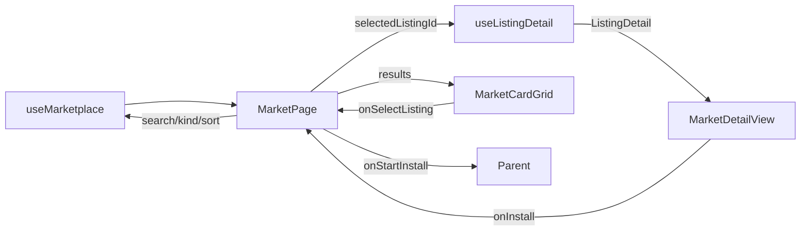
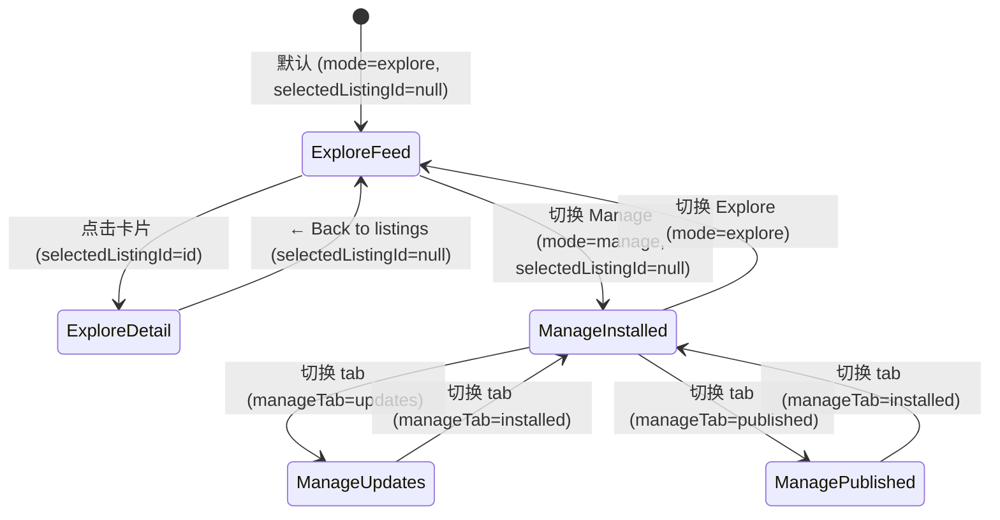

# 设计文档：Market 页面重建 (Market Page Rebuild)

## 概述

本设计覆盖 Market 页面内容的完全重建——从现有 3-pane 小面板设计重建为全屏游戏商店风格界面。核心变更：

1. **删除现有 workspace/ 组件** — MarketWorkspacePage、MarketWorkspaceExplore、MarketWorkspaceDetail、MarketWorkspaceManage、MarketWorkspaceSidebar、MarketWorkspaceContextPane
2. **删除旧面板组件** — MarketplacePanel、MarketplaceDetailOverlay、InstalledList、ListingCard
3. **新建全屏游戏商店布局** — MarketFilterBar（顶部过滤栏）+ MarketCardGrid（CSS Grid 卡片网格）+ MarketDetailView（两栏详情）+ MarketManageView（全宽行列表）
4. **稀有度配色系统** — AssetKind → Rarity_Color 映射，卡片边框发光效果
5. **纯数据模块** — market-rarity.ts 可独立测试

本 spec 不涉及导航架构变更（由 navigation-architecture spec 处理），仅实现 Market 页面的内容渲染。

依赖：navigation-architecture spec 提供的精简 FullPageWorkspaceShell（浮动返回按钮 + 全视口 children）。

## 架构

### 组件层级

```
FullPageWorkspaceShell (view === 'market')
├── FloatingBackButton ("← Office")
└── children:
    └── MarketPage                          ← 全屏入口（路由 Explore/Detail/Manage）
        ├── MarketFilterBar                  ← 顶部 h-16：搜索 + Kind + Sort + 模式切换 + Publish
        ├── MarketCardGrid                   ← Explore 模式：CSS Grid 卡片网格 + 无限滚动
        │   └── MarketListingCard × N        ← 单张卡片（280px min, 220px 高, 稀有度配色）
        ├── MarketDetailView                 ← Detail 视图：左 60% Hero + 右 40% 元数据
        │   └── PermissionsBlock             ← 保留：权限展示
        ├── MarketManageView                 ← Manage 模式：全宽行列表
        ├── MarketErrorState                 ← 错误状态："Connection Lost"
        ├── MarketEmptyState                 ← 空状态：无结果 / 无已安装包
        └── PublishDialog                    ← 保留：发布对话框
```

### 数据流



### 状态机



### 全屏布局设计 — Explore 模式

```
┌─────────────────────────────────────────────────────────────────────────┐
│ [← Office]                                                              │
│                                                                         │
│ MarketFilterBar (h-16)                                                  │
│ [🔍 Search packages...] [Kind ▼] [Sort ▼] [Explore | Manage] [Publish] │
├─────────────────────────────────────────────────────────────────────────┤
│                                                                         │
│  MarketCardGrid (flex-1, overflow-y-auto, p-6)                          │
│                                                                         │
│  ┌─────────────┐ ┌─────────────┐ ┌─────────────┐ ┌─────────────┐      │
│  │ 🟦 Employee │ │ 🟪 Skill    │ │ 🟨 SOP      │ │ 🟩 Component│      │
│  │ "AI Coder"  │ │ "Code Rev"  │ │ "Deploy"    │ │ "Chart"     │      │
│  │ ★★★★☆ 4.2  │ │ ★★★★★ 4.8  │ │ ★★★☆☆ 3.5  │ │ ★★★★☆ 4.0  │      │
│  │ ↓ 1.2k      │ │ ↓ 3.4k      │ │ ↓ 890       │ │ ↓ 2.1k      │      │
│  │ @creator    │ │ @creator    │ │ @creator    │ │ @creator    │      │
│  └─────────────┘ └─────────────┘ └─────────────┘ └─────────────┘      │
│                                                                         │
│  (CSS Grid: auto-fill, minmax(280px, 1fr), gap-5)                       │
│  (1440px 下约 4-5 列，1920px 下约 5-6 列，自适应填满)                     │
│  (滚动到底部自动 loadMore)                                               │
│                                                                         │
└─────────────────────────────────────────────────────────────────────────┘
```

### 全屏布局设计 — Detail 视图

```
┌─────────────────────────────────────────────────────────────────────────┐
│ [← Back to listings]                                                    │
│                                                                         │
│ ┌───────────────────────────────────┬───────────────────────────────┐   │
│ │ 左侧：Hero 区域 (60%)             │ 右侧：元数据 (40%)            │   │
│ │                                   │                               │   │
│ │ [Kind Badge: 🟦 Employee]         │ Version: 2.1.0                │   │
│ │                                   │ Creator: @handle              │   │
│ │ ████████████████████████          │ Rating: ★★★★☆ 4.2 (128)      │   │
│ │ █  Package Title       █          │ Installs: 1,234               │   │
│ │ █  Short description   █          │                               │   │
│ │ ████████████████████████          │ [████ Install ████]           │   │
│ │                                   │                               │   │
│ │ ── Tags ──                        │ ── Permissions ──             │   │
│ │ [ai] [coding] [automation]        │ PermissionsBlock              │   │
│ │                                   │                               │   │
│ │ ── Description ──                 │ ── Compatibility ──           │   │
│ │ Full markdown description...      │ Runtime: ≥1.2.0               │   │
│ └───────────────────────────────────┴───────────────────────────────┘   │
└─────────────────────────────────────────────────────────────────────────┘
```

### 全屏布局设计 — Manage 模式

```
┌─────────────────────────────────────────────────────────────────────────┐
│ [← Office]                                                              │
│                                                                         │
│ MarketFilterBar (h-16)                                                  │
│ [🔍 Search...] [Explore | Manage]                                       │
│ [Installed (12)] [Updates (3)] [Published (1)]  ← 子 tab                │
├─────────────────────────────────────────────────────────────────────────┤
│                                                                         │
│  全宽列表视图 (flex-1, overflow-y-auto)                                  │
│                                                                         │
│  ┌─────────────────────────────────────────────────────────────────┐    │
│  │ 🟦 AI Coder v2.1.0    │ @creator │ Installed 3d ago │ [Update] │    │
│  ├─────────────────────────────────────────────────────────────────┤    │
│  │ 🟪 Code Review v1.0.0 │ @creator │ Installed 1w ago │ [Up to date]│ │
│  ├─────────────────────────────────────────────────────────────────┤    │
│  │ 🟨 Deploy SOP v3.2.1  │ @creator │ Installed 2w ago │ [Update] │    │
│  └─────────────────────────────────────────────────────────────────┘    │
└─────────────────────────────────────────────────────────────────────────┘
```

## 组件与接口

### 1. MarketPage — 全屏入口

**文件**: `packages/ui-office/src/components/marketplace/MarketPage.tsx`

Market 全屏页面入口。管理模式路由、过滤器同步、详情加载和子组件编排。

```tsx
interface MarketPageProps {
  sessionState: MarketSessionState;
  onSessionStateChange: (updater: (prev: MarketSessionState) => MarketSessionState) => void;
  onStartInstall?: (listingId: string, version: string) => void;
}

type MarketSessionState = {
  mode: 'explore' | 'manage';
  selectedListingId: string | null;
  search: string;
  sort: MarketSortOption;
  kind: AssetKind | 'all';
  manageTab: 'installed' | 'updates' | 'published';
};
```

**职责：**
- 调用 `useMarketplace()` 获取搜索结果和过滤器控制
- 调用 `useListingDetail(selectedListingId)` 获取选中 listing 详情
- 通过 `useEffect` 同步 sessionState 的 search/kind/sort 到 useMarketplace hook
- 管理 `publishDialogOpen` 状态
- 根据 mode + selectedListingId 路由到 CardGrid / DetailView / ManageView
- 检测 listing unavailable 时 Toast 提示

**布局结构：**
```tsx
<div className="flex h-full flex-col">
  <MarketFilterBar ... />
  <div className="flex-1 overflow-y-auto">
    {/* 根据状态渲染 CardGrid / DetailView / ManageView / ErrorState / EmptyState */}
  </div>
</div>
```

### 2. MarketFilterBar — 顶部过滤栏

**文件**: `packages/ui-office/src/components/marketplace/MarketFilterBar.tsx`

```tsx
interface MarketFilterBarProps {
  mode: 'explore' | 'manage';
  search: string;
  sort: MarketSortOption;
  kind: AssetKind | 'all';
  manageTab: 'installed' | 'updates' | 'published';
  onModeChange: (mode: 'explore' | 'manage') => void;
  onSearchChange: (search: string) => void;
  onSortChange: (sort: MarketSortOption) => void;
  onKindChange: (kind: AssetKind | 'all') => void;
  onManageTabChange: (tab: 'installed' | 'updates' | 'published') => void;
  onPublishClick: () => void;
}
```

**布局：** 固定高度 64px（h-16），水平排列，内边距 px-6：
- 搜索输入框（`<Input>`，flex-1，placeholder "Search packages..."，左侧 Search 图标）
- Kind 下拉（`<Select>`，使用 `KIND_FILTERS` 数据，仅 Explore 模式显示）
- Sort 下拉（`<Select>`，使用 `SORT_OPTIONS` 数据，仅 Explore 模式显示）
- Explore/Manage 切换按钮组（两个 `<Button>`，选中态高亮）
- Publish 按钮（`<Button>`，仅 Explore 模式显示）
- Manage 模式下额外显示子 tab 行：Installed / Updates / Published

### 3. MarketCardGrid — 卡片网格

**文件**: `packages/ui-office/src/components/marketplace/MarketCardGrid.tsx`

```tsx
interface MarketCardGridProps {
  results: ListingSummary[];
  isLoading: boolean;
  isLoadingMore: boolean;
  hasMore: boolean;
  onSelectListing: (listingId: string) => void;
  onLoadMore: () => void;
}
```

**布局：** CSS Grid 全屏卡片网格：
```tsx
<div className="grid grid-cols-[repeat(auto-fill,minmax(280px,1fr))] gap-5 p-6">
  {results.map(listing => (
    <MarketListingCard key={listing.listing_id} listing={listing} onClick={onSelectListing} />
  ))}
</div>
```

**无限滚动实现：**
- 使用 `IntersectionObserver` 监听底部哨兵元素
- 当哨兵进入视口且 `hasMore` 为 true 时调用 `onLoadMore()`
- 加载中显示底部 spinner

**加载骨架屏：**
- `isLoading` 为 true 时渲染 8 个骨架卡片（`animate-pulse` 占位块）

### 4. MarketListingCard — 单张卡片

**文件**: `packages/ui-office/src/components/marketplace/MarketListingCard.tsx`

```tsx
interface MarketListingCardProps {
  listing: ListingSummary;
  onClick: (listingId: string) => void;
}
```

**视觉设计（220px 高）：**
```
┌─────────────────────────────────────┐
│ [Kind Badge]              @creator  │  ← 顶部行
│                                     │
│ Package Title (16px bold)           │  ← 标题
│ Summary text that spans up to       │  ← 摘要 (2 行截断)
│ two lines before truncating...      │
│                                     │
│ ★★★★☆ 4.2    ↓ 1.2k installs      │  ← 底部统计
└─────────────────────────────────────┘
```

- 深色卡片背景（`bg-white/[0.04] border border-white/10`）
- 稀有度边框发光：使用 `RARITY_COLORS[listing.kind]` 的 border 和 glow 类
- Hover 效果：增强 glow + `border-{color}/60`（从 /40 增强到 /60）
- Kind badge：使用 `RARITY_COLORS[listing.kind].badge` 类 + `KIND_ICON[listing.kind]` 图标
- 评分：星级图标 + 数值（1 位小数）
- 安装数：使用 `formatInstallCount()` 格式化

### 5. MarketDetailView — 详情视图

**文件**: `packages/ui-office/src/components/marketplace/MarketDetailView.tsx`

```tsx
interface MarketDetailViewProps {
  detail: ListingDetail | null;
  loading: boolean;
  unavailable: boolean;
  onBack: () => void;
  onInstall: (listingId: string, version: string) => void;
}
```

**布局：** 全屏两栏，左 60% 右 40%：
```tsx
<div className="flex h-full">
  {/* 返回按钮 */}
  <button onClick={onBack} className="absolute top-4 left-4 z-10 ...">
    ← Back to listings
  </button>

  {/* 左侧 Hero 区域 */}
  <div className="w-3/5 overflow-y-auto p-8">
    {/* Kind badge + 标题 + 摘要 + 标签 + 完整描述 */}
  </div>

  {/* 右侧元数据 */}
  <div className="w-2/5 border-l border-white/10 overflow-y-auto p-8">
    {/* 版本 + creator + 评分 + 安装数 + Install 按钮 + PermissionsBlock + 兼容性 */}
  </div>
</div>
```

**Install 按钮样式：**
- 使用 `getRarityColor(detail.kind)` 获取 accent 色
- 全宽按钮，稀有度颜色背景 + hover 增强

**加载/不可用状态：**
- `loading` 时显示骨架屏（左右两栏占位块）
- `unavailable` 时显示 "Listing unavailable" + 返回按钮

### 6. MarketManageView — Manage 模式

**文件**: `packages/ui-office/src/components/marketplace/MarketManageView.tsx`

```tsx
interface MarketManageViewProps {
  manageTab: 'installed' | 'updates' | 'published';
  onStartInstall: (listingId: string, version: string) => void;
  onGoToExplore: () => void;
}
```

**布局：** 全宽行列表：
```tsx
<div className="divide-y divide-white/5">
  {items.map(item => (
    <div key={item.id} className="flex items-center gap-4 px-6 py-4 hover:bg-white/[0.02]">
      <KindIcon />
      <span className="flex-1 font-medium">{item.name}</span>
      <span className="text-sm text-slate-400">v{item.version}</span>
      <span className="text-sm text-slate-500">@{item.creator}</span>
      <span className="text-sm text-slate-500">{item.installedAt}</span>
      <ActionButton />
    </div>
  ))}
</div>
```

每行高度约 56px，内容水平排列：Kind 图标(24px) → 名称(flex-1) → 版本 → creator → 安装时间 → 操作按钮。

### 7. MarketErrorState — 错误状态

**文件**: `packages/ui-office/src/components/marketplace/MarketErrorState.tsx`

```tsx
interface MarketErrorStateProps {
  error: string;
  onRetry: () => void;
}
```

游戏风格 "Connection Lost" 全屏错误界面：
- 居中布局，大图标（WifiOff 或 AlertTriangle）
- "Connection Lost" 标题（24px bold）
- 错误描述文本（14px，半透明）
- Retry 按钮（accent 色，带脉冲动画）

### 8. MarketEmptyState — 空状态

**文件**: `packages/ui-office/src/components/marketplace/MarketEmptyState.tsx`

```tsx
interface MarketEmptyStateProps {
  variant: 'no-results' | 'no-installed' | 'no-updates' | 'no-published';
  onAction: () => void;
  actionLabel: string;
}
```

根据 variant 显示不同文案和操作按钮：
- `no-results`: "No packages found" + "Reset filters" 按钮
- `no-installed`: "No packages installed" + "Browse the store" 按钮
- `no-updates`: "All packages up to date" + 无操作按钮
- `no-published`: "No published packages" + "Publish your first" 按钮

### 9. market-rarity.ts — 稀有度配色映射

**文件**: `packages/ui-office/src/components/marketplace/market-rarity.ts`

纯数据模块，无 React 依赖，可独立测试。

```tsx
import type { AssetKind } from '@offisim/asset-schema';

interface RarityColorScheme {
  border: string;   // Tailwind border 类
  glow: string;     // Tailwind shadow 类
  badge: string;    // Tailwind bg + text 类
  accent: string;   // Tailwind bg 类（用于 Install 按钮等）
}

const RARITY_COLORS: Record<string, RarityColorScheme> = {
  employee:         { border: 'border-blue-500/40',    glow: 'shadow-blue-500/20',    badge: 'bg-blue-500/20 text-blue-300',    accent: 'bg-blue-500 hover:bg-blue-400' },
  skill:            { border: 'border-purple-500/40',  glow: 'shadow-purple-500/20',  badge: 'bg-purple-500/20 text-purple-300',  accent: 'bg-purple-500 hover:bg-purple-400' },
  sop:              { border: 'border-amber-500/40',   glow: 'shadow-amber-500/20',   badge: 'bg-amber-500/20 text-amber-300',   accent: 'bg-amber-500 hover:bg-amber-400' },
  component:        { border: 'border-emerald-500/40', glow: 'shadow-emerald-500/20', badge: 'bg-emerald-500/20 text-emerald-300', accent: 'bg-emerald-500 hover:bg-emerald-400' },
  company_template: { border: 'border-cyan-500/40',    glow: 'shadow-cyan-500/20',    badge: 'bg-cyan-500/20 text-cyan-300',    accent: 'bg-cyan-500 hover:bg-cyan-400' },
  office_layout:    { border: 'border-rose-500/40',    glow: 'shadow-rose-500/20',    badge: 'bg-rose-500/20 text-rose-300',    accent: 'bg-rose-500 hover:bg-rose-400' },
  prefab:           { border: 'border-orange-500/40',  glow: 'shadow-orange-500/20',  badge: 'bg-orange-500/20 text-orange-300',  accent: 'bg-orange-500 hover:bg-orange-400' },
  bundle:           { border: 'border-indigo-500/40',  glow: 'shadow-indigo-500/20',  badge: 'bg-indigo-500/20 text-indigo-300',  accent: 'bg-indigo-500 hover:bg-indigo-400' },
};

const DEFAULT_RARITY: RarityColorScheme = {
  border: 'border-slate-500/40',
  glow: 'shadow-slate-500/20',
  badge: 'bg-slate-500/20 text-slate-300',
  accent: 'bg-slate-500 hover:bg-slate-400',
};

function getRarityColor(kind: AssetKind): RarityColorScheme {
  return RARITY_COLORS[kind] ?? DEFAULT_RARITY;
}
```

## 数据模型

### 核心类型（来自 @offisim/registry-client 和 @offisim/asset-schema，不修改）

```tsx
interface ListingSummary {
  listing_id: string;
  title: string;
  summary: string;
  kind: AssetKind;
  creator: { handle: string };
  rating: number;
  install_count: number;
}

interface ListingDetail extends ListingSummary {
  permissions: PermissionSummary;
  tags: string[];
  latest_version: string;
}

type AssetKind = 'employee' | 'skill' | 'sop' | 'component' | 'company_template' | 'office_layout' | 'prefab' | 'bundle';
```

### 现有 Hook 接口（不修改）

```tsx
// useMarketplace()
interface UseMarketplaceResult {
  results: ListingSummary[];
  query: string;
  setQuery: (query: string) => void;
  filters: { kind: AssetKind | 'all'; sort: MarketSortOption };
  setKind: (kind: AssetKind | 'all') => void;
  setSort: (sort: MarketSortOption) => void;
  isLoading: boolean;
  isLoadingMore: boolean;
  error: string | null;
  hasMore: boolean;
  loadMore: () => void;
}

// useListingDetail(listingId)
interface UseListingDetailResult {
  detail: ListingDetail | null;
  loading: boolean;
  unavailable: boolean;
}
```

### Session State 类型

```tsx
type MarketSessionState = {
  mode: 'explore' | 'manage';
  selectedListingId: string | null;
  search: string;
  sort: MarketSortOption;
  kind: AssetKind | 'all';
  manageTab: 'installed' | 'updates' | 'published';
};
```

### 新增类型

```tsx
// market-rarity.ts
interface RarityColorScheme {
  border: string;
  glow: string;
  badge: string;
  accent: string;
}
```

### 保留的组件

以下组件保留不动：
- `marketplace-meta.tsx` — KIND_ICON、KIND_FILTERS、SORT_OPTIONS、formatInstallCount、formatRiskLabel
- `PermissionsBlock.tsx` — 权限展示组件
- `PublishDialog.tsx` — 发布对话框

### 删除的组件

以下组件将被删除（workspace/ 目录）：
- `workspace/MarketWorkspacePage.tsx`
- `workspace/MarketWorkspaceExplore.tsx`
- `workspace/MarketWorkspaceDetail.tsx`
- `workspace/MarketWorkspaceManage.tsx`
- `workspace/MarketWorkspaceSidebar.tsx`
- `workspace/MarketWorkspaceContextPane.tsx`

以下旧组件在新实现中不再需要：
- `MarketplacePanel.tsx` — 被 MarketPage 替代
- `MarketplaceDetailOverlay.tsx` — 被 MarketDetailView 替代
- `InstalledList.tsx` — 被 MarketManageView 替代
- `ListingCard.tsx` — 被 MarketListingCard 替代

## 正确性属性

### Property 1: 稀有度配色映射完整性

*对于任意* `AssetKind` 值 `kind`，`getRarityColor(kind)` 返回的 `RarityColorScheme` 应满足：`border`、`glow`、`badge`、`accent` 四个字段均为非空字符串。

**Validates: Requirements 7.2**

### Property 2: 安装数格式化不变量

*对于任意*非负整数 `n`，`formatInstallCount(n)` 应返回非空字符串。且：
- 当 `n < 1000` 时，返回值等于 `String(n)`
- 当 `n >= 1000` 时，返回值以 "k" 结尾

**Validates: Requirements 8.1, 8.2, 8.3, 8.4**

### Property 3: 模式切换清除选中状态

*对于任意* `MarketSessionState`，当 mode 从 'explore' 切换到 'manage' 时，结果状态的 `selectedListingId` 应为 `null`。

**Validates: Requirements 1.5**

## 错误处理

| 场景 | 处理方式 |
|------|---------|
| useMarketplace 返回 error | MarketPage 渲染 MarketErrorState，显示 "Connection Lost" + Retry 按钮 |
| useListingDetail 返回 unavailable | MarketDetailView 显示 "Listing unavailable" + 返回按钮，Toast 提示 |
| useListingDetail 返回 loading | MarketDetailView 显示骨架屏 |
| 搜索/过滤无结果 | MarketEmptyState variant="no-results" + Reset filters 按钮 |
| Manage 无已安装包 | MarketEmptyState variant="no-installed" + Browse the store 按钮 |
| IntersectionObserver 不支持 | 降级为手动 "Load more" 按钮 |

## 测试策略

### 属性测试（Property-Based Testing）

使用 `fast-check` 库，每个属性测试最少 100 次迭代。

1. **Property 1: 稀有度配色完整性** — 从 AssetKind 联合类型中随机选取 kind，验证 getRarityColor 返回完整的 4 字段配色方案
2. **Property 2: 安装数格式化** — 生成随机非负整数，验证 formatInstallCount 返回非空字符串且满足 <1000/>=1000 的格式规则
3. **Property 3: 模式切换清除选中** — 生成随机 MarketSessionState，模拟 explore→manage 切换，验证 selectedListingId 被清除

每个属性测试标注格式：`Feature: market-page-rebuild, Property {N}: {描述}`

### 单元测试（Example-Based）

- MarketPage 根据 mode 渲染 CardGrid 或 ManageView
- MarketPage 在 selectedListingId 非 null 时渲染 DetailView
- MarketFilterBar 渲染搜索框、Kind/Sort 下拉和模式切换
- MarketListingCard 渲染 title、rating、install_count 和 kind badge
- MarketDetailView 渲染左右两栏布局
- MarketErrorState 渲染 "Connection Lost" + Retry 按钮
- MarketEmptyState 根据 variant 渲染不同文案

### 测试工具

- vitest + @testing-library/react
- fast-check（属性测试）
