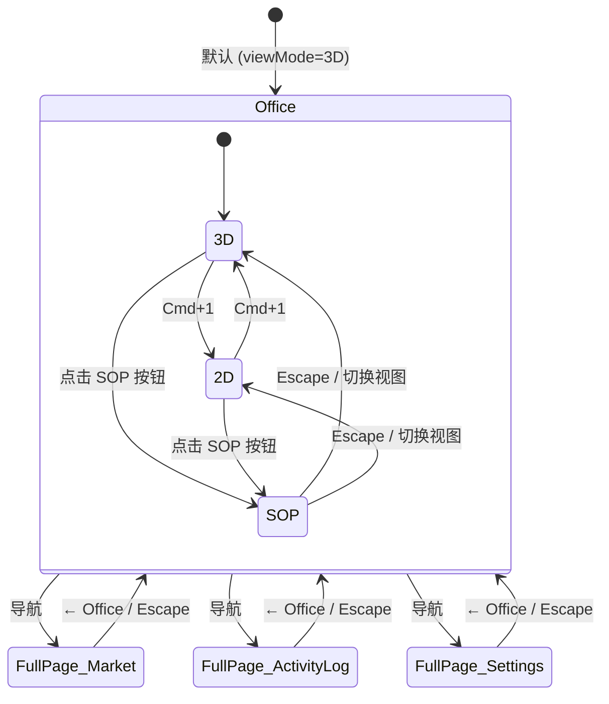

# 设计文档：导航架构重构 (Navigation Architecture)

## 概述

本设计覆盖 Offisim 导航层面的三项架构变更，是其余 4 个页面 spec（SOP、Market、Activity Log、Settings）的基础依赖。

变更范围：
1. **FullPageWorkspaceShell 精简** — 删除重建，去除所有 chrome，仅保留浮动返回按钮 + 全视口 children
2. **SOP 路由降级** — 从 `FULL_PAGE_WORKSPACE_VIEWS` 移除，改为 Office 中间区域的 `OfficeViewMode`
3. **Escape 键处理** — 全屏页面 + SOP 视图模式的统一退出逻辑

本 spec 不涉及任何页面内容实现，仅处理导航管道。

## 架构

### 路由状态机



### 组件层级变更

```
App.tsx
├── OfficeWorkspaceShell (view === 'office')
│   ├── centerContent:
│   │   ├── OfficeSceneSurface (viewMode === '2D' | '3D')
│   │   └── <div>SOP placeholder</div> (viewMode === 'sop')  ← 新增
│   └── sceneView.viewMode: OfficeViewMode  ← 类型扩展
│
├── FullPageWorkspaceShell (view === 'market' | 'activity-log' | 'settings')
│   ├── FloatingBackButton ("← Office")  ← 精简后仅此
│   ├── Escape 键监听 → onBackToOffice()
│   └── children (100vw × 100vh)
```

## 组件与接口

### 1. app-view-layout.ts 类型变更

**文件**: `apps/web/src/lib/app-view-layout.ts`

```typescript
// 变更 1: FULL_PAGE_WORKSPACE_VIEWS 移除 'sops'
export const FULL_PAGE_WORKSPACE_VIEWS = [
  'market',
  'activity-log',
  'settings',
] as const satisfies readonly AppView[];

// 变更 2: WORKSPACE_VIEWS 保持不变（仍含 'sops'）
export const WORKSPACE_VIEWS = [
  'office',
  'sops',
  'market',
  'activity-log',
  'settings',
] as const satisfies readonly AppView[];

// 变更 3: 新增 OfficeViewMode 类型
export type OfficeViewMode = '2D' | '3D' | 'sop';
```

`isFullPageWorkspaceView('sops')` 将自动返回 `false`，无需修改函数体。

### 2. FullPageWorkspaceShell（精简版）

**文件**: `apps/web/src/components/workspaces/FullPageWorkspaceShell.tsx`

删除现有文件，从零重建。

#### 新接口

```typescript
interface FullPageWorkspaceShellProps {
  onBackToOffice: () => void;
  children: ReactNode;
}
```

#### 布局结构

```
┌─────────────────────────────────────────────────────┐
│ [← Office]  (absolute top-4 left-4 z-50)            │
│              bg-white/10 backdrop-blur-sm             │
│              hover:bg-white/20                        │
│                                                       │
│         children (100vw × 100vh, 无 padding)          │
│                                                       │
│  深色渐变背景:                                         │
│  bg-[radial-gradient(circle_at_top,                   │
│      #14203d_0%,#0a1022_38%,#050814_100%)]            │
│                                                       │
│  Escape 键 → onBackToOffice()                         │
└─────────────────────────────────────────────────────┘
```

#### 实现要点

- 根容器: `fixed inset-0` 或 `h-screen w-screen`，深色径向渐变背景（复用现有渐变）
- 浮动返回按钮: `<button>` 使用 `absolute top-4 left-4 z-50`，`bg-white/10 backdrop-blur-sm rounded-lg`，内含 `<ArrowLeft />` 图标 + "Office" 文字
- children 直接渲染在根容器内，无额外 wrapper/padding
- `useEffect` 注册 `keydown` 监听器，Escape 键触发 `onBackToOffice()`，卸载时清理

#### 移除项

| 移除内容 | 原因 |
|---------|------|
| `header` 区域（← Office 按钮、公司名、Workspace 标签、面包屑） | 改为浮动按钮 |
| `WORKSPACE_META` 映射 + tab pills | 不再需要页面间切换 |
| 圆角容器（`rounded-[28px] border max-w-[1700px]`） | children 全视口 |
| `activeWorkspace` / `companyName` / `onOpenSettings` / `onWorkspaceSwitch` props | 精简接口 |

### 3. App.tsx 路由变更

**文件**: `apps/web/src/App.tsx`

#### 3a. viewMode 类型扩展

```typescript
// 变更前
const [viewMode, setViewMode] = useState<'2D' | '3D'>('3D');

// 变更后
import type { OfficeViewMode } from './lib/app-view-layout';
const [viewMode, setViewMode] = useState<OfficeViewMode>('3D');
```

#### 3b. SOP 路由从全屏分支移至 Office 分支

当 `viewMode === 'sop'` 时，`OfficeWorkspaceShell` 的 `centerContent` 渲染 SOP 占位符（具体内容由 sop-view-rebuild spec 实现）。

`sceneView` prop 传递扩展后的 `viewMode` 和 `setViewMode`，让 OfficeWorkspaceShell 内部根据 viewMode 决定中间区域内容。

#### 3c. FullPageWorkspaceShell 调用精简

```typescript
// 变更前
<FullPageWorkspaceShell
  activeWorkspace={view as FullPageWorkspaceAppView}
  companyName={activeCompanyName}
  onBackToOffice={() => handleWorkspaceSwitch('office')}
  onOpenSettings={handleOpenSettings}
  onWorkspaceSwitch={(workspace) => handleWorkspaceSwitch(workspace)}
>

// 变更后
<FullPageWorkspaceShell
  onBackToOffice={() => handleWorkspaceSwitch('office')}
>
```

#### 3d. Escape 键处理变更

现有 Escape 处理已使用 `isFullPageWorkspaceView(view)` 判断。移除 `'sops'` 后，`view === 'sops'` 不再匹配全屏分支。

新增 SOP viewMode 的 Escape 处理：

```typescript
// 在 Escape handler 中，全屏页面判断之前添加：
if (view === 'office' && viewMode === 'sop') {
  setViewMode('3D');  // 或记住之前的模式
  return;
}
```

#### 3e. isNonOfficeWorkspace 判断

现有代码 `const isNonOfficeWorkspace = isFullPageWorkspaceView(view)` 在移除 `'sops'` 后自动排除 SOP，无需额外修改。

## 数据模型

### 新增类型

```typescript
// apps/web/src/lib/app-view-layout.ts
export type OfficeViewMode = '2D' | '3D' | 'sop';
```

### 修改的常量

```typescript
// FULL_PAGE_WORKSPACE_VIEWS: 移除 'sops'
// 变更前: ['sops', 'market', 'activity-log', 'settings']
// 变更后: ['market', 'activity-log', 'settings']
```

### 类型影响

- `FullPageWorkspaceAppView` 自动从联合类型中排除 `'sops'`（因为它从 `FULL_PAGE_WORKSPACE_VIEWS` 推导）
- `WorkspaceAppView` 不变（仍含 `'sops'`）
- `FullPageWorkspaceShellProps` 从 6 个 props 精简为 2 个


## 正确性属性 (Correctness Properties)

*正确性属性是在系统所有有效执行中都应成立的特征或行为——本质上是对系统应做什么的形式化陈述。属性是人类可读规范与机器可验证正确性保证之间的桥梁。*

本 spec 主要涉及类型变更、组件精简和路由逻辑，大部分验收标准是具体的配置断言（EXAMPLE）或类型级检查（SMOKE）。经过 prework 分析，识别出一个适合属性测试的不变量：

### Property 1: Escape 键从任意全屏页面返回 Office

*For any* view in `FULL_PAGE_WORKSPACE_VIEWS`（即 `'market' | 'activity-log' | 'settings'`），当用户按下 Escape 键时，应用应导航回 Office 视图。

**Validates: Requirements 5.1**

> 注：虽然当前域只有 3 个值，但这个属性验证了一个重要的不变量——所有全屏页面对 Escape 键的响应行为一致。如果未来新增全屏页面，该属性自动覆盖。

## 错误处理

| 场景 | 处理方式 |
|------|---------|
| `viewMode` 收到无效值 | TypeScript 编译期拒绝，运行时 `OfficeViewMode` 联合类型保证 |
| Escape 键在有 overlay 打开时按下 | 现有优先级链不变：shortcutHelp → dashboard → kanban → marketplace → employeeEditor → selectedEmployee → 全屏页面/SOP viewMode |
| FullPageWorkspaceShell 卸载后 Escape 事件 | `useEffect` cleanup 移除监听器，不会触发已卸载组件的回调 |
| SOP viewMode 下 Cmd+1 快捷键 | 现有 Cmd+1 handler 在 2D/3D 间切换，需确保 viewMode='sop' 时 Cmd+1 行为合理（切换到 2D 或 3D） |

## 测试策略

### 单元测试（Example-based）

1. **app-view-layout.ts**
   - `FULL_PAGE_WORKSPACE_VIEWS` 不含 `'sops'`，仅含 `['market', 'activity-log', 'settings']`
   - `isFullPageWorkspaceView('sops')` 返回 `false`
   - `isWorkspaceView('sops')` 返回 `true`
   - `OfficeViewMode` 类型编译检查

2. **FullPageWorkspaceShell**
   - 渲染浮动返回按钮（含 ArrowLeft 图标 + "Office" 文字）
   - 不渲染 header、tab pills、圆角容器
   - children 正常渲染
   - Escape 键触发 `onBackToOffice()`
   - 卸载后 Escape 不触发回调

3. **App.tsx 路由逻辑**
   - `view='sops'` 时不渲染 FullPageWorkspaceShell
   - `viewMode='sop'` 时 Office 中间区域渲染 SOP 占位
   - FullPageWorkspaceShell 仅接收 `onBackToOffice` + `children`

### 属性测试（Property-based）

- **Property 1**: 使用 fast-check 从 `FULL_PAGE_WORKSPACE_VIEWS` 中随机选取 view，模拟 Escape 键，验证导航回 Office
- 最少 100 次迭代
- Tag: `Feature: navigation-architecture, Property 1: Escape from any fullscreen page returns to Office`

### 测试工具

- vitest + @testing-library/react
- fast-check（属性测试）
