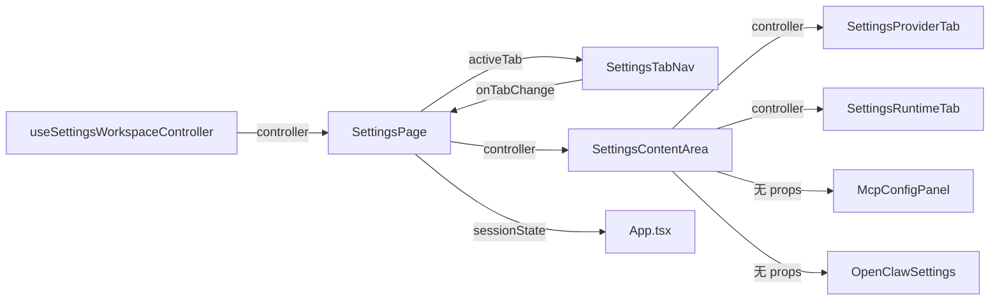

# 设计文档：Settings 页面重建 (Settings Page Rebuild)

## 概述

本设计覆盖 Settings 页面全屏入口的完全重建——从现有简单包装组件重建为游戏设置菜单风格（Cyberpunk 2077 / Fortnite）的全屏界面。核心变更：

1. **删除现有 SettingsPage.tsx** — 当前仅是 SettingsWorkspaceSurface 的薄包装，不适合全屏布局
2. **新建游戏设置菜单布局** — SettingsTabNav（左侧垂直 tab 导航 w-56）+ SettingsContentArea（右侧内容区 flex-1 + sticky Save 按钮）
3. **新增布局原子组件** — SettingsGroupSection（分组标题 + 设置项列表）、SettingsRow（标签 + 控件，48px 行高）
4. **保留共享层** — SettingsWorkspaceSurface + useSettingsWorkspaceController 不变，确保 SettingsDialog 和 SettingsPage 行为一致

本 spec 不涉及导航架构变更（由 navigation-architecture spec 处理），不修改 SettingsWorkspaceSurface、SettingsProviderTab、SettingsRuntimeTab、McpConfigPanel 等共享组件。

依赖：navigation-architecture spec 提供的精简 FullPageWorkspaceShell（浮动返回按钮 + 全视口 children）。

## 架构

### 组件层级

```
FullPageWorkspaceShell (view === 'settings')
├── FloatingBackButton ("← Office")
└── children:
    └── SettingsPage                            ← 全屏入口（左右两栏布局）
        ├── SettingsTabNav                       ← 左侧 w-56：Provider / Runtime / MCP / Gateway
        └── SettingsContentArea                  ← 右侧 flex-1：tab 内容 + sticky Save
            ├── SettingsProviderTab              ← activeTab='provider' 时渲染（保留）
            ├── SettingsRuntimeTab               ← activeTab='runtime' 时渲染（保留）
            ├── McpConfigPanel                   ← activeTab='mcp' 时渲染（保留）
            ├── OpenClawSettings                 ← activeTab='openclaw' 时渲染（保留）
            └── Save 按钮 (sticky bottom)        ← hasUnsavedChanges 驱动样式
```

### 数据流



### 全屏布局设计

```
┌─────────────────────────────────────────────────────────────────────────┐
│ [← Office]                                                              │
│                                                                         │
│ ┌──────────────┬────────────────────────────────────────────────────┐   │
│ │ SettingsTab  │  Settings 内容区 (flex-1, overflow-y-auto, p-8)    │   │
│ │ Nav (w-56)   │                                                    │   │
│ │              │  ── Provider ──────────────────────────────────     │   │
│ │ ┌──────────┐ │                                                    │   │
│ │ │▶Provider │ │  Preset    [OpenAI ▼] [Anthropic] [Custom]        │   │
│ │ ├──────────┤ │                                                    │   │
│ │ │ Runtime  │ │  API Key   [••••••••••••••••] [👁]                 │   │
│ │ ├──────────┤ │                                                    │   │
│ │ │ MCP      │ │  Model     [gpt-4o________________]               │   │
│ │ ├──────────┤ │                                                    │   │
│ │ │ Gateway  │ │  Base URL  [https://api.openai.com_]              │   │
│ │ └──────────┘ │                                                    │   │
│ │              │  Headers   [{"Authorization": "..."}]              │   │
│ │              │                                                    │   │
│ │              │                                                    │   │
│ │              │  ┌─────────────────────────────────────────────┐   │   │
│ │              │  │  hasUnsavedChanges → [████ Save ████]       │   │   │
│ │              │  └─────────────────────────────────────────────┘   │   │
│ └──────────────┴────────────────────────────────────────────────────┘   │
│                                                                         │
└─────────────────────────────────────────────────────────────────────────┘
```

**Runtime tab 布局示例：**

```
── Execution ──────────────────────────────────────────
  Mode              [Auto ▼]  (auto / sequential / parallel)

── Summarization ──────────────────────────────────────
  Enabled           [●]
  Trigger Tokens    [4096_______]
  Keep Recent       [5__________]

── Memory ─────────────────────────────────────────────
  Enabled           [●]
  Injection         [●]
  Max Facts         [100________]
  Confidence        [0.7________]

── Tools ──────────────────────────────────────────────
  Tool Search       [●]
  Git Auto-commit   [●]  (desktop only)
  Permissions       [Ask ▼]  (ask / allow / deny)

── Display ────────────────────────────────────────────
  Density           [Normal ▼]  (compact / normal / spacious)
```

## 组件与接口

### 1. SettingsPage — 全屏入口

**文件**: `packages/ui-office/src/components/settings/SettingsPage.tsx`

删除现有文件，从零重建。全屏设置页面入口，编排左右两栏布局，管理 controller 和 tab 状态。

```tsx
interface SettingsPageProps {
  sessionState: SettingsSessionState;
  onSessionStateChange: (
    updater: (prev: SettingsSessionState) => SettingsSessionState,
  ) => void;
  onBack: () => void;
  onSave: (config: ProviderConfig) => void;
  onSaveSuccess?: () => void;
}

type SettingsSessionState = {
  activeTab: SettingsTab;
};
```

**职责：**
- 调用 `useSettingsWorkspaceController({ isActive: true, onDismiss: onBack, onSave, onSaveSuccess })` 获取 controller
- 编排左右两栏布局：SettingsTabNav + SettingsContentArea
- 将 `sessionState.activeTab` 传递给 SettingsTabNav 和 SettingsContentArea
- 将 controller 传递给 SettingsContentArea

**布局结构：**
```tsx
<div className="flex h-full">
  <SettingsTabNav
    activeTab={sessionState.activeTab}
    onTabChange={(tab) => onSessionStateChange((prev) => ({ ...prev, activeTab: tab }))}
  />
  <SettingsContentArea
    activeTab={sessionState.activeTab}
    controller={controller}
  />
</div>
```

### 2. SettingsTabNav — 左侧垂直 tab 导航

**文件**: `packages/ui-office/src/components/settings/SettingsTabNav.tsx`

新建组件。左侧固定宽度垂直 tab 导航，游戏设置菜单风格。

```tsx
interface SettingsTabNavProps {
  activeTab: SettingsTab;
  onTabChange: (tab: SettingsTab) => void;
}
```

**Tab 配置常量：**
```tsx
const SETTINGS_TABS: Array<{ key: SettingsTab; label: string; icon: LucideIcon }> = [
  { key: 'provider', label: 'Provider', icon: Bot },
  { key: 'runtime', label: 'Runtime', icon: Cpu },
  { key: 'mcp', label: 'MCP', icon: Plug },
  { key: 'openclaw', label: 'Gateway', icon: Workflow },
];
```

**视觉设计：**
- 容器：`w-56 flex-shrink-0 border-r border-white/10 bg-slate-950/60 py-6`
- 每个 tab 按钮：`w-full h-12 flex items-center gap-3 px-5 text-sm transition-colors`
- 选中状态：`border-l-[4px] border-cyan-400 bg-white/[0.06] text-white`
- 未选中状态：`border-l-[4px] border-transparent text-slate-400 hover:text-slate-200 hover:bg-white/[0.03]`
- 图标：`h-4 w-4`

### 3. SettingsContentArea — 右侧内容区

**文件**: `packages/ui-office/src/components/settings/SettingsContentArea.tsx`

新建组件。右侧内容区容器，根据 activeTab 渲染对应内容，底部 sticky Save 按钮。

```tsx
interface SettingsContentAreaProps {
  activeTab: SettingsTab;
  controller: ReturnType<typeof useSettingsWorkspaceController>;
}
```

**布局结构：**
```tsx
<div className="flex flex-1 flex-col min-h-0">
  <div className="flex-1 overflow-y-auto p-8">
    {activeTab === 'provider' && <SettingsProviderTab controller={controller} />}
    {activeTab === 'runtime' && <SettingsRuntimeTab controller={controller} />}
    {activeTab === 'mcp' && <McpConfigPanel />}
    {activeTab === 'openclaw' && <OpenClawSettings />}
  </div>
  <div className="sticky bottom-0 border-t border-white/10 bg-slate-950/80 backdrop-blur-sm px-8 py-4">
    <Button
      onClick={() => void controller.handleSave()}
      disabled={controller.isSaveDisabled || !hasUnsavedChanges}
      className={hasUnsavedChanges ? 'accent-pulse-style' : 'disabled-style'}
    >
      {controller.isSaving ? 'Saving…' : 'Save settings'}
    </Button>
    {controller.saveError && <p className="text-sm text-red-400">{controller.saveError}</p>}
  </div>
</div>
```

**Save 按钮样式：**
- 未修改时：`opacity-50 cursor-not-allowed bg-white/10 text-slate-500`
- 有未保存变更时：`bg-cyan-500 hover:bg-cyan-400 text-white animate-pulse`（脉冲动画仅在首次检测到变更时触发短暂动画，非持续脉冲）
- 保存中：`opacity-75 cursor-wait`，文字显示 "Saving…"

### 4. SettingsGroupSection — 设置分组

**文件**: `packages/ui-office/src/components/settings/SettingsGroupSection.tsx`

新建组件。设置项分组容器，包含标题分隔线和子内容。

```tsx
interface SettingsGroupSectionProps {
  title: string;
  children: ReactNode;
}
```

**视觉设计：**
```tsx
<div className="mb-6">
  <div className="flex items-center gap-3 mb-4">
    <span className="text-xs font-semibold uppercase tracking-wider text-slate-500">{title}</span>
    <div className="flex-1 h-px bg-white/10" />
  </div>
  <div className="space-y-1">
    {children}
  </div>
</div>
```

### 5. SettingsRow — 单行设置项

**文件**: `packages/ui-office/src/components/settings/SettingsRow.tsx`

新建组件。单行设置项，标签左对齐 + 控件右对齐，48px 行高。

```tsx
interface SettingsRowProps {
  label: string;
  description?: string;
  children: ReactNode;
}
```

**视觉设计：**
```tsx
<div className="flex items-center h-12 px-2 rounded-lg hover:bg-white/[0.02]">
  <div className="flex-1 min-w-0">
    <span className="text-sm text-slate-200">{label}</span>
    {description && <p className="text-xs text-slate-500 mt-0.5">{description}</p>}
  </div>
  <div className="flex-shrink-0 ml-4">
    {children}
  </div>
</div>
```

## 数据模型

### 核心类型（不修改）

```tsx
// SettingsWorkspaceSurface.tsx（保留）
export type SettingsTab = 'provider' | 'runtime' | 'mcp' | 'openclaw';

// provider-config.ts（保留）
interface ProviderConfig {
  provider: string;
  apiKey?: string;
  model: string;
  baseURL?: string;
  defaultHeaders?: Record<string, string>;
  acpCommand?: string;
  runtimePolicy?: RuntimePolicyConfig;
  // ... 其他字段
}
```

### Session State 类型

```tsx
type SettingsSessionState = {
  activeTab: SettingsTab;
};
```

### 保留的组件/模块

以下文件保留不动：
- `SettingsWorkspaceSurface.tsx` — useSettingsWorkspaceController hook + SettingsWorkspaceSurface 组件（共享 Surface）
- `SettingsProviderTab.tsx` — Provider tab 内容
- `SettingsRuntimeTab.tsx` — Runtime tab 内容
- `McpConfigPanel.tsx` — MCP 服务器配置面板
- `provider-presets.ts` — PROVIDER_PRESETS 常量 + 辅助函数
- `settings-primitives.tsx` — SurfaceCard、MetricCard、SectionLabel、surfaceInputProps
- `SettingsDialog.tsx` — 对话框入口（不修改）

### 删除的组件

- `SettingsPage.tsx` — 被新的全屏 SettingsPage 替代

### 新增组件

- `SettingsPage.tsx` — 全屏入口（左右两栏布局）
- `SettingsTabNav.tsx` — 左侧垂直 tab 导航（w-56，深色）
- `SettingsContentArea.tsx` — 右侧内容区容器（flex-1，滚动，sticky Save）
- `SettingsGroupSection.tsx` — 设置分组（标题分隔线 + 设置项列表）
- `SettingsRow.tsx` — 单行设置项（标签 + 控件，48px 高）

## 正确性属性

### Property 1: Tab 导航完整性 — 所有 4 个 tab 渲染对应内容

*对于任意* Settings_Tab 值 `tab`（即 `'provider' | 'runtime' | 'mcp' | 'openclaw'`），当 `activeTab === tab` 时，SettingsContentArea 应渲染且仅渲染该 tab 对应的内容组件：
- `'provider'` → SettingsProviderTab
- `'runtime'` → SettingsRuntimeTab
- `'mcp'` → McpConfigPanel
- `'openclaw'` → OpenClawSettings

**Validates: Requirements 3.5**

> 注：虽然当前域只有 4 个值，但这个属性验证了一个重要的不变量——每个 tab 值都有对应的内容渲染，不会出现空白或错误渲染。如果未来新增 tab，该属性需要同步更新。

### Property 2: 未保存变更检测不变量 — snapshot 相同则无变更

*对于任意*两次 controller 状态 snapshot，`hasUnsavedChanges` 为 `true` 当且仅当 `currentSnapshot !== loadedSnapshot`。即：
- 如果用户未修改任何设置，`hasUnsavedChanges` 为 `false`
- 如果用户修改了设置然后撤回到原始值，`hasUnsavedChanges` 恢复为 `false`
- 保存后 `loadedSnapshot` 更新为 `currentSnapshot`，`hasUnsavedChanges` 恢复为 `false`

**Validates: Requirements 5.1, 5.2, 5.3**

> 注：这个属性测试 useSettingsWorkspaceController 的 snapshot 比较逻辑。通过生成随机设置值序列，验证 hasUnsavedChanges 的行为与 snapshot 比较一致。

## 错误处理

| 场景 | 处理方式 |
|------|---------|
| handleSave 抛出异常 | controller 内部 catch，设置 saveError 字符串，Save 按钮恢复可用 |
| JSON.parse defaultHeaders 失败 | controller 内部 catch，设置 saveError "Invalid JSON in Default Headers field." |
| API Key 为空且无 storedSecret | controller 设置 saveError "API Key is required."，阻止保存 |
| activeTab 值无效 | TypeScript 编译期拒绝，SettingsTab 联合类型保证 |
| hasUnsavedChanges 为 true 时用户点击返回 | requestDismiss 显示 window.confirm 确认对话框 |

## 测试策略

### 属性测试（Property-Based Testing）

使用 `fast-check` 库，每个属性测试最少 100 次迭代。

1. **Property 1: Tab 导航完整性** — 使用 fast-check 从 SettingsTab 联合类型中随机选取 tab 值，渲染 SettingsContentArea，验证对应的内容组件存在于 DOM 中。Tag: `Feature: settings-page-rebuild, Property 1: Tab navigation renders correct content`

2. **Property 2: 未保存变更检测不变量** — 使用 fast-check 生成随机设置值对（initialValues, modifiedValues），模拟 controller 的 snapshot 比较逻辑，验证：当 JSON.stringify(initialValues) === JSON.stringify(modifiedValues) 时 hasUnsavedChanges 为 false，否则为 true。Tag: `Feature: settings-page-rebuild, Property 2: Unsaved changes detection invariant`

### 单元测试（Example-Based）

- SettingsPage 渲染左右两栏布局（SettingsTabNav + SettingsContentArea）
- SettingsTabNav 渲染 4 个 tab 按钮，选中 tab 有 accent 左边条
- SettingsContentArea 根据 activeTab 渲染对应内容组件
- Save 按钮在 hasUnsavedChanges=false 时 disabled，=true 时 accent 高亮
- SettingsGroupSection 渲染标题分隔线 + children
- SettingsRow 渲染标签 + 控件，48px 高

### 测试工具

- vitest + @testing-library/react
- fast-check（属性测试）
