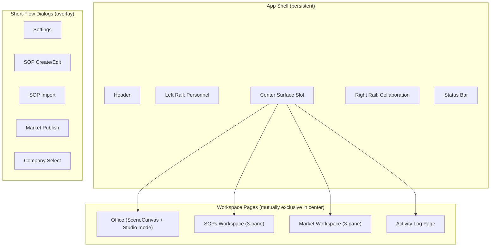
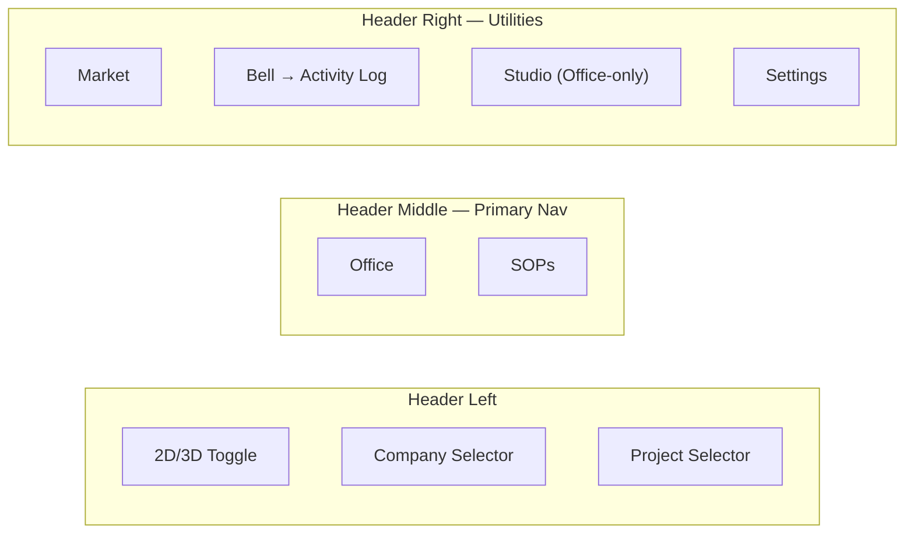
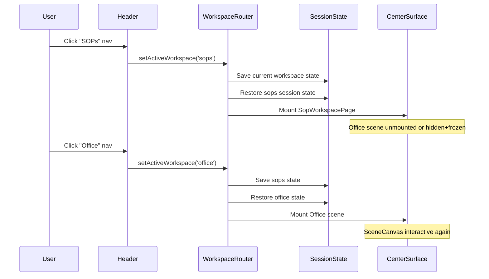
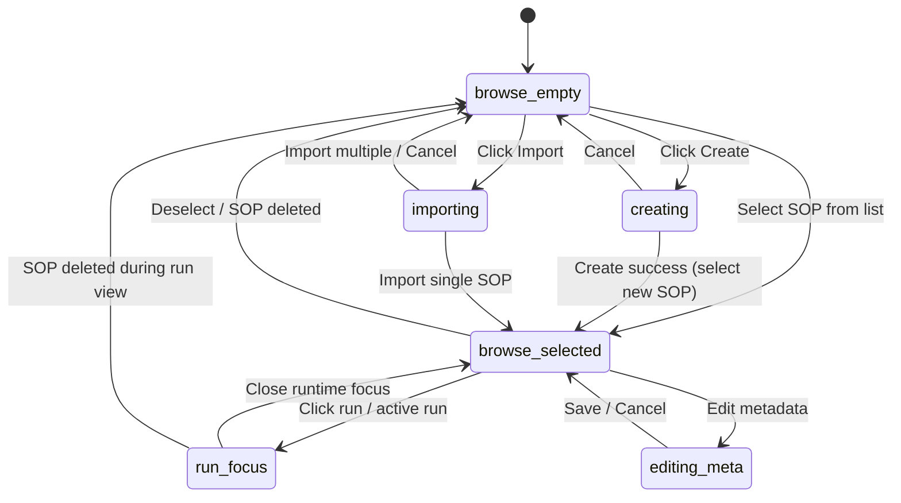
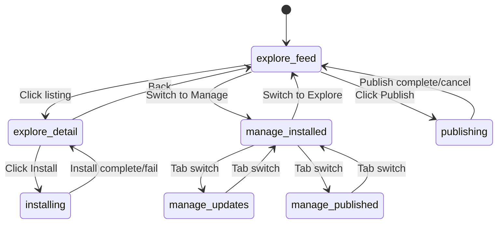
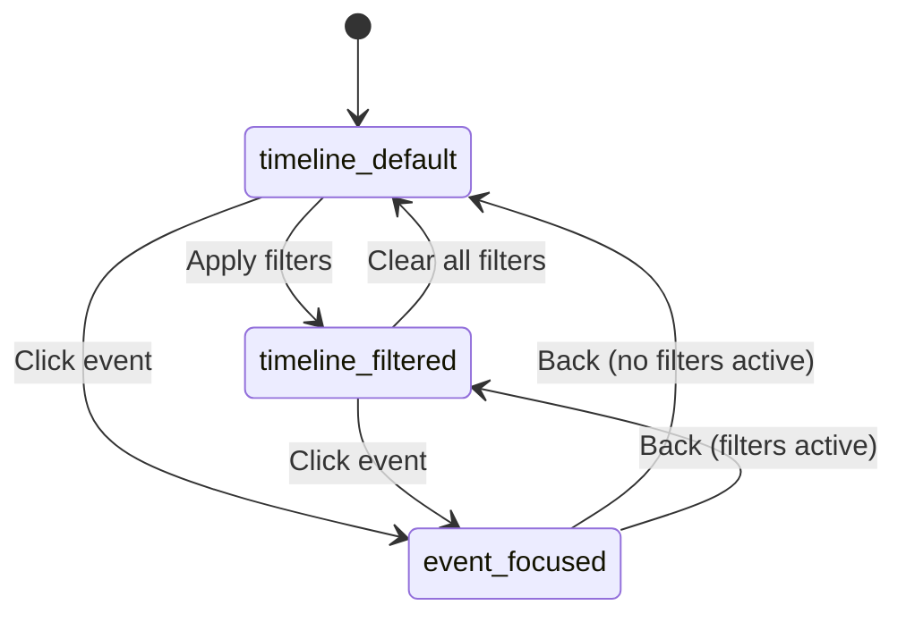
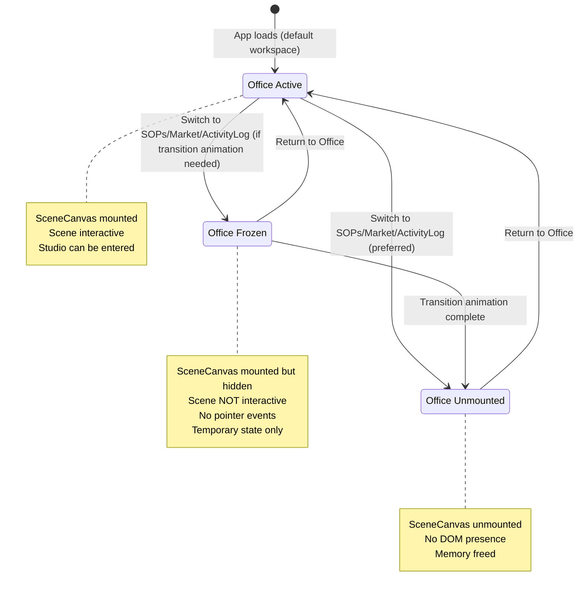

# Design Document: Workspace IA Rebuild

## Overview

The Offisim product currently treats SOPs, Market, and Activity Log as overlay/panel-based surfaces mounted on top of the Office scene. This creates a stacked-card UX where non-office workspaces feel like popups rather than first-class destinations. The current `WorkspaceSurface` component in `App.tsx` wraps workspace content in a card-like overlay, `SopDrawer` renders SOP detail as a slide-over panel, and `MarketplaceDetailOverlay` renders market listing detail as a fixed overlay — all violating the principle that workspaces should be page-native surfaces.

This rebuild introduces a proper workspace surface architecture where Office, SOPs, Market, and Activity Log are peer page-level surfaces with their own internal navigation, state machines, and responsive layouts. The right rail becomes exclusively a collaboration layer (Chat + Tasks), and all primary domain detail flows happen inside their respective workspace pages rather than in overlays.

The execution follows 8 phases: workspace surface architecture (Phase 0), office stabilization (Phase 1), SOPs workspace (Phase 2), Market workspace (Phase 3), Activity Log page (Phase 4), collaboration rail finalization (Phase 5), employee/office semantics cleanup (Phase 6), and visual unification (Phase 7).

## Architecture

### Top-Level Surface Architecture



### Navigation Model



### Workspace Routing Flow




## Components and Interfaces

### Component 1: WorkspaceRouter

**Purpose**: Replaces inline workspace composition in `App.tsx`. Owns workspace switching, session state persistence, and center surface mounting.

**Interface**:
```typescript
interface WorkspaceRouterProps {
  activeWorkspace: WorkspaceKey;
  sessionState: WorkspaceSessionState;
  onSessionStateChange: (state: WorkspaceSessionState) => void;
  children?: React.ReactNode; // Office scene slot
}
```

**Responsibilities**:
- Mount/unmount workspace page components based on `activeWorkspace`
- Preserve per-workspace session state across switches
- Enforce Office scene mount/freeze policy
- Manage browser history entries for workspace-internal drill-in

### Component 2: WorkspacePageShell

**Purpose**: Shared page shell for non-office workspaces. Provides consistent title row, action row, loading/empty/error states, and responsive layout contracts.

**Interface**:
```typescript
interface WorkspacePageShellProps {
  eyebrow: string;
  title: string;
  actions?: React.ReactNode;
  loading?: boolean;
  error?: string;
  empty?: React.ReactNode;
  children: React.ReactNode;
}
```

**Responsibilities**:
- Render consistent page header (eyebrow, title, secondary actions)
- Handle loading, empty, and error states uniformly
- Provide desktop/tablet/narrow layout contracts via CSS
- Replace the current `WorkspaceSurface` card-overlay pattern

### Component 3: SopWorkspacePage

**Purpose**: Full SOPs workspace with 3-pane layout: library sidebar, definition canvas, context pane.

**Interface**:
```typescript
interface SopWorkspacePageProps {
  sessionState: SopSessionState;
  onSessionStateChange: (state: SopSessionState) => void;
}
```

**Responsibilities**:
- Render SOP library list in left pane with search/filter/grouping
- Render selected SOP definition surface in center pane
- Render run status, linked tasks, revision context in right pane
- Manage internal state machine (browse-empty → browse-selected → run-focus)
- Handle back navigation unwinding within the workspace

### Component 4: MarketWorkspacePage

**Purpose**: Full Market workspace with explore/manage modes and 3-pane layout.

**Interface**:
```typescript
interface MarketWorkspacePageProps {
  sessionState: MarketSessionState;
  onSessionStateChange: (state: MarketSessionState) => void;
}
```

**Responsibilities**:
- Render mode/filter rail in left pane (Explore vs Manage)
- Render listing feed, detail surface, or management tables in center pane
- Render package metadata, install state, trust context in right pane
- Manage internal state machine (explore-feed → explore-detail, manage-*)
- Handle back navigation unwinding within the workspace

### Component 5: ActivityLogPage

**Purpose**: Full Activity Log page with timeline, filters, and event focus.

**Interface**:
```typescript
interface ActivityLogPageProps {
  sessionState: ActivityLogSessionState;
  onSessionStateChange: (state: ActivityLogSessionState) => void;
}
```

**Responsibilities**:
- Render filter pane (event types, actors, date presets)
- Render full timeline in center with event-focused reading state
- Manage internal state machine (timeline-default → timeline-filtered → event-focused)
- Maintain clear boundary with bell notification panel

## Data Models

### WorkspaceKey

```typescript
type WorkspaceKey = 'office' | 'sops' | 'market' | 'activity-log';
```

### WorkspaceSessionState

```typescript
type WorkspaceSessionState = {
  office: OfficeSessionState;
  sops: SopSessionState;
  market: MarketSessionState;
  activityLog: ActivityLogSessionState;
};

type OfficeSessionState = {
  viewMode: '2D' | '3D';
  selectedEmployeeId: string | null;
  studioMode: 'create' | 'edit' | null;
};

type SopSessionState = {
  selectedSopId: string | null;
  leftPaneMode: 'library' | 'active-runs';
  centerMode: 'empty' | 'definition' | 'run-focus';
  rightPaneTab: 'context' | 'runs' | 'history';
  search: string;
  filters: string[];
};

type MarketSessionState = {
  mode: 'explore' | 'manage';
  selectedListingId: string | null;
  search: string;
  sort: string;
  filters: string[];
  manageTab: 'installed' | 'updates' | 'published';
};

type ActivityLogSessionState = {
  selectedEventId: string | null;
  search: string;
  eventTypes: string[];
  actorFilters: string[];
  datePreset: 'today' | '7d' | '30d' | 'custom';
};
```

**Validation Rules**:
- `activeWorkspace` must be one of the four `WorkspaceKey` values
- `studioMode` can only be non-null when `activeWorkspace === 'office'`
- `centerMode` must be `'empty'` when `selectedSopId` is null
- `selectedListingId` is only relevant when `mode === 'explore'`

### SOPs State Machine

```typescript
type SopWorkspaceState =
  | { mode: 'browse-empty' }
  | { mode: 'browse-selected'; sopId: string }
  | { mode: 'run-focus'; sopId: string; runId: string }
  | { mode: 'editing-meta'; sopId: string }
  | { mode: 'creating' }
  | { mode: 'importing' };
```

### Market State Machine

```typescript
type MarketWorkspaceState =
  | { mode: 'explore-feed' }
  | { mode: 'explore-detail'; listingId: string }
  | { mode: 'manage-installed' }
  | { mode: 'manage-updates' }
  | { mode: 'manage-published' }
  | { mode: 'publishing' }
  | { mode: 'installing'; listingId: string };
```

### Activity Log State Machine

```typescript
type ActivityLogState =
  | { mode: 'timeline-default' }
  | { mode: 'timeline-filtered'; filters: ActivityLogFilters }
  | { mode: 'event-focused'; eventId: string };

type ActivityLogFilters = {
  eventTypes: string[];
  actorFilters: string[];
  datePreset: 'today' | '7d' | '30d' | 'custom';
  search: string;
};
```


## SOPs Workspace State Machine Diagram



## Market Workspace State Machine Diagram



## Activity Log State Machine Diagram



## Office Scene Mount Policy



## Key Functions with Formal Specifications

### Function 1: useWorkspaceSessionState()

```typescript
function useWorkspaceSessionState(): {
  state: WorkspaceSessionState;
  activeWorkspace: WorkspaceKey;
  setActiveWorkspace: (key: WorkspaceKey) => void;
  updateWorkspaceState: <K extends WorkspaceKey>(
    key: K,
    updater: (prev: WorkspaceSessionState[K]) => WorkspaceSessionState[K]
  ) => void;
  canGoBack: boolean;
  goBack: () => void;
}
```

**Preconditions:**
- Hook is called within a React component tree
- Initial state is derived from defaults or restored from session

**Postconditions:**
- `setActiveWorkspace(key)` preserves the current workspace's session state before switching
- `setActiveWorkspace(key)` restores the target workspace's last session state
- `goBack()` unwinds workspace-internal drill-in before switching workspaces
- `canGoBack` is true when workspace-internal history stack is non-empty OR a previous workspace exists
- State updates are immutable — no mutation of previous state objects

**Loop Invariants:** N/A

### Function 2: useWorkspaceBackNavigation()

```typescript
function useWorkspaceBackNavigation(
  activeWorkspace: WorkspaceKey,
  workspaceInternalBack: () => boolean, // returns true if handled internally
  switchToPreviousWorkspace: () => void
): void
```

**Preconditions:**
- `activeWorkspace` is a valid `WorkspaceKey`
- `workspaceInternalBack` returns `true` if the workspace consumed the back action (e.g., deselected an item), `false` if the workspace has no internal history to unwind

**Postconditions:**
- Browser/system back first calls `workspaceInternalBack()`
- If `workspaceInternalBack()` returns `true`, the workspace remains active and internal state is unwound
- If `workspaceInternalBack()` returns `false`, `switchToPreviousWorkspace()` is called
- No workspace session state is lost during back navigation

**Loop Invariants:** N/A

### Function 3: shouldMountOfficeScene()

```typescript
function shouldMountOfficeScene(
  activeWorkspace: WorkspaceKey,
  transitionState: 'idle' | 'animating-out' | 'animating-in'
): boolean
```

**Preconditions:**
- `activeWorkspace` is a valid `WorkspaceKey`
- `transitionState` reflects the current animation state

**Postconditions:**
- Returns `true` if `activeWorkspace === 'office'`
- Returns `true` if `transitionState === 'animating-out'` AND previous workspace was `'office'` (allows exit animation)
- Returns `false` for all other cases
- When returning `false`, the Office scene has no DOM presence and receives no pointer events

**Loop Invariants:** N/A

### Function 4: isOfficeSceneInteractive()

```typescript
function isOfficeSceneInteractive(
  activeWorkspace: WorkspaceKey,
  transitionState: 'idle' | 'animating-out' | 'animating-in'
): boolean
```

**Preconditions:**
- `activeWorkspace` is a valid `WorkspaceKey`

**Postconditions:**
- Returns `true` only when `activeWorkspace === 'office'` AND `transitionState === 'idle'`
- Returns `false` during any transition or when another workspace is active
- When `false`, the scene canvas must have `pointer-events: none` and `aria-hidden: true`

**Loop Invariants:** N/A


## Algorithmic Pseudocode

### Workspace Switch Algorithm

```typescript
ALGORITHM switchWorkspace(targetKey: WorkspaceKey)
INPUT: targetKey — the workspace to switch to
OUTPUT: updated global state with new activeWorkspace and preserved session

BEGIN
  ASSERT targetKey ∈ {'office', 'sops', 'market', 'activity-log'}
  
  currentKey ← state.activeWorkspace
  
  IF currentKey === targetKey THEN
    RETURN  // no-op
  END IF
  
  // Step 1: If leaving Office with Studio active, close Studio
  IF currentKey === 'office' AND state.office.studioMode !== null THEN
    state.office.studioMode ← null
  END IF
  
  // Step 2: Snapshot current workspace state (already in sessionState)
  // Session state is preserved by reference — no explicit save needed
  
  // Step 3: Push workspace transition to history stack
  historyStack.push(currentKey)
  
  // Step 4: Set new active workspace
  state.activeWorkspace ← targetKey
  
  // Step 5: Mount/unmount scene based on policy
  IF targetKey === 'office' THEN
    mountOfficeScene()
    setSceneInteractive(true)
  ELSE
    IF shouldMountOfficeScene(targetKey, 'idle') THEN
      setSceneInteractive(false)
    ELSE
      unmountOfficeScene()
    END IF
  END IF
  
  ASSERT state.activeWorkspace === targetKey
  ASSERT previousWorkspaceSessionState is preserved
END
```

**Preconditions:**
- `targetKey` is a valid WorkspaceKey
- Global state is initialized

**Postconditions:**
- `activeWorkspace` equals `targetKey`
- Previous workspace session state is fully preserved
- Office scene is mounted/interactive only when `targetKey === 'office'`
- History stack contains the previous workspace for back navigation

### Back Navigation Algorithm

```typescript
ALGORITHM handleBackNavigation()
INPUT: current workspace state, history stack
OUTPUT: state unwound by one level

BEGIN
  currentKey ← state.activeWorkspace
  
  // Step 1: Try workspace-internal back
  handled ← workspaceInternalBack(currentKey)
  
  IF handled THEN
    RETURN  // workspace consumed the back action
  END IF
  
  // Step 2: No internal history — switch to previous workspace
  IF historyStack.isEmpty() THEN
    RETURN  // nothing to go back to
  END IF
  
  previousKey ← historyStack.pop()
  switchWorkspace(previousKey)
  
  ASSERT state.activeWorkspace === previousKey OR handled === true
END
```

**Preconditions:**
- Workspace state and history stack are initialized

**Postconditions:**
- If workspace had internal drill-in, it is unwound by one level
- If no internal drill-in, switches to previous workspace
- Session state is never lost

### SOPs Internal Back Algorithm

```typescript
ALGORITHM sopWorkspaceInternalBack(state: SopSessionState): boolean
INPUT: current SOPs workspace state
OUTPUT: true if back was handled internally, false otherwise

BEGIN
  MATCH state.centerMode WITH
    'run-focus':
      state.centerMode ← 'definition'
      RETURN true
    'definition':
      state.selectedSopId ← null
      state.centerMode ← 'empty'
      RETURN true
    'empty':
      RETURN false  // nothing to unwind
  END MATCH
END
```

**Preconditions:**
- `state` is a valid SopSessionState

**Postconditions:**
- Returns `true` if state was unwound (run-focus → definition, or definition → empty)
- Returns `false` only when already at browse-empty
- State transitions follow the SOPs state machine diagram exactly

### Responsive Layout Algorithm

```typescript
ALGORITHM computeLayoutTier(viewportWidth: number): LayoutTier
INPUT: viewportWidth in pixels
OUTPUT: layout tier with panel visibility rules

BEGIN
  IF viewportWidth <= 768 THEN
    RETURN {
      tier: 'narrow',
      leftRailDefault: 'collapsed',
      rightRailDefault: 'collapsed',
      workspaceLayout: 'stacked-navigation'
    }
  ELSE IF viewportWidth <= 1280 THEN
    RETURN {
      tier: 'tablet',
      leftRailDefault: 'visible',
      rightRailDefault: 'collapsed',
      workspaceLayout: 'two-pane-collapsible'
    }
  ELSE
    RETURN {
      tier: 'desktop',
      leftRailDefault: 'visible',
      rightRailDefault: 'visible',
      workspaceLayout: 'three-pane'
    }
  END IF
END
```

**Preconditions:**
- `viewportWidth` is a positive number

**Postconditions:**
- Returns exactly one of three tiers
- Panel defaults match the responsive contract
- Workspace layout mode is appropriate for the tier

## Example Usage

### Workspace Switching

```typescript
// In WorkspaceRouter — rendering the active workspace
function WorkspaceRouter({ activeWorkspace, sessionState, onSessionStateChange }: WorkspaceRouterProps) {
  const officeVisible = activeWorkspace === 'office';

  return (
    <>
      {/* Office scene: conditionally mounted */}
      {shouldMountOfficeScene(activeWorkspace, 'idle') && (
        <div style={{ pointerEvents: officeVisible ? 'auto' : 'none' }}>
          <SceneCanvas interactive={officeVisible} />
        </div>
      )}

      {/* Non-office workspaces: mutually exclusive */}
      {activeWorkspace === 'sops' && (
        <SopWorkspacePage
          sessionState={sessionState.sops}
          onSessionStateChange={(s) => onSessionStateChange({ ...sessionState, sops: s })}
        />
      )}
      {activeWorkspace === 'market' && (
        <MarketWorkspacePage
          sessionState={sessionState.market}
          onSessionStateChange={(s) => onSessionStateChange({ ...sessionState, market: s })}
        />
      )}
      {activeWorkspace === 'activity-log' && (
        <ActivityLogPage
          sessionState={sessionState.activityLog}
          onSessionStateChange={(s) => onSessionStateChange({ ...sessionState, activityLog: s })}
        />
      )}
    </>
  );
}
```

### SOPs Workspace Internal Navigation

```typescript
// SOP selection within the workspace — no drawer, no overlay
function SopWorkspacePage({ sessionState, onSessionStateChange }: SopWorkspacePageProps) {
  const handleSopSelect = (sopId: string) => {
    onSessionStateChange({
      ...sessionState,
      selectedSopId: sopId,
      centerMode: 'definition',
    });
  };

  const handleRunFocus = (runId: string) => {
    onSessionStateChange({
      ...sessionState,
      centerMode: 'run-focus',
    });
  };

  return (
    <WorkspacePageShell eyebrow="Workspace" title="SOPs">
      <div className="flex h-full">
        <SopWorkspaceSidebar
          search={sessionState.search}
          filters={sessionState.filters}
          selectedSopId={sessionState.selectedSopId}
          onSelect={handleSopSelect}
        />
        <SopWorkspaceCanvas
          sopId={sessionState.selectedSopId}
          mode={sessionState.centerMode}
        />
        <SopWorkspaceContextPane
          sopId={sessionState.selectedSopId}
          activeTab={sessionState.rightPaneTab}
        />
      </div>
    </WorkspacePageShell>
  );
}
```

### Header Navigation Update

```typescript
// Updated Header with workspace-aware primary nav
const primaryNav: { key: WorkspaceKey; label: string }[] = [
  { key: 'office', label: 'Office' },
  { key: 'sops', label: 'SOPs' },
];

// Market moves from icon button to workspace-aware utility
// Bell CTA links to Activity Log page
// Studio only shows when activeWorkspace === 'office'
```


## Correctness Properties

*A property is a characteristic or behavior that should hold true across all valid executions of a system — essentially, a formal statement about what the system should do. Properties serve as the bridge between human-readable specifications and machine-verifiable correctness guarantees.*

### Property 1: Workspace Exclusivity

*For any* sequence of workspace switch operations, after each switch exactly one workspace page component is mounted and visible in the Center_Surface. No two workspace pages are simultaneously rendered.

**Validates: Requirements 1.1, 1.4**

### Property 2: Session State Round-Trip

*For any* workspace W and any valid WorkspaceSessionState for W, switching away from W to any other workspace and then switching back to W restores W's session state (selectedId, search, filters, mode) to the values it had before leaving.

**Validates: Requirements 2.1, 2.2**

### Property 3: Dialog State Independence

*For any* workspace with any valid session state, opening and then closing any Short_Flow_Dialog (Settings, SOP Create, SOP Import, Market Publish) produces no change to the active workspace's selection state, search, or filters.

**Validates: Requirement 2.4**

### Property 4: Back Navigation Unwind Ordering

*For any* workspace with internal drill-in depth D > 0, pressing back exactly D times unwinds all internal state following the workspace's state machine ordering (SOPs: run-focus → browse-selected → browse-empty; Market: explore-detail → explore-feed; Activity Log: event-focused → timeline state) before the next back switches to the previous workspace.

**Validates: Requirements 3.1, 3.4, 3.5, 3.6**

### Property 5: Back Navigation Workspace Switch

*For any* workspace at internal drill-in depth 0 with a non-empty workspace history stack, pressing back switches the active workspace to the most recently visited workspace from the history stack.

**Validates: Requirement 3.2**

### Property 6: Office Scene Mount and Interactive Policy

*For any* WorkspaceKey and transition state combination, `shouldMountOfficeScene` returns true only when the active workspace is 'office' or during an exit animation from Office, and `isOfficeSceneInteractive` returns true only when the active workspace is 'office' and the transition state is 'idle'. In all other cases, the Office scene is either unmounted or has `pointer-events: none` and `aria-hidden: true`.

**Validates: Requirements 1.3, 4.1, 4.2, 4.3, 4.5**

### Property 7: Studio Containment

*For any* workspace switch operation where the source workspace is 'office' and Studio mode is active, the switch operation closes Studio mode (sets studioMode to null) before completing. *For any* non-office WorkspaceKey, Studio mode entry is rejected. The Studio navigation item is hidden when the active workspace is not Office.

**Validates: Requirements 5.1, 5.2, 17.3**

### Property 8: SOP State Machine Validity

*For any* valid SopWorkspaceState and any valid user action (select SOP, click run, close run focus, delete SOP, create, import), the resulting state is a valid SopWorkspaceState that follows the defined state machine transitions. Selecting a SOP produces browse-selected, clicking run produces run-focus, and deleting a selected SOP produces browse-empty.

**Validates: Requirements 7.2, 7.4, 7.5**

### Property 9: Market State Machine Validity

*For any* valid MarketWorkspaceState and any valid user action (click listing, switch mode, back, install, publish), the resulting state is a valid MarketWorkspaceState that follows the defined state machine transitions. Clicking a listing in explore mode produces explore-detail, and a listing becoming unavailable produces an inline unavailable state without crashing.

**Validates: Requirements 8.3, 8.4, 8.5**

### Property 10: Activity Log State Machine Validity

*For any* valid ActivityLogState and any valid user action (apply filters, click event, clear filters, back), the resulting state is a valid ActivityLogState that follows the defined state machine transitions. Applying filters produces timeline-filtered, clicking an event produces event-focused, and clearing all filters produces timeline-default.

**Validates: Requirements 9.2, 9.3, 9.4**

### Property 11: Collaboration Rail Purity

*For any* workspace switch sequence and any point in time, the Right_Rail contains only Chat, Tasks, and Deliverables content. No SOP detail, Market detail, or Activity Log content appears in the Right_Rail.

**Validates: Requirement 11.1**

### Property 12: Chat Action Workspace Isolation

*For any* workspace with any valid session state, triggering a direct chat action (from notification or employee inspector) focuses the Chat panel in the Right_Rail without modifying the active workspace's session state (selections, filters, mode).

**Validates: Requirement 11.3**

### Property 13: Responsive Tier Determinism

*For any* positive viewport width V, `computeLayoutTier(V)` is deterministic and returns exactly one tier: V ≤ 768 → narrow, 769 ≤ V ≤ 1280 → tablet, V > 1280 → desktop. The same input always produces the same output.

**Validates: Requirements 13.1, 13.2, 13.3, 13.6**

### Property 14: Resize Entity State Preservation

*For any* workspace with a selected entity and an open context pane, resizing the viewport from desktop to narrow collapses the context pane but preserves the selected entity state (selectedSopId, selectedListingId, selectedEventId).

**Validates: Requirement 13.4**

### Property 15: Deleted Entity Recovery

*For any* workspace with a selected entity (SOP, market listing, or activity event) that is deleted, the workspace transitions to its no-selection state while preserving all other workspace state (search, filters, mode). No crash, no blank screen.

**Validates: Requirements 14.1, 14.3**

## Error Handling

### Error Scenario 1: Selected Entity Deleted

**Condition**: A SOP, market listing, or activity event is deleted (by another user, background process, or data sync) while the user has it selected in the workspace.
**Response**: The workspace transitions to its no-selection state (e.g., `browse-empty` for SOPs, `explore-feed` for Market). A non-blocking toast notification informs the user.
**Recovery**: User can select another entity. No data loss occurs for other workspace state (search, filters).

### Error Scenario 2: Deep Link to Missing Entity

**Condition**: User navigates via deep link or bookmark to a workspace with a specific entity ID that no longer exists.
**Response**: The workspace loads in its default state. A non-blocking notice explains the entity was not found.
**Recovery**: Full workspace functionality is available. User can browse and select other entities.

### Error Scenario 3: Company Data Not Ready

**Condition**: User switches to a workspace before company data has finished loading (e.g., after company switch or initial load).
**Response**: `WorkspacePageShell` renders a loading skeleton with the workspace's eyebrow and title visible.
**Recovery**: Once data loads, the workspace renders normally with restored session state.

### Error Scenario 4: Resize During Open Context Pane

**Condition**: User resizes viewport from desktop to narrow while a right context pane (within a workspace) is open.
**Response**: The context pane collapses according to the responsive tier rules. Selected entity state is preserved.
**Recovery**: Resizing back to desktop restores pane visibility. Entity selection is not lost.

### Error Scenario 5: Install/Update In Progress on Workspace Leave

**Condition**: User leaves Market workspace while a package install or update is in progress.
**Response**: The operation continues in the background. Progress is reflected in the notification bell and Activity Log.
**Recovery**: Returning to Market restores the focused listing and shows the latest install/update state.

### Error Scenario 6: Runtime Config Incomplete

**Condition**: User navigates to any workspace while runtime configuration (API keys, provider settings) is incomplete.
**Response**: Workspace page loads normally. Config-dependent features show inline CTAs that open the Settings dialog.
**Recovery**: After configuring settings via the dialog, the workspace refreshes affected data without losing navigation state.

## Testing Strategy

### Unit Testing Approach

Key test cases:
- `useWorkspaceSessionState`: verify state preservation across workspace switches
- `useWorkspaceBackNavigation`: verify back unwinds internal state before switching workspaces
- `shouldMountOfficeScene`: verify mount policy for all workspace × transition combinations
- `isOfficeSceneInteractive`: verify interactivity only when office is active and idle
- SOPs state machine: verify all transitions (browse-empty → browse-selected → run-focus and back)
- Market state machine: verify explore/manage mode transitions and back behavior
- Activity Log state machine: verify filter/focus transitions
- Responsive layout: verify tier computation and panel defaults

Coverage goals: All state machine transitions, all back navigation paths, all error recovery scenarios.

### Property-Based Testing Approach

**Property Test Library**: fast-check

Properties to test:
1. Workspace switch roundtrip: switching away and back always restores session state
2. Back navigation termination: repeated back actions always terminate (reach initial state)
3. State machine validity: any sequence of valid transitions produces a valid state
4. Responsive tier determinism: same viewport width always produces same tier

### Integration Testing Approach

Browser verification targets (from execution plan):
1. Office → SOPs reads as page navigation, not overlay
2. SOPs list click updates center content in-page
3. SOPs back behavior unwinds selection before leaving workspace
4. Market opens as full workspace, not popup
5. Market listing click stays in-page
6. Market Explore and Manage modes feel distinct
7. Bell panel stays compact
8. Activity Log opens as page
9. Activity Log focus and filter states unwind correctly
10. Direct employee chat still works from inspector and notification affordances
11. Responsive layouts remain comprehensible on desktop, tablet, and narrow

## Performance Considerations

- Office scene should be unmounted (not just hidden) when another workspace is active to free GPU/memory resources. Only keep it mounted during transition animations.
- Workspace page components should use React.lazy for code splitting — SOPs, Market, and Activity Log bundles are loaded on first navigation.
- Session state should be stored in a lightweight React context or zustand store, not in URL query params (to avoid serialization overhead on every state change).
- Workspace-internal list components (SOP library, Market feed) should use virtualized rendering for large datasets.

## Security Considerations

- Workspace session state must not persist sensitive data (API keys, tokens) — only UI navigation state.
- Deep link parameters (entity IDs) must be validated against the user's access permissions before rendering entity detail.
- Market install actions must verify package integrity and user authorization before proceeding.

## Dependencies

### Existing Dependencies (reuse)
- `useSops` — SOP list data source
- `useSopRuntimeState` — SOP execution state
- `useMarketplace` — Market search/filter/feed
- `EventLog` filter logic — Activity Log data source
- `ChatPanel`, `TaskDashboard`, `PitchHall` — Collaboration rail content

### New Internal Modules
- `apps/web/src/components/workspaces/WorkspaceRouter.tsx`
- `apps/web/src/components/workspaces/WorkspacePageShell.tsx`
- `apps/web/src/components/workspaces/types.ts`
- `apps/web/src/components/workspaces/useWorkspaceSessionState.ts`
- `apps/web/src/components/workspaces/useWorkspaceBackNavigation.ts`
- `packages/ui-office/src/components/sop/workspace/*` (5 components)
- `packages/ui-office/src/components/marketplace/workspace/*` (6 components)
- `packages/ui-office/src/components/events/workspace/*` (3 components)

### Overlay Retirement Targets
- `SopDrawer.tsx` → extract content into `SopWorkspaceCanvas`, then delete
- `MarketplaceDetailOverlay.tsx` → extract content into `MarketWorkspaceDetail`, then delete
- `WorkspaceSurface` in `App.tsx` → replace with `WorkspacePageShell`, then delete

### Files to Modify
- `apps/web/src/App.tsx` — thin down to workspace routing only
- `apps/web/src/lib/app-view-layout.ts` — update mount/interactive policies
- `packages/ui-office/src/components/layout/AppLayout.tsx` — true shell with center page slot
- `packages/ui-office/src/components/layout/Header.tsx` — workspace-aware navigation
- `packages/ui-office/src/components/layout/RightSidebar.tsx` — enforce collaboration-only content
