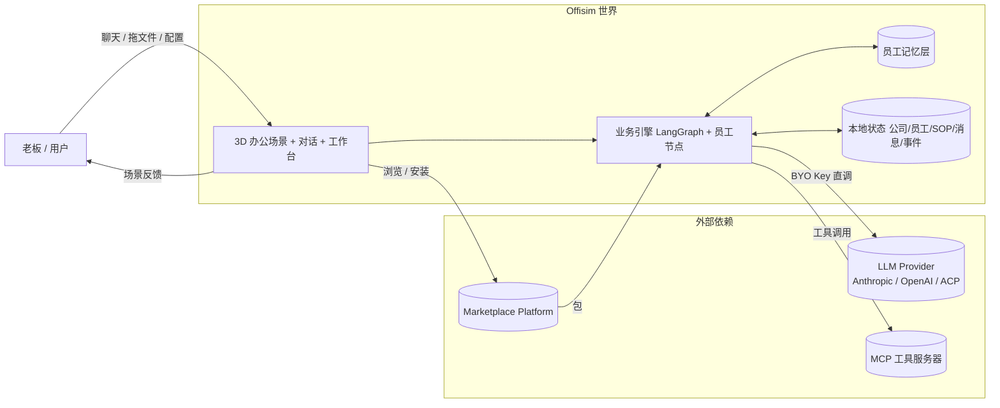
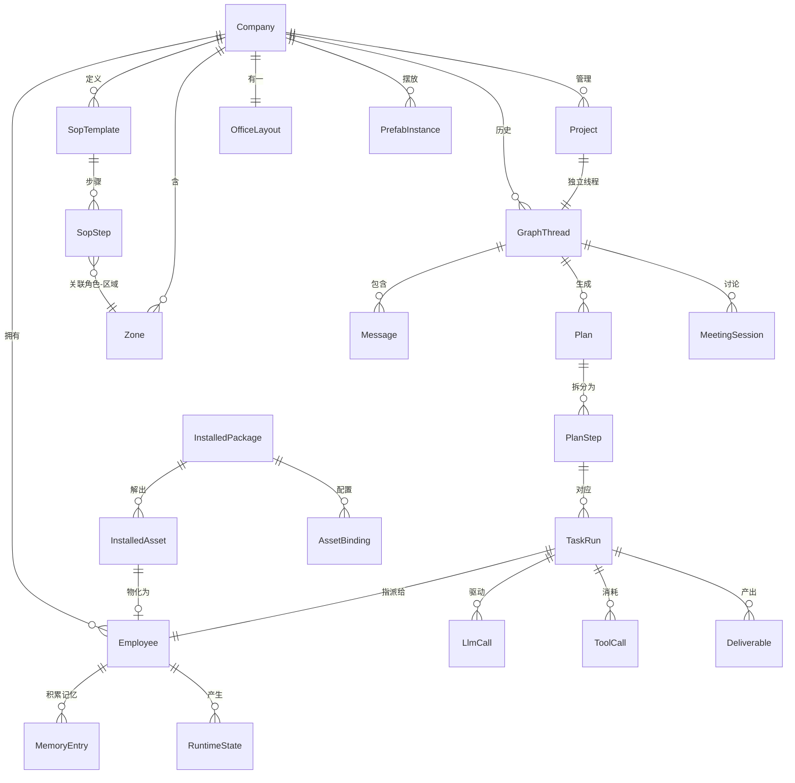
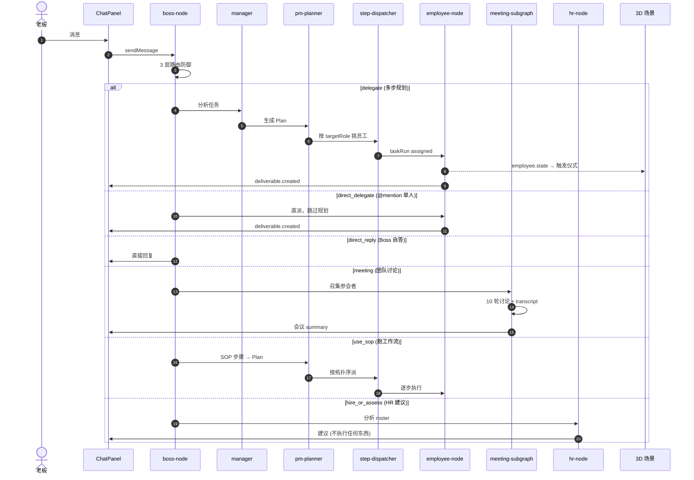
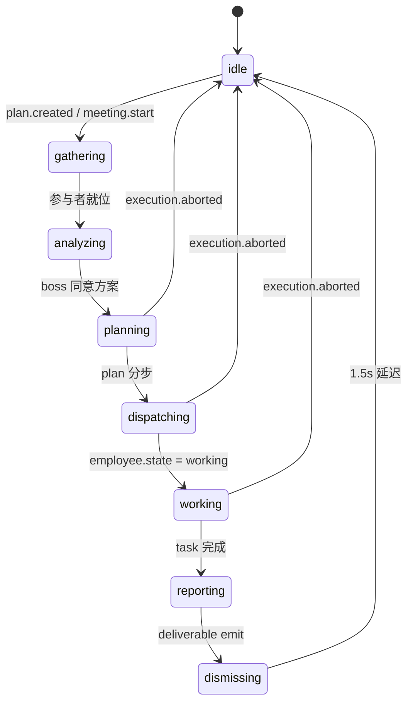
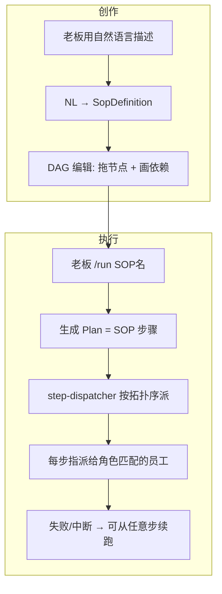
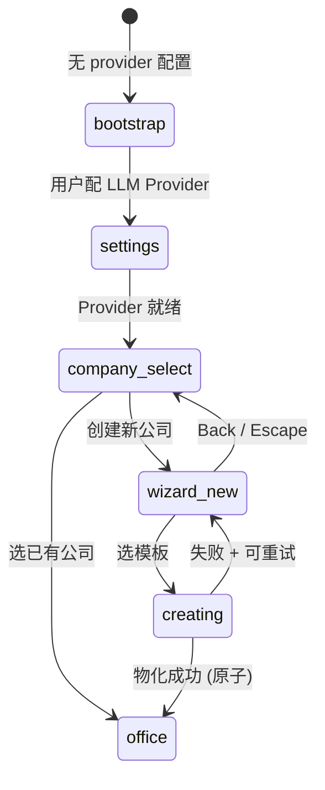
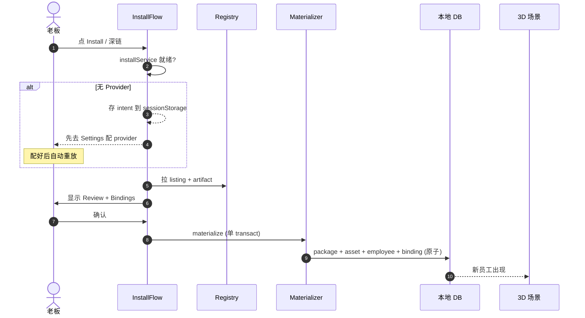

# Offisim 业务逻辑图

不讲实现，只讲业务。每一节回答：**"这件事在产品上是什么"** 以及 **"从哪来，到哪去，谁拿到什么"**。

---

## 1. 产品一句话

> **Offisim 是一个 "AI 办公室模拟器"：你在 3D 场景里当老板，LLM 驱动的员工按你的指令干活，过程以仪式化的 3D 动作呈现，结果沉淀成可复用的工作流 / 可交付物 / 员工记忆。**

四个并列的 "游戏循环"：

| 循环 | 输入 | 过程 | 产出 |
|---|---|---|---|
| **指令循环** | 老板消息 | Boss 6 路路由 → 分派 → 执行 → 报告 | 消息历史、事件流、交付物 |
| **工作流循环** | SOP (步骤 DAG) | 按拓扑序自动派给角色 → 可中断/续跑/回滚 | 结构化执行记录 |
| **讨论循环** | "开个会" | 多人 10 轮讨论 → transcript → summary → action-item 提取 | 会议纪要 + action items（不自动派发，需老板再发 delegate） |
| **扩展循环** | 市集安装包 / 新建员工 | 物化到 DB → 场景刷新 | 多了一个可指挥的员工 |

---

## 2. 顶层业务边界

**三条不可混淆的 runtime 路径（locked framing F1）**：
- Anthropic SDK 直连
- OpenAI SDK 直连
- 订阅模式 ACP（桌面端，调 `claude` CLI subprocess）

外部 agent 接入统一走 A2A (HTTP JSON-RPC, `packages/core/src/a2a/`)。

---

## 3. 核心实体关系

**产品层面最重要的 5 个实体**：
- **Employee** — 可指挥的 "人"，有角色、人格、Skill 绑定、所在 Zone，会积累记忆
- **Plan / TaskRun** — 每次发话生成规划 + 执行，可追溯谁做了什么
- **Deliverable** — 员工真正产出的文件/文档/代码片段
- **MemoryEntry** — 员工从执行中提炼的经验/决策/知识/偏好，影响未来行为
- **Project** — 有 scope 的工作容器，所有子任务归到同一线程

Zone 是 3D 场景的业务锚点：员工按角色自动落座，执行任务时走到工位，开会时走到 meeting zone。

---

## 4. Boss 路由：老板说话后发生什么

Boss 路由是整个游戏的**中枢决策点**。老板每条消息经过 3 层防御（规则 → 关键词 → ID 校验）后被分成 **6 种动作**：

| # | 动作 | 玩家体验 | 走的路径 | 有交付物？ |
|---|---|---|---|---|
| 1 | `delegate` | "帮我做 X" → 多步规划 + 多人执行 | boss → manager → pm-planner → step-dispatcher → employees | 有 |
| 2 | `direct_delegate` | "@Alex 做 X" → 跳过规划，单人直派 | boss → employee-node（绕过 manager + planner） | 有 |
| 3 | `direct_reply` | Boss 自己回答（不干活） | boss 直接输出，不经过任何员工 | 无 |
| 4 | `meeting` | "开个会讨论 X" → 多人讨论 | boss → meeting-subgraph（10 轮讨论 + summary + action-item 提取） | 有 action items（不自动派发） |
| 5 | `use_sop` | "/run 发布流程" → 跑预设工作流 | boss → SOP → plan → step-dispatcher → employees | 有 |
| 6 | `hire_or_assess` | "团队够不够" → HR 出建议 | boss → hr-node（**只出建议，不执行任何东西**） | 无 |

**关键产品语义**：
- 玩家**不需要手动选**路由类型 —— boss-node 自动判断。唯一主动选择是 `@mention`（触发 direct_delegate）和 `/run SOP名`（触发 use_sop）
- **Meeting 没有任务产出** —— 纯讨论，产出只有 summary。如果想"开会然后分活"，需要再发一条 delegate 消息
- **HR 只建议不执行** —— 说"帮我招个设计师"，HR 会说"建议招一个"但**不会真的创建员工**

---

## 5. 3D 仪式状态机（Ceremony）

业务事件触发场景的 8 阶段仪式：

**产品意义**：用户看的不是日志行，而是角色在场景里**走出来**的流程 —— 从工位起身 → 走到会议室 → 回工位干活 → 走回会议室汇报。Stop 时从任意阶段立刻复位到 idle（FS3 修复）。

---

## 6. 记忆系统

员工不是无状态的 —— 每次任务完成后，系统自动跑 LLM reflection，从执行结果中提炼记忆。

| 维度 | 说明 |
|---|---|
| **记忆类型** | experience（经历）/ decision（决策）/ knowledge（知识）/ preference（偏好） |
| **作用域** | employee（个人）/ team（团队）/ company（公司级） |
| **重要度** | 0-1 浮点，影响注入优先级 |
| **上限** | 每次提取 0-3 条；每员工最多 maxFacts（默认 50）条 |
| **注入时机** | 下次该员工执行任务时，系统从记忆池中按重要度 + 相关性选取注入 context |

**玩家感知**：员工会"记住"上次怎么做的、踩过什么坑、老板偏好什么风格，行为随时间演化。这是 AI 办公模拟器跟普通 chatbot 最大的差异。

---

## 7. SOP = 工作流

SOP（Standard Operating Procedure）= 把重复的老板指令固化成一个可执行 DAG。**SOP 就是工作流，不是别的东西。**

**SOP vs 直接对话**：
| | 直接对话 | SOP 工作流 |
|---|---|---|
| 规划 | boss 临时 ad-hoc plan | 预编排好的步骤 DAG |
| 可复用 | 不可（每次重新路由） | 保存为模板，反复跑 |
| 暂停/续跑 | 只能 abort | 可以暂停、回滚到某步、换人重跑 |
| 版本化 | 无 | SopTemplate 有 version，可 URL 同步拉取 |

SOP 的运行状态在 LangGraph checkpoint 里 —— 支持 rewind to step N。

---

## 8. Meeting 讨论系统

Meeting 是独立于任务执行的**第一公民玩法**，不只是 ceremony 里的一个 zone。

| 阶段 | 说明 |
|---|---|
| **召集** | boss 指定参会者（或自动按角色选），员工走到 meeting zone |
| **讨论** | 最多 10 轮发言，每轮一个员工基于上下文 + transcript 发言 |
| **中断** | boss 可随时 pause / inject（插话）/ end |
| **总结** | 讨论结束后自动生成 summary，写入 chat |
| **Action Items** | LLM 从 transcript 中提取结构化 action items，创建 taskRun 记录并发 `meeting.action.created` 事件 |

**关键区别**：Meeting **不产出 deliverable、不调工具**，但会提取 action items 并创建 taskRun 记录。这些 action items **不自动派发** —— 老板需要再发一条 delegate / use_sop 消息才能让人去做。Meeting 的产出是"共识 + 待办清单"，不是"执行结果"。

---

## 9. Project 项目容器

Project = 有 scope 的工作单元。

| 属性 | 说明 |
|---|---|
| 生命周期 | planning → active |
| 线程 | 每个 project 绑定一个独立 GraphThread |
| 员工指派 | ProjectAssignment 关联 employee → project |
| 玩家操作 | "创建一个项目" / "把 Alex 加到这个项目" / "跑这个项目" |

**产品意义**：Project 让工作有边界 —— 不是所有对话混在一条 thread 里，而是按项目分线程。执行历史、员工分配、交付物都归属到项目。

---

## 10. 权限门控（Interaction 系统）

员工执行任务时可能需要老板批准，这通过 Interaction 系统实现。

| 场景 | 弹框内容 | 批准粒度 |
|---|---|---|
| MCP 工具调用 | "Alex 想调用 file_write 工具，允许吗？" | once / thread / session |
| Plan 审核 | "规划好了，确认执行吗？" | 逐次 |

老板可在 Settings 配置 toolPermissions 策略（ask / allow / deny），控制员工的自主权。

---

## 11. Onboarding / 建公司流程

**业务不变式**：
1. 物化原子 —— employees + SOPs + layout + zones + prefabs 全成功或全回滚
2. 不可重入 —— 双击不建两个公司
3. 创建中不能偷偷取消又偷偷完成

---

## 12. Marketplace 安装流程

**当前限制**：
- 只能装 employee，不能装 SOP / Layout / Prefab 包
- 只有软删（EmployeeInspector 的 Dismiss/Re-enable）—— 不出现在场景但记忆保留；无硬卸载
- 没有 upgrade 路径（manifest 里有 lineage 字段但 UI 未实现）

---

## 13. Studio 办公室编辑器

| 能力 | 说明 |
|---|---|
| 创建模式 | 从空白开始，选 zone 预设放置 |
| 编辑模式 | 打开已有公司的 layout，调整 zone + prefab |
| Zone 来源 | **只能放 SYSTEM_ZONE_TEMPLATES 预设**，不能自建 zone 类型 |
| Prefab | 从 builtin-catalog（190+ frozen 对象）里拖放，有位置/旋转 |
| 保存 | deleteByCompany → 重建（幂等），有 savingRef 重入守卫 |
| beforeunload | dirty 时拦截页面关闭 |

---

## 14. 状态 / 数据所在位置

| 状态类别 | 存储位置 | 生命周期 |
|---|---|---|
| 公司 / 员工 / SOP / Zone / Layout / Project | SQLite (desktop) / memory repos (web) | 持久 |
| Thread / Message / Plan / TaskRun / Deliverable | 同上 + LangGraph checkpoint | 持久，可回退 |
| 员工记忆（MemoryEntry） | 同上 | 持久，有 maxFacts 上限 |
| Meeting transcript / summary | 同上（MeetingSession 表） | 持久 |
| LlmCall / ToolCall / Cost | 同上 | 持久 |
| Event 流 | In-memory EventBus + 近 200 条 persisted | 会话 + 最近 |
| Runtime 配置 | localStorage / secret-store | 持久 |
| Studio 编辑中态 | Zustand 内存 | 保存前都是脏 |
| Ceremony 状态 | useSceneOrchestrator | 一次对话 |
| Pending install intent | sessionStorage (10min TTL) | 跨 Provider 配置 |
| 多公司 | 一次只激活一个，切换时清空 ceremony / thread 内存态 | 持久选择 |

---

## 15. 业务稳定性承诺

| 承诺 | 保障机制 |
|---|---|
| 公司物化原子 | drizzle create 同步 + transact 内联 zone seeding (R1) |
| 员工安装物化原子 | drizzle install repo 同步化 (codex adversarial HIGH) |
| 重入保护 | useRef + try/finally 全覆盖 |
| Dispatch 可中断 | `execution.aborted` 事件 + scene 订阅 (FS3) |
| 事件可审计 | EVENT_PREFIXES + 持久化都含 `execution.` |
| 提交失败必须显示 | catch + Alert error banner |
| Wizard 取消即取消 | isCreating gate |
| Install 深链不丢意图 | sessionStorage intent + 自动 replay (M4) |
| 输入有边界 | NaN guard + maxLength |
| 核心 LLM runtime 稳定 | Locked framing F1 |

---

## 16. 非目标（明确不做）

| 非目标 | 原因 |
|---|---|
| 外部 agent 接入 (A2A) | 当前统一方向；1.0 仍不开 |
| 多人协作 / 服务端运行 | 本地优先 BYO key |
| 代理 LLM 请求 | 浏览器直调 vendor API |
| 装 SOP / Layout / Prefab 包 | 只装 employee |
| 硬卸载已安装员工 | 有软删（Dismiss），不做硬卸载 |
| 自建 Zone 类型 | Studio 只有预设 |
| Bundle size / Scene V2 / CI | Known Debt |
