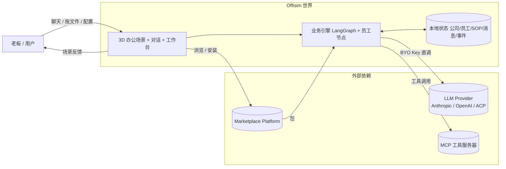
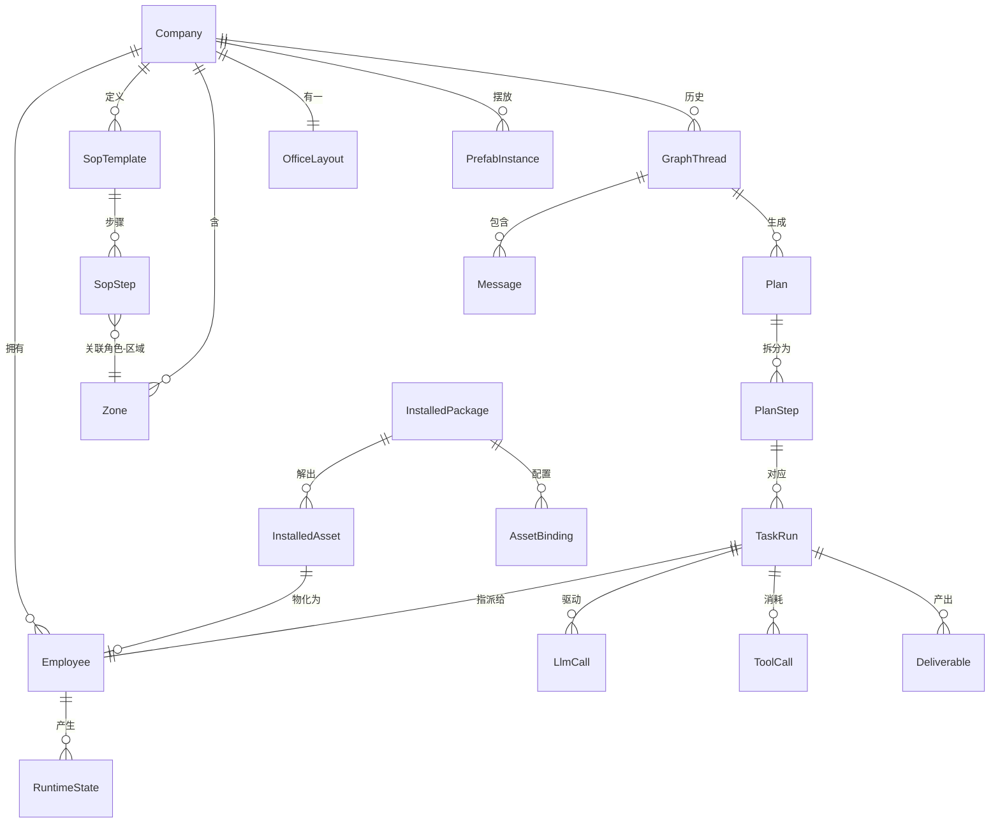
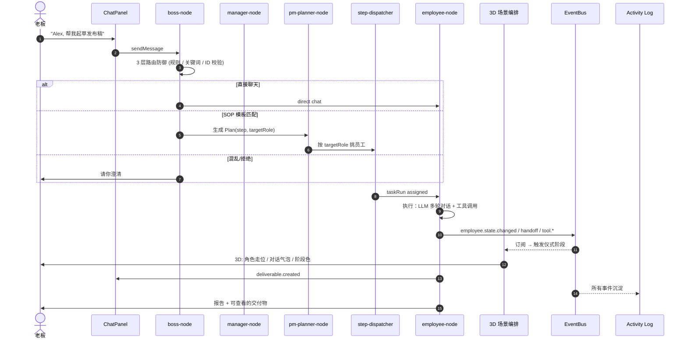
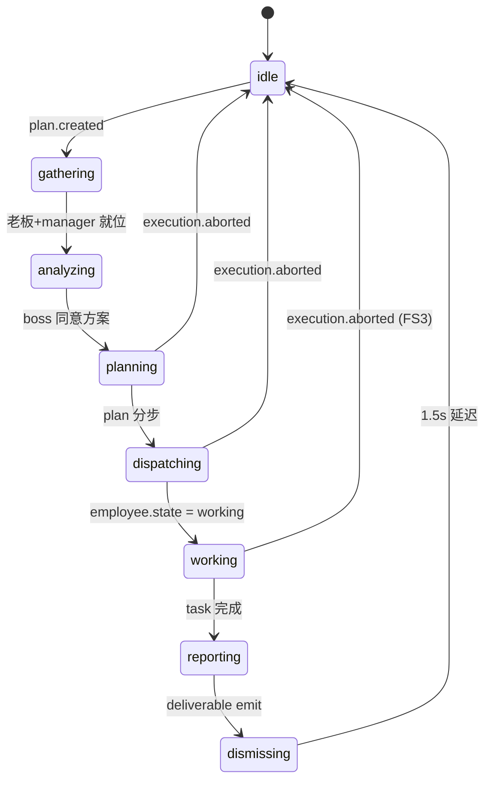
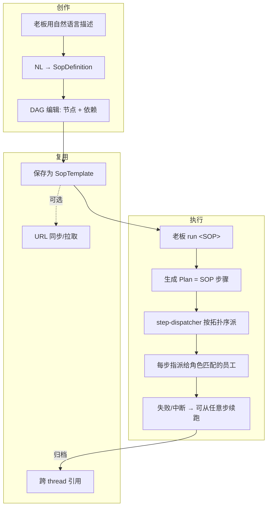
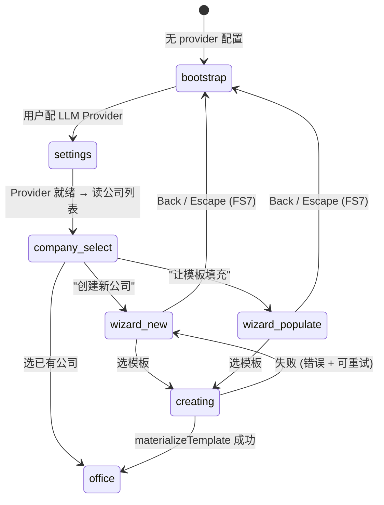
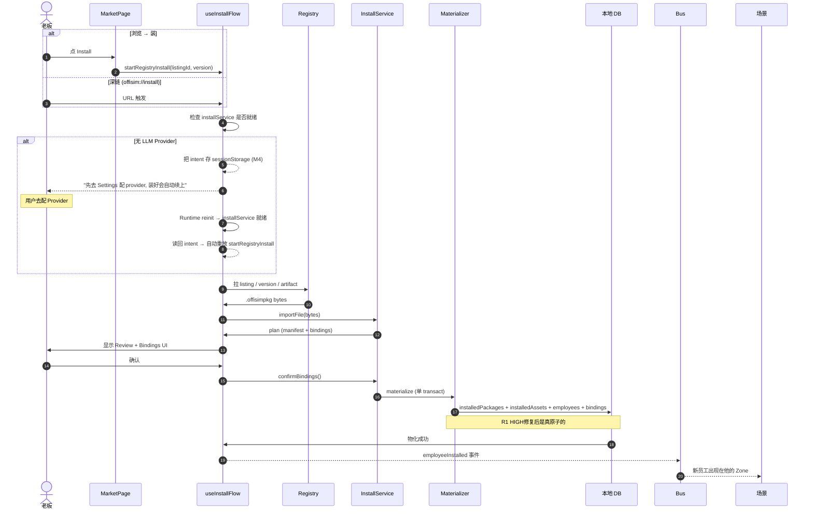

# Offisim 业务逻辑图

不讲实现，只讲业务。每一节回答：**"这件事在产品上是什么"** 以及 **"从哪来，到哪去，谁拿到什么"**。

---

## 1. 产品一句话

> **Offisim 是一个 "AI 办公室模拟器"：你在 3D 场景里当老板，LLM 驱动的员工按你的指令干活，过程以仪式化的 3D 动作呈现，结果沉淀成可复用的 SOP / 可交付物 / 已安装的员工包。**

三个并列的 "游戏循环"：

| 循环 | 输入 | 过程 | 产出 |
|---|---|---|---|
| **对话循环** | 老板消息 | Boss 路由 → Manager 或 Employee 分派 → 执行 → 报告 | 消息历史、事件流、交付物 |
| **编排循环** | SOP (步骤 DAG) | 按拓扑序自动派给角色 → 员工按步骤做 → 可中断/续跑 | 结构化执行记录 |
| **扩展循环** | 市集安装包 / 新建员工 | 物化到 DB → 场景刷新 | 多了一个可指挥的员工 |

---

## 2. 顶层业务边界

**三条不可混淆的 runtime 路径（locked framing F1）**：
- Anthropic SDK 直连
- OpenAI SDK 直连
- 订阅模式 ACP（桌面端，调 `claude` CLI subprocess）

A2A + OpenClaw 代码是 sleeping asset，给未来外派 agent 预留的扩展点，**不是**核心 runtime 的一部分。

---

## 3. 核心实体关系

**产品层面最重要的 3 个实体**：
- **Employee** — 可指挥的 "人"，有角色、人格、Skill 绑定、所在 Zone
- **Plan / TaskRun** — 每次你发话就生成一次规划 + 执行，可在事后追溯谁做了什么
- **Deliverable** — 员工真正产出的文件/文档/代码片段，有所属 thread 和员工

Zone 是 3D 场景的业务锚点：员工按角色自动落座，执行任务时走到工位，开会时走到 meeting zone。

---

## 4. 对话 → 交付物（主流程）

这是用户每次发话最核心的闭环。

**每条消息的产品语义**：
| 业务动作 | 事件签名 | 在哪能看到 |
|---|---|---|
| 老板发话 | `chat.sent` | ChatPanel 历史 |
| 路由决策 | `plan.created` / `direct.chat.dispatched` | Scene 气泡、Activity Log |
| 员工状态变化 | `employee.state.changed` | Scene 上色、Activity Rail |
| 工具调用 | `tool.execution.started/completed` | Scene 工具图标、Cost 面板 |
| 交付物就绪 | `deliverable.created` | Chat 气泡 + 工作台 |
| 执行中断 | `execution.aborted` | Scene 复位、Activity Log |

---

## 5. 3D 仪式状态机（Ceremony）

这是 Offisim 的视觉特色。业务事件会触发场景的 8 阶段仪式：

**产品意义**：用户看的不是一行行日志，而是角色在场景里**走**出来的流程 —— 你告诉某某"帮我做 X"，他真的从工位起身、走到会议室、再回工位干活、最后回到会议室汇报。这个仪式**必须**随真实业务事件同步，不能 hardcode 动画时长。FS3 修复就是补了 "Stop 时立刻复位" 的路径。

---

## 6. SOP（标准流程）循环

SOP = 把重复的老板话术固化成一个可执行 DAG。

**SOP vs 直接对话的差别**：
- 直接对话：每次老板消息 → boss 路由 → 单步或 ad-hoc plan
- SOP 执行：每次 run → plan = 预设步骤 → 自动按顺序跑 → **可以暂停/恢复/回滚到某步重跑**

SOP 的 "状态" 不在 DB 里，在 LangGraph 的 checkpoint 里 —— 可以 `rewind to step N` 这种玩法。

---

## 7. Onboarding / 建公司流程

第一次进来 or 切公司的业务路径：

**业务不变式**（**R1 + FS4 + FS7 都在保这些**）：
1. 公司物化是**原子的** —— employees + SOPs + layout + zones + prefabs 全部成功或全部回滚。半成品公司是 bug。
2. 创建过程不可重入 —— 双击 Create 不能产出两个公司。
3. 创建过程中不能被 Escape 悄悄打断 —— 要么完成要么取消，不存在 "我以为我取消了结果后台还是建出来了"。

---

## 8. Marketplace 安装流程

**产品不变式**：
- 装一次 = 要么整个员工和所有绑定都活了、要么都没活 (R1 + C2-materializer 修复)
- 装到一半被掐（关 tab / refresh）不会留半成品 (transact 单事务)
- 没配 Provider 时点 Install 不再丢意图 (M4 sessionStorage)

---

## 9. 状态 / 数据所在位置

这是一张 "到底我数据放在哪" 的速查表。修 bug 找状态先看这里。

| 状态类别 | 例子 | 存储位置 | 生命周期 |
|---|---|---|---|
| 公司 / 员工 / SOP / Zone / Layout | 公司组成 | Drizzle SQLite (desktop) / memory repos (web) | 持久 |
| Thread / Message / Plan / TaskRun / Deliverable | 对话 + 执行历史 | 同上 + LangGraph checkpoint | 持久 (可回退) |
| LlmCall / ToolCall / Cost | 执行明细 | 同上 | 持久 |
| Event 流 | 所有业务事件 | In-memory EventBus + 近 200 条 persisted snapshot | 会话内 + 最近 |
| Runtime 配置 | LLM provider / base URL / model | localStorage (web) / secret-store (desktop) | 持久 |
| Runtime policy | execution mode / memory / toolPermissions | localStorage | 持久 |
| Studio 编辑中态 | 拖放的 prefab / zone 改动 | Zustand `StudioState` (内存) | 保存前都是脏 |
| Interview wizard 表单 | 新员工各字段 | hook useReducer | dialog 打开期间 |
| Install flow 状态机 | step / plan / bindings | hook useState | 对话框打开期间 |
| Ceremony state | 阶段 / 颜色 / 气泡 | useSceneOrchestrator 内部 | 一次对话 |
| Pending install intent (M4) | 深链 listingId/version | sessionStorage (10 min TTL) | 跨 Provider 配置 |
| Company 切换状态 | activeCompanyId | CompanyContext + localStorage | 持久 |
| Workspace 会话 | 当前 tab / 侧栏状态 | sessionStorage | 会话内 |

---

## 10. 业务稳定性承诺（Phase 5 闭合后）

这几条是 "产品一定要这样工作否则就是 bug" 的不变式。任何后续修改都不能破坏它们。

| 承诺 | 为什么 | 保障机制 |
|---|---|---|
| 公司模板物化原子 | 半成品公司会导致场景、scene-behavior 找不到 zone 等级联崩溃 | drizzle create 同步 + transact 内联 zone seeding (R1) |
| 员工安装物化原子 | 半成品员工会被 scene 渲染但 bindings 缺失 → tool call 失败 | drizzle install repo 同步化 (codex adversarial HIGH) |
| 重入保护一次到位 | 双击 Create 会建两个公司；双击 Save 会覆盖自己；双击 Create Employee 会建两个员工 | useRef + try/finally (FS4/FS6/FS1 + codex MED1) |
| Dispatch 可中断 | 老板点 Stop 必须立刻看到场景复位 | `execution.aborted` 事件 + useSceneOrchestrator 订阅 (FS3) |
| Dispatch 可审计 | 每个事件都进 Activity Log，含 execution.aborted | EventLog EVENT_PREFIXES + 持久化列表都含 `execution.` (codex MED2) |
| 用户操作不被静默吞掉 | InterviewWizard 失败不显示错误；safety: 所有 submit 必须有 error 出口 | catch + 错误 banner (FS1) + ui-core `<Alert>` 复用 |
| Wizard 取消即取消 | 创建期间 Back/Escape 不能悄悄完成创建 | isCreating gate + 异步 gate + 取消不计入 onComplete (FS7 + codex MED3) |
| Install 深链不丢意图 | 用户点击"安装这个员工"到真正装上不能丢路径 | sessionStorage intent + Provider 就绪自动 replay (M4) |
| 输入边界 | maxTokens / temperature / Chat 长度都有防御 | NaN guard + maxLength (R3/R4) |
| 异步错误不被 `void` 吃掉 | 所有 `.then()` 都有 `.catch()` | useProjectAssignments 等 (R2) |
| 核心 LLM runtime 稳定 | 三个 adapter 是产品根基，不能乱动 | Locked framing F1 |

---

## 11. 业务上暂不做 / 明确边界

| 非目标 | 为什么 |
|---|---|
| 外部 agent 接入 (A2A / OpenClaw) | 扩展点保留，1.0 不开 (F2 sleeping asset) |
| 多人协作 / 服务端运行 | 本地优先，BYO key，不做后端 |
| 代理 LLM 请求 | 浏览器直调 vendor API，任何代理都不能动 |
| 装 SOP / Layout / Prefab 包 | 只装 employee，其他 kind 走 `INSTALLABLE_KINDS` gate |
| Bundle size / Scene V2 / Repo dedup / CI | Known Debt，非 goal |

---

## 12. 一句话回答 "这游戏要怎么稳"

**数据原子 + 事件可中断 + 输入有边界 + 非目标不越线。**

- 任何写 DB 的业务都必须能 rollback（R1 + materializer HIGH）
- 任何长跑的业务都必须能 stop 且 UI 立即复位（FS3）
- 任何用户输入都必须有下界上界和 catch（R2/R3/R4 + FS1）
- 任何扩展意图都不丢（M4）
- 任何超出 "1.0 ship" 的东西都明确写进 "非目标" 不触碰（F1/F2/F4/F5）

Phase 5 做完之后，上面这 5 条都有具体代码保障了。剩下的开放项（deep-link intent 的 UX 优化 / SOP DAG 视图持久化 / Scene V2）都是增强，不是正确性 bug。
