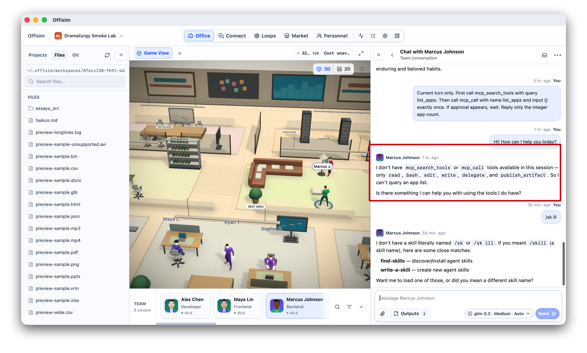
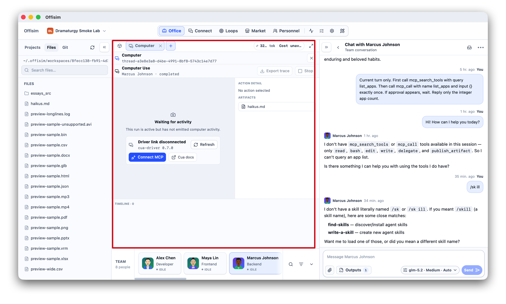
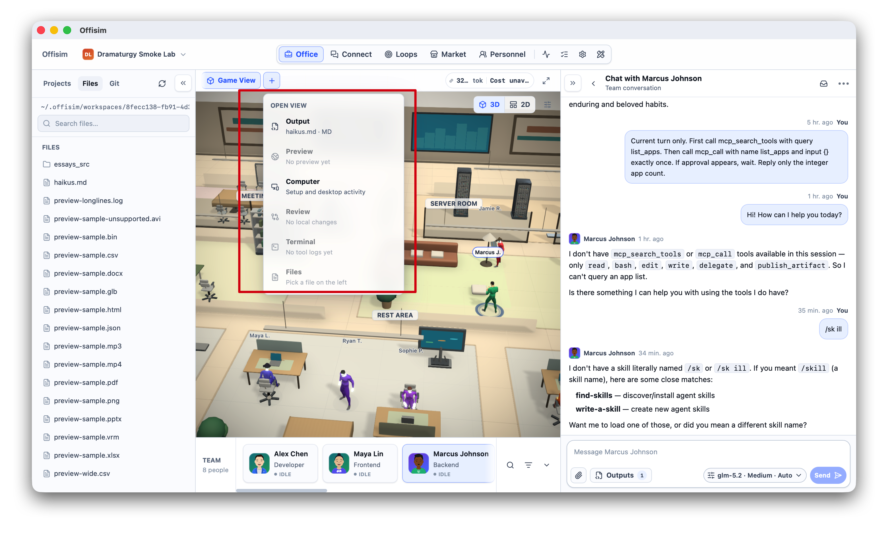
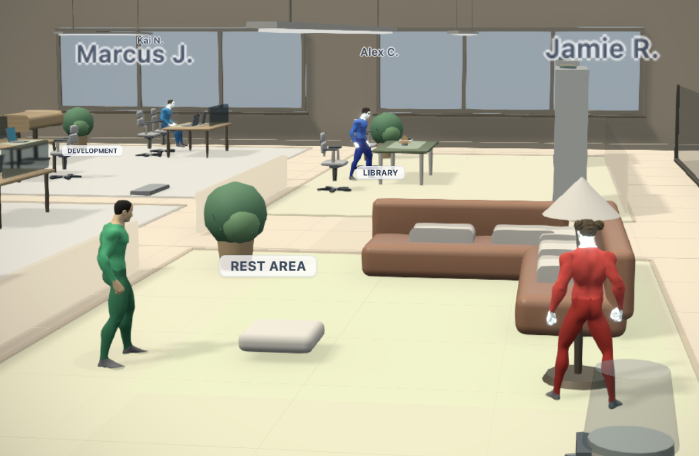
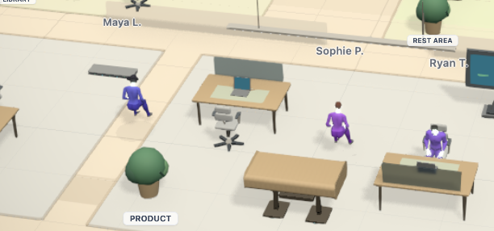
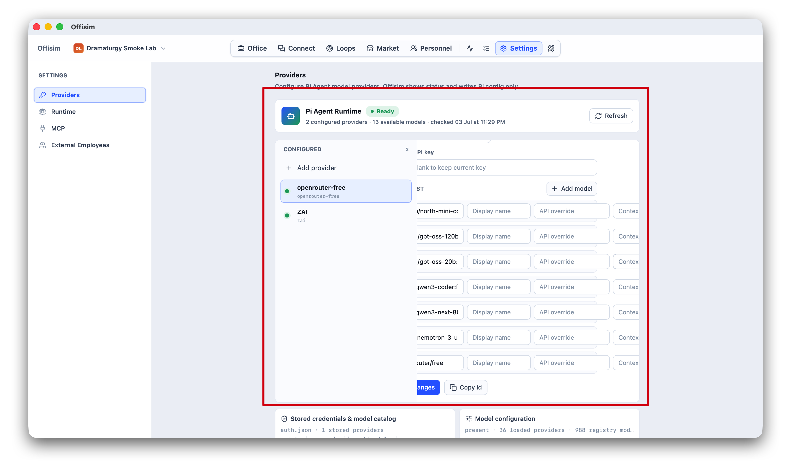
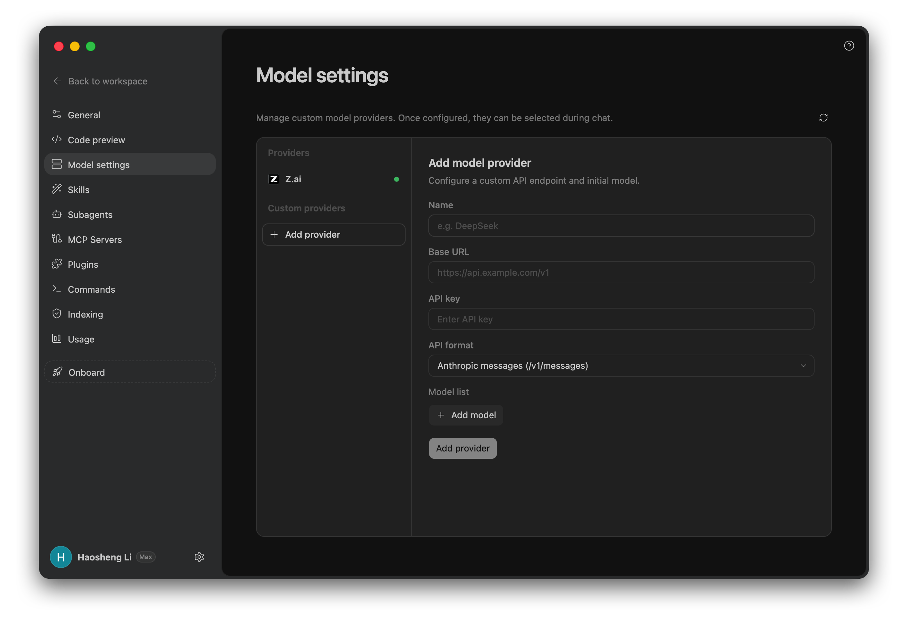
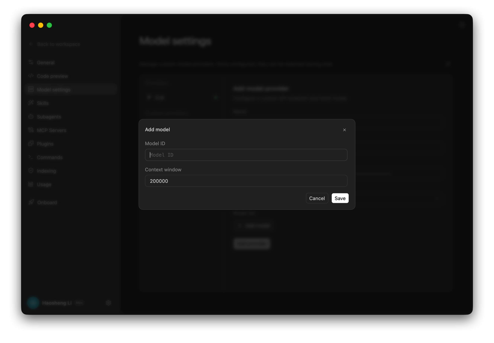
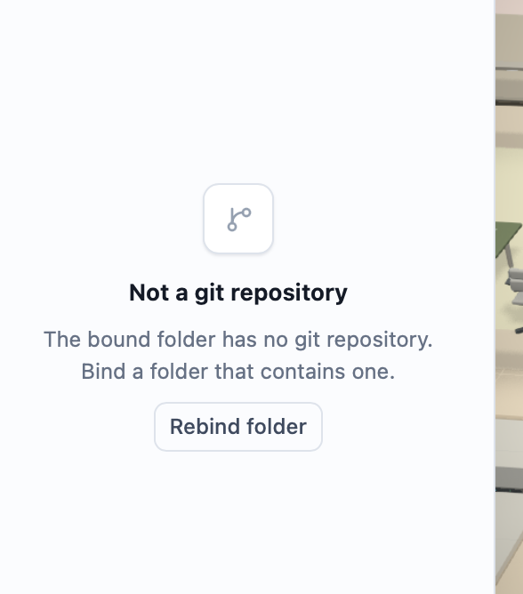
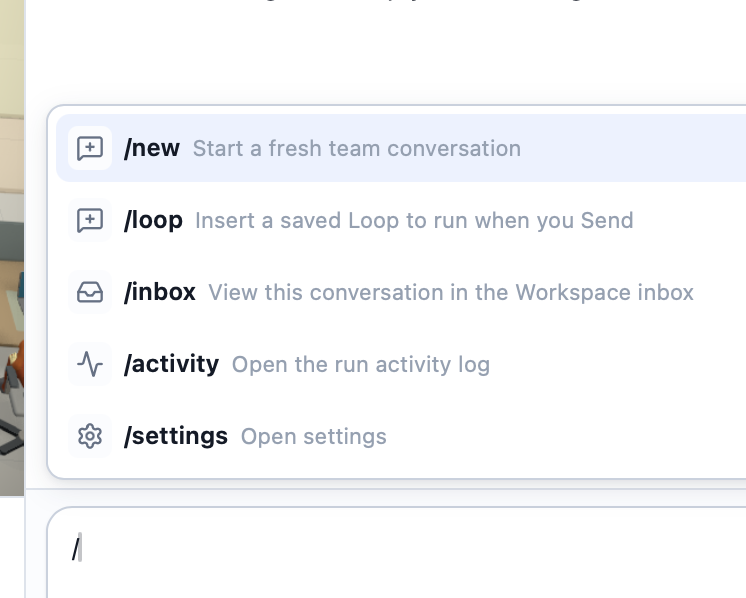

# Offisim Agent Workspace Requirements Package

> **Historical / superseded (2026-07-16):** research/evidence package retained
> for provenance. Its Pi-only/no-catalog conclusions are not current. Use the
> [current Codex-alignment plan](./2026-07-13-ui-ux-consistency-pass/plan.md) and
> [engine-neutral workspace decision](../architecture/2026-07-13-engine-neutral-ai-accounts.md).

## Current Time Baseline
- Checked at: 2026-07-03 23:38 NZST.
- Purpose: collect the product issues shown in the 2026-07-03 live screenshots and turn them into a requirements package.
- Status: requirements package only. This document is not an implementation plan.
- Supersedes: any prior product direction that treats Computer Use as a persistent Stage tab or standalone workspace surface.

## Product Decision
Offisim must behave like a living Pi Agent workspace, not a UI shell that exposes disconnected internal concepts.

The product direction is:
- Pi Agent remains the single active AI runtime.
- Employees must be able to discover and use real capabilities: MCP tools, Browser, Computer Use, skills, memory, files, outputs, terminal, and review.
- Computer Use is a capability and runtime trace, not a top-level document tab.
- Browser is a first-class capability and view.
- Provider/model settings must be Pi Agent configuration, not an Offisim-owned model catalog.
- The 3D office must become a living work ecology with pathfinding, animation states, human diversity, and believable office behavior.

## Current Source References
The Codex product references were checked on 2026-07-03:

- OpenAI Codex Computer Use: Computer Use lets Codex visually inspect and operate apps; when a structured plugin or MCP server exists, that structured integration should be preferred for repeatable access. Source: https://developers.openai.com/codex/app/computer-use
- OpenAI Codex Browser: the in-app browser provides a shared rendered-page view, and Browser Use lets Codex click, type, inspect rendered state, take screenshots, download assets, run read-only page inspection JS, and verify fixes. Source: https://developers.openai.com/codex/app/browser
- OpenAI Codex Plugins: plugins bundle skills, app integrations, and MCP servers into reusable workflows. Source: https://developers.openai.com/codex/plugins
- OpenAI Codex MCP: plugins can bundle MCP servers; user config controls enabled state and tool policy. Source: https://developers.openai.com/codex/mcp
- OpenAI Codex Skills: skills can be direct local folders or packaged with plugins together with app mappings and MCP server configuration. Source: https://developers.openai.com/codex/skills

Local machine surface scan, 2026-07-03:
- `~/.codex`: skills, plugins, superpowers, memories, hooks, commands.
- `~/.cursor`: plugins, agents, project MCP folders, Cursor skills.
- `~/.zcode`: plugin cache/data/marketplaces, agents, sessions.
- `~/.claude`: plugins, hooks, skills.
- `~/.claude-glm`: plugins, skills.
- `~/.agents`: plugins, skills.
- `~/.pi/agent`: `auth.json`, `models.json`, sessions. No shallow `skills/` or `plugins/` directory was found.

Implication: if Pi Agent does not natively expose skills/plugins as a file-system catalog, Offisim needs a capability index layer that references Pi as runtime truth while importing or linking host-side skills/plugins/MCP surfaces.

## Screenshot Evidence Map

### 1. Agent Capability Gap: MCP Search/Call Missing

The employee cannot call `mcp_search_tools` or `mcp_call` and falls back to an apology. This is a core product failure: an employee in Offisim must not be a chat-only actor when the product promise is agent productivity.

### 2. Computer Use Is Mispositioned As A Tab

Computer Use appears as a large empty tab/workspace surface. This exposes implementation detail and creates confusion. It should live in Settings as a capability setup surface and appear during runs as trace/activity/evidence.

### 3. Browser Is Missing From Open View

The view launcher lists Output, Preview, Computer, Review, Terminal, Files, but no Browser. Browser should be a first-class capability because it is required for web preview, research, interaction, QA, and rendered-page verification.

### 4. Character Appearance And Diversity Are Not Believable

Characters look like color-coded bodysuits. Skin tone, hair, body type, clothing silhouette, role, and professional variation are not credible. The office cannot feel alive if people look like placeholder assets.

### 5. Motion System Has No Pathfinding Or Living Behavior

Dragging a person does not produce path planning, walking, obstacle avoidance, or believable occupancy. Static slot-filling behavior makes the office feel hard-coded instead of alive.

### 6. Provider Settings Are Overcomplex And Misowned

The settings page exposes a heavy provider/model table and many fields at once. This contradicts the Pi Agent-only runtime boundary and makes a simple provider setup feel fragile.

### 7. Reference: Cleaner Model Settings Shape

Reference shows a cleaner settings hierarchy: left list, one selected provider, focused add provider form. Offisim should not copy the visual style blindly, but the interaction shape is better.

### 8. Reference: Focused Add Model Dialog

Reference add-model flow asks for the minimum fields at the point of action. Offisim's current model rows expose too much at once.

### 9. Git Empty State Has Wrong Primary Action

When the bound folder is not a git repository, the primary action should be initialize repository, not rebind folder. Rebind is only for a mistaken folder selection.

### 10. Slash Command Menu Does Not Expose Skills/Tools/Memory

The slash menu has no direct skill/tool/memory/browser/computer capability access. The composer should be a productivity control surface, not just a chat input.

## Requirement Group A: Agent Capability Routing

### A1. Every Employee Has A Runtime Capability Manifest
Each employee conversation must have a visible and machine-readable capability manifest for the current thread:
- MCP search, describe, and call.
- Browser.
- Computer Use.
- Files and workspace access.
- Terminal/shell where allowed.
- Skills.
- Memory/vault.
- Outputs/artifacts.
- Review/git.

Acceptance:
- A user prompt asking for a tool list must produce a real tool/capability answer or an actionable missing-setup state.
- The assistant must not reply with apology-only "I do not have tools" when Offisim has a configured route to Pi/MCP capabilities.
- Missing capabilities must show source, reason, and setup action: not installed, disabled, permission missing, runtime disconnected, or policy blocked.

### A2. Tool Discovery And Tool Call Are First-Class
MCP tool discovery and execution must be part of normal employee work:
- Required tool intents: search tools, describe tool, call tool.
- Tool availability is resolved from the active Pi Agent thread/runtime, not from static UI assumptions.
- Tool calls produce visible run events and artifacts.

Acceptance:
- The screenshot 1 failure class is closed: a worker can answer "what tools are available?" with the real list.
- A disabled MCP server appears as disabled with setup action, not as an invisible missing capability.

### A3. Thread Isolation Without UI Multiplication
Each thread can run its own tool/MCP context, but Offisim should not show multiple persistent "Computer" tabs as if Computer Use were a document.

Acceptance:
- Multiple threads can each have independent Computer Use/MCP activity.
- UI groups them under thread run activity, not under duplicated global tabs.

## Requirement Group B: Computer Use Product Boundary

### B1. Computer Use Is A Capability, Not A Workspace Tab
Computer Use belongs in:
- Settings: install, enable/disable, driver health, permissions, allowed apps, MCP connection.
- Composer: `@Computer` / target app mention / tool suggestion.
- Activity/run trace: screenshots, actions, approvals, artifacts, stop/takeover.

Computer Use must not be:
- a persistent top-level Stage tab,
- an empty workspace panel,
- a manually opened document-like view.

Acceptance:
- The UI no longer has a persistent Computer tab in the open-view/tab model.
- A Computer Use run opens an activity trace attached to the run/thread.
- Empty "waiting for activity" Computer pages are removed from primary navigation.

### B2. Prefer Structured Integrations, Use Visual Control When Needed
When a target has a structured plugin/MCP integration, Offisim should route through that before visual Computer Use. Computer Use is for visual app operation, QA, native-app flows, and GUI-only work.

Acceptance:
- The task router can explain why it picked MCP/plugin vs Computer Use.
- Computer Use setup copy does not imply that visual desktop control is the only way to operate external systems.

### B3. Setup Is Simple But Complete
Computer Use settings must show:
- capability status: installed, enabled, disabled, missing driver, missing OS permission, disconnected,
- driver/MCP connection state,
- target app approval policy,
- last run traces,
- repair actions.

Acceptance:
- A user can enable or repair Computer Use from Settings without opening a fake work tab.
- Permission and driver problems are diagnosed in one place.

## Requirement Group C: Browser Capability

### C1. Browser Is A First-Class Capability
Browser must appear in:
- capability launcher/open view,
- composer reference surface,
- run activity,
- preview/artifact routing.

Acceptance:
- Browser appears beside other work capabilities.
- Browser runs generate inspectable activity and preview artifacts.
- Browser can be referenced with the same grammar as other capabilities.

### C2. Browser And Computer Use Are Separate
Browser is for rendered web pages and local/public web preview. Computer Use is for visual desktop/native app operation. They share activity and artifact patterns but remain distinct capabilities.

Acceptance:
- Browser work does not require Computer Use setup.
- Computer Use work does not replace Browser for normal local web preview/debug flows.

## Requirement Group D: Skills, Plugins, MCP, Memory, Vault

### D1. Capability Index Layer
Offisim must expose a unified capability index:
- Pi Agent runtime capabilities are authoritative for execution.
- Host-side skills/plugins/MCP catalogs can be imported or linked as available capability sources.
- Each indexed item must show source, enabled state, and execution route.

Acceptance:
- Skills from Codex/Cursor/ZCode/Claude-style folders can be discovered or intentionally excluded with a reason.
- The user can tell whether a skill is executable by Pi, imported as reference, or unavailable.

### D2. Skills Are Usable From Composer
The composer must expose skills as work actions, not only as settings data.

Acceptance:
- Slash menu includes skill/tool/memory/browser/computer actions.
- Typing `/skill` or equivalent shows available skills with source and description.
- Unknown skill names produce close matches and install/import actions.

### D3. Memory/Vault Have Clear Product Roles
Memory and vault must not be vague storage buckets:
- Memory: agent-operational memory and reusable context.
- Vault: company/project knowledge base that can be browsed, cited, and updated.
- Outputs: concrete artifacts produced by runs, linked to source thread/run/employee.

Acceptance:
- Output entries explain why they exist and where they came from.
- Memory/vault references are inspectable from chat and settings.
- Employees can learn or reuse skills only through an explicit skill/memory flow, not by hidden side effects.

## Requirement Group E: Composer Reference Grammar

### E1. Unified Reference Palette
The composer must support one unified reference palette with typed results:
- People/employees.
- Files/folders.
- Skills.
- Tools/MCP servers.
- Browser pages.
- Computer targets/apps/windows.
- Outputs/artifacts.
- Memory/vault entries.

Acceptance:
- `@` does not mean only people.
- Results are grouped with icons and source labels.
- File reference is discoverable without guessing a separate syntax.

### E2. Slash Commands Are Actions
Slash commands should trigger workflows, not just navigation:
- `/new`
- `/loop`
- `/skill`
- `/tool`
- `/browser`
- `/computer`
- `/memory`
- `/output`
- `/settings`

Acceptance:
- Slash menu directly exposes the core productivity surface.
- Commands explain the action in one line and route to the correct capability.

## Requirement Group F: Pi Agent Runtime And Provider Settings

### F1. Pi Agent Is The Only Runtime Owner
Settings must not revive Offisim-owned provider/model catalog behavior. Offisim should read and write Pi Agent configuration only where appropriate.

Acceptance:
- Provider/model settings are framed as Pi Agent runtime configuration.
- No separate Offisim provider lane or model catalog is presented as the primary path.
- Advanced model override exists only as Pi Agent override, not as a competing provider system.

### F2. Provider Add Flow Is Focused
Add provider should be a small guided form:
- provider name,
- base URL,
- API key,
- API format,
- initial model ID if needed.

Advanced fields are collapsed:
- context window,
- display name,
- API override,
- per-model metadata.

Acceptance:
- The heavy inline model table in screenshot 6 is removed from the primary setup path.
- Adding one provider does not require reading or editing a large grid.
- Existing provider status is summarized first, edited only on demand.

### F3. Exact Model IDs Still Matter
When models are shown or configured, Offisim must use exact model IDs from Pi/supplier data and show checked time/source. Series names are not enough.

Acceptance:
- Model entries display exact ID, source, and checked time.
- Missing or stale source is visible.

## Requirement Group G: 3D Character Assets

### G1. Human Diversity Is Required
The office population must include believable diversity:
- skin tones,
- hair styles,
- body shapes,
- age range,
- gender presentation,
- role-specific clothing.

Acceptance:
- No team of same-looking color-coded mannequins.
- White, Black, Asian, and other visible human variation are represented in the default sample office.

### G2. Clothing Must Look Professional
Characters need office-appropriate clothing silhouettes:
- jackets, shirts, sweaters, dresses, trousers, shoes, accessories,
- role and personality variation,
- no skin-tight monochrome bodysuits as default employee clothing.

Acceptance:
- Screenshot 4 failure class is closed: characters look like office people, not placeholder rigs.
- Clothing reads correctly at normal office camera distance.

## Requirement Group H: Living Office Motion Ecology

### H1. Pathfinding And Occupancy
The office needs path planning and occupancy rules:
- walkable floor graph/navmesh,
- obstacle avoidance,
- zone entry/exit,
- seat/desk/meeting/rest-area occupancy,
- no hard-coded slot refill behavior.

Current package-manager check, 2026-07-03:
- `recast-navigation@0.43.1`: MIT, modified 2026-02-04, suitable candidate for navmesh research.
- `three-pathfinding@1.3.0`: MIT, navmesh toolkit for three.js, modified 2024-05-17, candidate.
- `pathfinding@0.4.18`: grid-based pathfinding, modified 2022-07-13, candidate only for 2D/grid fallback.

Acceptance:
- Dragging an employee to another place produces route planning and walking.
- Characters do not teleport or cause another employee to magically fill a previous slot unless a real behavior rule triggers that.
- The system can explain why a character moved: task, schedule, meeting, break, user drag, or path recovery.

### H2. Animation State System
Employees require animation states:
- idle,
- walk,
- sit,
- type,
- talk,
- think,
- present,
- meet,
- read,
- rest,
- carry/handle object where useful.

Acceptance:
- Movement has walk animation and transition states.
- Sitting/working at a desk is distinct from standing idle.
- Group meetings use talk/listen/present poses instead of static placement.

### H3. Office Behavior Ecology
The office must feel alive:
- employees have role, task, focus, current intent, and schedule,
- zones have affordances,
- run events influence behavior,
- conversations and tool work can be reflected in scene state,
- idle behavior is varied but not noisy.

Acceptance:
- A normal 3-minute observation shows meaningful office behavior variation.
- User drag/manual placement does not break the simulation model.

## Requirement Group I: Git Workspace State

### I1. Not-Git State Uses Initialize As Primary Action
If the bound folder is not a git repository:
- primary action: Initialize repository.
- secondary action: Rebind folder.
- tertiary detail: explanation of current folder path and detected state.

Acceptance:
- Screenshot 9 failure class is closed.
- Rebind is not presented as the only fix.

### I2. Git State Belongs To The Bound Project
Git should be scoped to the bound project folder and should not suggest rebinding when the selected folder is valid but uninitialized.

Acceptance:
- Existing repo: show status, branch, changes.
- Non-repo valid folder: show init flow.
- Invalid/missing folder: show rebind flow.

## Requirement Group J: Output And Artifact Model

### J1. Output Must Explain Source And Use
Outputs must be concrete work artifacts, not a vague bucket.

Acceptance:
- Each output shows producer employee, source run/thread, file path or artifact ID, type, status, and next useful actions.
- Clicking output opens the appropriate preview or file.

### J2. Outputs, Files, Browser, Computer Artifacts Share Preview Routing
Artifacts should not need separate viewer concepts for each source.

Acceptance:
- Output from a browser run, Computer Use screenshot, generated file, and workspace file all route to the same preview model.
- The user can inspect provenance from the preview.

## Requirement Group K: Information Architecture Cleanup

### K1. Primary Navigation Should Reflect User Work, Not Internals
Top-level surfaces should be:
- Office,
- Connect,
- Loops,
- Market,
- Personnel,
- Activity,
- Review/Git,
- Settings.

Capabilities should appear where they are used:
- Browser: work/preview/activity.
- Computer Use: settings/setup and run trace.
- MCP/tools/skills: settings plus composer/capability palette.
- Outputs: artifacts/preview, not mysterious tab chrome.

Acceptance:
- No major surface exists only because an internal tool emits logs.
- The open-view menu is understandable without knowing implementation details.

### K2. Product Copy Must Be Direct
Copy should explain the user action, not internal architecture.

Acceptance:
- "Connect MCP" in a blank Computer Use pane is replaced by a setup state that says what is missing and what the user can do.
- Provider and git states use action-oriented language.

## Requirement Group L: Verification Requirements

This requirements package becomes complete only when a later implementation plan defines verification for each group. Minimum verification categories:

- Release `.app` live interaction.
- Computer Use capability setup and one real trace.
- Browser capability launch and one real rendered-page interaction.
- MCP tool discovery and one real tool call.
- Skill discovery and one skill invocation or documented unavailable route.
- Provider add/edit flow.
- Git non-repo init state.
- 3D character appearance screenshot.
- 3D pathfinding/animation recording or screenshot sequence.
- Composer `@` and `/` reference discovery.

Desktop truth must use the release `.app`, not localhost as final evidence.

## Open Product Risks

- Pi Agent currently appears to store auth/models/sessions but not a visible shallow skills/plugins catalog; Offisim needs a decision on whether Pi will expose skills natively or Offisim indexes host-side skills and routes execution through Pi.
- The old Stage Preview + Computer Use PRD contains a Computer tab direction that conflicts with this package. That plan must be amended before implementation continues.
- The 3D behavior system is a product-level requirement, not a cosmetic polish task. It likely needs a dedicated simulation layer rather than isolated animation tweaks.

## Done Definition For The Future Plan

A future execution plan can be considered complete only if it closes these screenshot failure classes:
- worker can discover and call MCP tools,
- Computer Use is configured and traced as a capability, not a persistent blank tab,
- Browser is available as a first-class capability,
- settings are Pi Agent-focused and simple,
- slash/reference surfaces expose skills/tools/memory/files/outputs,
- non-git folder offers Initialize repository,
- office characters are diverse and professionally dressed,
- dragging/movement uses pathfinding and walk animation,
- office behavior feels alive rather than slot-filled.
